# Overwatch
### AI Talent Intelligence & Recruitment Platform
**Team: The Big Oh's** · Idea Submission

---

## Table of Contents

**The Problem Statement We Were Given**

1. **Executive Summary & Core Value Proposition**
   1. Executive Summary
   2. What Overwatch Is, In Plain Terms
   3. The Problem
   4. System Vision & Engineering Objectives
   5. Our USP
   6. How We Compare
2. **System Architecture & Technical Design**
   1. Architecture & Data Flow
   2. Technology Stack
   3. Multi-Agent Architecture
   4. Scalability Strategy
3. **Repository Structure**
4. **Feature Breakdown & User Workflows**
   1. Security & Credential Management
   2. Candidate Intelligence
   3. How Every Module Feeds One Score
   4. Job Matching
   5. Skill Verification
   6. AI Interview
   7. Hackathon-to-Hiring
   8. Trust & Fraud Layer
   9. Role-Based Interfaces
5. **Quantitative Framework**
   1. Core Formulations
   2. Statistical Methods
   3. Formulation Summary Matrix
6. **Data Model & Security**
   1. Schema Overview
   2. Access Control
7. **How We Build It**
8. **Verification, Testing & Guardrails**
9. **Deployment**
10. **Challenges We Expect**
11. **MVP & Repository**
12. **What We Do After Deployment**

---

## The Problem Statement We Were Given

**Theme:** AI-Powered Talent Discovery, Verification & Recruitment Ecosystem

> **The brief:** build a platform that discovers, verifies, evaluates and hires candidates on **real skills, technical contributions, hackathon performance, presentations and AI-driven assessments**, not resumes alone. Connect candidates, recruiters, communities and hackathons into one pipeline.

### Where the signal goes today

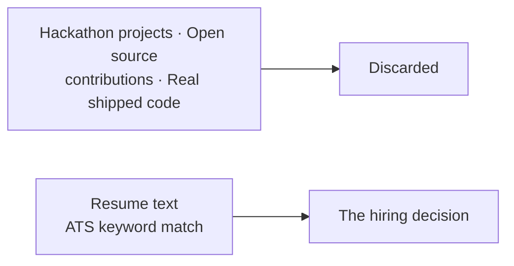

**The evidence that proves ability never reaches the decision, while a document that merely asserts it does.**

---

## 1. Executive Summary & Core Value Proposition

### 1.1 Executive Summary

Hiring runs on documents nobody can verify. A resume asserts five years of Python. A certificate asserts a credential. Recruiters read all of it and guess. The candidates who get through are often the ones who write the best claims, not the ones who wrote the best code.

**Overwatch inverts that.** It scores people on artifacts that are expensive to fake: commit history, merged pull requests to repositories they don't own, code written under a timer, answers given in a live interview. The resume becomes the least trusted input in the pipeline rather than the primary one.

**Four engines work together:**

| Engine | What it does |
| :--- | :--- |
| **Talent Score** | Reads GitHub, resumes, certificates and assessments → 9 sub-scores plus a composite, each carrying its evidence |
| **Job Matching** | Scores candidate–job pairs on skill overlap, meaning, experience fit and job-specific alignment |
| **Hackathon → Hiring** | Analyzes team submissions and pushes top performers into recruiter feeds |
| **Trust Layer** | Certificate verification, code plagiarism, duplicate profiles |

**One rule shapes everything: nothing silently moves a number.**

- **A fraud flag changes nothing** until a human reviews and upholds it
- **Missing signals redistribute their weight**, and we tell the candidate which ones dropped
- **No bare numbers**: every score ships with the components behind it

### 1.2 What Overwatch Is, In Plain Terms

**Overwatch looks at what a person has actually built, and turns that into a score a recruiter can trust and a candidate can see the reasoning behind.**

**A worked example.** A final-year student connects her GitHub:

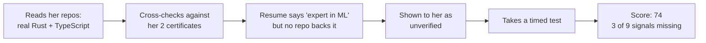

A recruiter hiring for Rust searches in plain English. **She ranks high because her verified Rust work fits, not because of her wording.** He opens the score and sees which repos produced it. Six months later, that reasoning is still on record.

### 1.3 The Problem

**For recruiters.** Keyword matching against resume text is the industry default. It rewards keyword stuffing, misses candidates who describe the same skill differently, and produces a ranked list with no explanation attached. A recruiter challenged on a decision six months later has nothing to reconstruct it from.

**For candidates.** A strong engineer with a thin resume loses to a weaker one with a better-written resume. New graduates and career-switchers have no assessments and little commit history, so systems that treat missing data as zero score them near the bottom regardless of ability.

**For hackathon organizers.** Events generate exactly the signal recruiters want: real code, built under time pressure, judged by experts. Then the event ends and all of it is thrown away. There is no path from "placed third at a hackathon" to "appeared in a recruiter's pipeline."

**The shared root cause.** Self-declared claims and verified evidence are treated as interchangeable. Everything above follows from that.

### 1.4 System Vision & Engineering Objectives

Six concrete goals, each enforced somewhere specific in the code:

| # | Objective | How it is enforced |
| :--- | :--- | :--- |
| 1 | **No fabricated values** | Every sub-score resolves to a real number with attached evidence or an explicit *undefined*. Missing data never becomes zero |
| 2 | **Anti-gaming scoring** | Sub-scores rank against real peers instead of a fixed published formula anyone can farm |
| 3 | **No blocking work on the API** | AI pipelines run in the background; handlers give back their database connection while waiting on a model |
| 4 | **Graceful degradation** | Exactly one thing we truly need: the database. Vector search, AI providers and background work all have fallbacks |
| 5 | **Human review gates anything punitive** | Fraud penalties apply only to flags a person has upheld |
| 6 | **Sub-second interactive reads** | Hot-path foreign keys carry explicit indexes; the read path never invokes a model |

### 1.5 Our USP

Six things, each enforced in the arithmetic and not merely claimed in the UI:

| # | What we do | Why it matters |
| :--- | :--- | :--- |
| **1** | **Verified skills score 1.0, claimed skills score 0.6** | A real coefficient in the formula, not a badge. Keyword stuffing measurably scores lower than real work |
| **2** | **Missing data returns *undefined*, never 0** | One shared function, five modules. A fresher gets renormalized and labeled, not scored near zero |
| **3** | **Ranked against real peers, not a fixed formula** | A published formula is farmable: buy stars until you clear it. A ranking is not, because no one controls everyone else's numbers |
| **4** | **"Vue" against a "React" job earns partial credit** | String comparison gives that an undeserved zero. We fall back to meaning, then discount it because it's inferred |
| **5** | **Scores are recomputed per job** | One global number doesn't say if someone is strong *at the thing being hired for*. The same person scores differently for Rust vs React roles |
| **6** | **Fraud flags do nothing until a human upholds one** | The scoring function only accepts already-upheld flags. Detection alone cannot touch a score |

> **Evidence Confidence ships beside every score.** A 72 built on three signals and a 72 built on nine mean different things, so the score is always labeled with how much evidence sits behind it.

### 1.6 How We Compare

**The market is split into four tools that don't talk to each other.**

| | LinkedIn / Naukri | HackerRank / Codility | Greenhouse / Lever | Unstop / Devfolio | **Overwatch** |
| :--- | :--- | :--- | :--- | :--- | :--- |
| **Trusts** | Self-written profiles | One timed test | Resume text | Event submissions | Commits, PRs, timed code, live answers |
| **Covers** | Discovery | Testing | Pipeline | Events | **All four** |
| **Explains a rank** | No | A single number | No | Judge opinion | Every number opens into its parts |
| **Freshers** | Invisible | Only if they test well | Filtered out | Only during an event | Renormalized and labeled |
| **After a hackathon** | — | — | — | Data dies with the event | Feeds recruiter pipelines |

Each is strong in its own lane, but none of them join up. A candidate is profiled on LinkedIn, tested on HackerRank, tracked in Greenhouse, and competes on Unstop. **Four disconnected records that never talk to each other.** We make one verified identity across all four.

## 2. System Architecture & Technical Design

### 2.1 Architecture & Data Flow

**One rule shapes everything: the request handler owns the database, and agent code never touches it.** Handlers fetch what an agent needs and pass it in as plain data, which is what makes our scoring testable without a database.

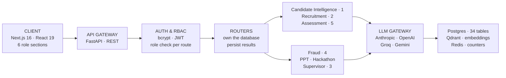

### What happens when a candidate connects GitHub

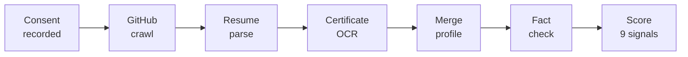

The endpoint returns straight away and does not hold the connection open for minutes. We write down the stage at each step, and the screen reads that stage, so a four-minute crawl shows real progress rather than a frozen spinner.

### When something goes down

| Dependency | Fallback |
| :--- | :--- |
| **Database** | No fallback. This is the one hard dependency |
| **AI provider** | Fixed rule-based scoring |
| **Vector search** | Exact string matching |
| **Redis** | In-memory counters |

---

### 2.2 Technology Stack

**Why each choice:**

| Choice | Reason |
| :--- | :--- |
| **FastAPI + Python** | Async throughout, and the AI ecosystem is Python-native |
| **LangGraph** | Explicit state machines, so an auditable score has an auditable path |
| **5 model providers** | Two tiers: a fast model to extract, a stronger one to judge. No lock-in |
| **Local embeddings** | No per-call cost, no rate limit, works offline |
| **Postgres** | Relational integrity for data that decides careers |
| **Qdrant** | Filtered search: "similar *and* remote-eligible" |
| **Pyodide** | Candidate code runs in the browser, never on our servers |

**Candidate code executes in the browser's WebAssembly sandbox, so untrusted code never reaches our infrastructure at all.**

### 2.3 Multi-Agent Architecture

**What "multi-agent" means here: 12 LangGraph state machines across 7 domains, each with defined steps and typed state.** Not chatbots negotiating with each other, which is unpredictable and impossible to audit. Every number a graph produces has to be traceable to the step that produced it.

| Domain | Graphs | What it does |
| :--- | :---: | :--- |
| **Candidate Intelligence** | 1 | Resume parsing, GitHub analysis, certificate reading, profile merge, fact-check, scoring |
| **Recruitment** | 2 | Job matching, plus a copilot that turns plain-English recruiter questions into real searches |
| **Assessment** | 5 | Code verification, interview planning, the live interview loop, report writing, contribution analysis |
| **Fraud** | 4 | Certificate checks, plagiarism, duplicate profiles, AI-content heuristics |
| **Pitch Analyzer** | 1 | Four rubric checks over a deck in parallel, plus cross-deck similarity |
| **Hackathon** | 1 | Links repos to decks, scores novelty, builds rankings, notifies recruiters |
| **Supervisor** | 1 | Reads what a user is asking for and routes it to the right domain |

#### Three rules every graph follows

| Rule | Why it matters |
| :--- | :--- |
| **Nodes never touch the database** | The handler fetches data first and passes it in. Scoring becomes a pure function, testable with no database at all |
| **Never invent a value on failure** | Missing data raises a typed error and the caller decides to skip or retry. No node returns `0.0` or `"unknown"` standing in for a real answer |
| **Every run is recorded** | Each run writes an `agent_runs` row with its inputs, output and model. That record is what every evidence receipt reads from |

#### Real branching, not one big prompt

The interview graph routes on the live score, not a fixed script:

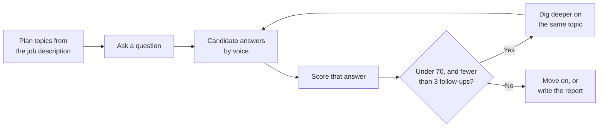

Wrapping a whole interview in a single prompt would be an hour of conversation with no decision points in it. A weak answer earns a follow-up; a strong one moves the interview along.

> **On routing:** the supervisor fronts the two surfaces where plain-English input replaces a filter form, recruiter search and candidate questions. The other five domains are called directly through their own endpoints, since the caller already knows which module it needs.

### 2.4 Scalability Strategy

Three things scale without changing the architecture:

| Axis | How | Limit to watch |
| :--- | :--- | :--- |
| **API** | Run more processes behind a load balancer | None. Session state lives in the token, rate-limit counters in shared storage |
| **Background work** | Run more processes | Each holds a 1.3 GB embedding model, so concurrency is tuned to available memory |
| **Reads** | Database replicas for analytics | Those are the only genuinely read-heavy paths |

Each job's identity comes from its subject, so a double-clicked "recompute" collapses into one run instead of two pipelines racing to write the same rows.

---

## 3. Repository Structure

A monorepo: shared code in `packages/`, runnable processes in `services/`, the web app in `apps/web`. Every agent domain repeats the same layout, so the graph defines the state machine, `nodes/` orchestrates, `tools/` holds pure functions, and `tests/` covers those functions without needing a database.

---

## 4. Feature Breakdown & User Workflows


### 4.1 Security & Credential Management

**Authentication.** Self-hosted password hashing plus signed tokens, so every authenticated request is verified in-process with no external round trip.

- **Input:** email, password, role at signup; email and password at login.
- **Processing:** passwords are hashed with a per-password salt. Verification is wrapped so that a malformed stored hash reads as a failed login, never as a server error that leaks the malformation.
- **Output:** a signed token carrying the subject and expiry.

**Authorization.** Five roles, constrained at the database *and* checked at the API. Authorization is declared in each route's signature, not inside its body, so an endpoint cannot accidentally skip it through an early return. Role membership alone is never sufficient. Ownership is a separate check. A recruiter with a valid token still cannot read a job posted by a different recruiter.

**Consent.** Anything privacy-sensitive requires a typed consent record first, covering resume parsing, interviews, photo hashing and assessments. Records store when consent was granted, from where, and under which terms version. Revocation writes a timestamp and keeps the row, so the audit trail survives.

**Rate limiting.** Shared counters keyed on the authenticated user, falling back to client IP. Counters are shared across processes, because a per-process limiter running four API workers silently multiplies the effective limit by four.

### 4.2 Candidate Intelligence

A candidate connects GitHub, uploads a resume and certificates. The pipeline crawls repositories, parses the resume, reads certificates, and merges everything into one profile.

The merge step is where contradictions surface: a resume claiming five years of Go against a GitHub account with no Go repositories. Conflicts are shown to the candidate, never silently resolved in favor of one source.

**Output:** nine sub-scores, a composite, an evidence receipt showing which artifacts produced which score, and skill badges backed by named sources.

### 4.3 How Every Module Feeds One Score

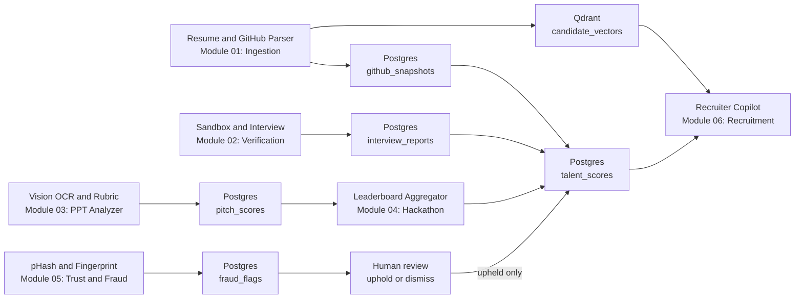

**Every path ends at one score, and the fraud path is the only one that must pass through a person first.**

### 4.4 Job Matching

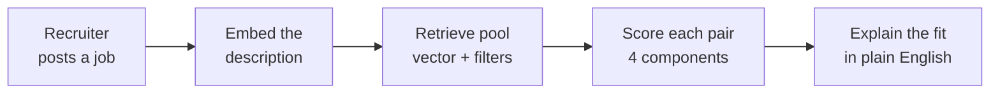

Recruiters see the breakdown (skill overlap, meaning, experience, talent alignment), never a bare percentage.

### 4.5 Skill Verification

Candidates solve problems in a browser editor with instant feedback. On submit, static analysis plus a model review scores correctness, efficiency and style. **Timed, unseen problems are the hardest signal to fake, so assessments carry the heaviest weight in the coding sub-score.**

### 4.6 AI Interview

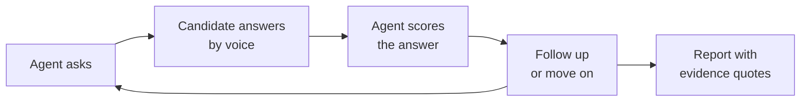

Requires explicit consent, recorded before the session starts.

### 4.7 Hackathon-to-Hiring

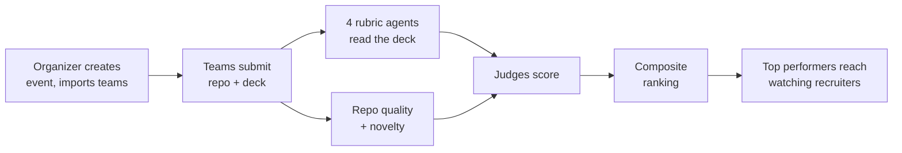

Organizers reweight the components per event, since different events value judging and novelty differently.

### 4.8 Trust & Fraud Layer

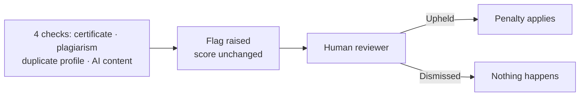

> **Every check is advisory.** A flag affects a candidate's authenticity score **only after a human upholds it.** Detection alone carries no penalty.

The AI-content check carries the lowest weight of any signal and is capped in confidence by design, because a writing-style statistic is evidence worth reviewing, never proof of misconduct.

### 4.9 Role-Based Interfaces

Five roles, each with its own scoped section of the app, so the access boundary is visible in the folder structure and not only enforced at runtime.

| Who uses it | Features |
| :--- | :--- |
| **Candidate** | Talent dashboard · evidence receipts · GitHub activity heatmap · skill badges · career guidance and skill gaps · learning roadmap · salary range · resume builder · coding assessments · AI interview · public portfolio |
| **Recruiter** | Plain-language search · job posting · match lists with score breakdowns · drag-and-drop hiring pipeline · top-performer feed from hackathons · hiring analytics |
| **Organizer** | Create events · import teams · set judge and rubric weights · track submissions · finalize leaderboards |
| **Judge** | Scoring queue · rubric scoring · PPT analysis prepared in advance · repository summary |
| **Admin** | User and role management · audit log · fraud review queue · trusted issuer registry |
| **Public** | Candidate portfolios · hackathon leaderboards, no login needed |

Public portfolios are opt-in and default to unpublished, so no candidate is exposed by inaction.

Long-running work shows real progress from the recorded pipeline stage, not an indeterminate spinner. A four-minute crawl of a large GitHub account is normal rather than a fault, but an unchanging spinner is indistinguishable from a hang.

---

## 5. Quantitative Framework

### 5.1 Core Formulations

The central problem is **scoring under incomplete information.** Almost every candidate is missing something: no assessments yet, a thin commit history, no hackathon record. Treating absence as zero builds a system that punishes newcomers and rewards tenure.

### The renormalization rule

When a signal is missing, its weight is redistributed across the signals that remain:

$$S = \frac{\sum_{i \in A} w_i S_i}{\sum_{i \in A} w_i}$$

where $A$ is the set of signals actually available. The weights always sum to 1, no matter how many dropped out.

If *nothing* is available, the result is **undefined, not zero.** That distinction is the most important rule in the scoring layer: a candidate with no data must never look identical to one who genuinely scored zero.

### The Talent Score

Nine sub-scores feed one composite:

| Sub-score | Weight | Primary source |
| :--- | ---: | :--- |
| Coding Ability | 0.16 | Commits, code quality, assessments |
| Problem Solving | 0.16 | Assessment results |
| Project Quality | 0.12 | Repository analysis |
| Innovation | 0.12 | Project novelty |
| Open Source Contributions | 0.10 | Merged PRs to external repos |
| Hackathon Performance | 0.10 | Platform and self-reported results |
| Technical Consistency | 0.08 | Commit cadence over time |
| Community Participation | 0.08 | Stars, external contributions |
| Leadership | 0.08 | Owned repositories, PR reviews |

Five of the nine are computed by fixed rules with no model call at all. AI is reserved for judgments that require reading code or prose. Anything reducible to arithmetic stays arithmetic, which is cheaper and reproducible.

**Evidence Confidence** ships alongside as `available signals ÷ 9`. A candidate scoring 72 on three signals and one scoring 72 on all nine are very different propositions, and a recruiter should be able to tell them apart.

### The Match Score

$$M = 0.35\,(\text{skill overlap}) + 0.30\,(\text{semantic similarity}) + 0.15\,(\text{experience fit}) + 0.20\,(\text{talent alignment})$$

Skill overlap is where the anti-gaming intent is most visible:

```
for each required skill:
    if candidate has it, verified        -> credit 1.0
    else if candidate claims it          -> credit 0.6
    else if a similar skill is close     -> credit 0.6 x similarity
    else                                 -> credit 0
overlap = 100 x total credit / number of required skills
```

Experience fit stops at the stated minimum. A twenty-year veteran is not a "200% match" for a two-year role, so exceeding the bar earns full credit and goes no higher.

> **On the weights:** every component is stored separately in the schema, so once the platform accumulates outcome data on who advanced and who was hired, these weights can be learned from real hiring results rather than set by hand.

### 5.2 Two More Rules

**Recent work counts more.** A signal loses half its weight every six months:

$$w(t) = e^{-\lambda t}, \qquad \lambda = \frac{\ln 2}{180}$$

with $t$ in days. Someone who shipped constantly two years ago and nothing since should not score the same as someone shipping now.

**Steady beats bursty.** Technical consistency measures how evenly commits are spread across weeks, not how many there are. The same total delivered in one weekend scores lower than the same work spread over months. Under four active weeks returns *undefined*, because that is a cold start, not a bad result.

### 5.3 Formulation Summary Matrix

| Metric | Formula | Range | Undefined when |
| :--- | :--- | :--- | :--- |
| Renormalized mean | $\sum_{i \in A} w_i S_i / \sum_{i \in A} w_i$ | 0–100 | No signals available |
| Talent Score | Weighted sum of 9 sub-scores | 0–100 | All sub-scores absent |
| Evidence Confidence | $\lvert A \rvert / 9$ | 0–1 | Never |
| Match Score | $0.35O + 0.30\Sigma + 0.15E + 0.20T$ | 0–100 | Never |
| Skill Overlap | Credit-weighted required-skill ratio | 0–100 | No required skills |
| Experience Fit | $100\min(y_C / y_{\min},\, 1)$ | 0–100 | No stated minimum |
| Recency Weight | $e^{-t\ln 2/180}$ | 0–1 | Never |
| Technical Consistency | Commit spread across weeks | 0–100 | Under 4 active weeks |
| Authenticity | $100 - \sum(\text{upheld flag penalties})$ | 0–100 | Never |

**Variables:** $A$ = available signals · $w_i$ = weight · $S_i$ = component score · $y_C$ = candidate years, $y_{\min}$ = job minimum · $t$ = days elapsed · $O, \Sigma, E, T$ = overlap, meaning, experience, talent alignment.

---

## 6. Data Model & Security

### 6.1 Schema Overview

Relational state in PostgreSQL, organized into seven domains:

| Domain | Holds |
| :--- | :--- |
| **Identity** | Users, organizations, roles, consent records, audit log |
| **Candidate** | Profiles, GitHub snapshots, certifications, talent scores, badges |
| **Recruitment** | Jobs, applications with pipeline stages, match scores |
| **Assessment** | Problem definitions, submissions, interview sessions and turns |
| **Hackathon** | Events, teams, submissions, judge scores, rankings |
| **Trust** | Fraud flags, authenticity scores, disputes, trusted issuers |
| **Operations** | Agent run history, event outbox |

Three conventions run throughout:

- **Every score stores its components,** not just the composite, which is what makes an explanation reconstructible months later.
- **Consent is a record, not a boolean.** Revocation writes a timestamp and keeps the row, so the audit trail survives.
- **Score columns are nullable on purpose,** because that is what separates "no evidence" from "scored zero."

Foreign keys get explicit indexes, since PostgreSQL indexes primary keys automatically but not foreign keys, and the recruiter candidate pool reads across those on every request.

### 6.2 Access Control

Four layers, application first:

| Layer | Mechanism |
| :--- | :--- |
| **Role** | Every endpoint declares its required role in its signature, so it cannot be skipped by an early return |
| **Ownership** | Checked separately from role. A recruiter with a valid token still cannot read another recruiter's pipeline |
| **Identity** | Candidate endpoints read the profile from the token and never accept an ID from the client, which removes a whole class of access bug instead of patching it per endpoint |
| **Database** | Row-level security acts as a second net, so a query that escapes the application still cannot cross tenants |

Candidates can never write their own scores. Audit logs have no update or delete policy, so both are denied by default. Passwords are salted hashes, every admin action is logged with actor and target, and public portfolios are opt-in.

---

## 7. How We Build It

Our build order follows one principle: **the parts that are hardest to correct later come first.**

| Phase | Focus | Why in this order |
| :--- | :--- | :--- |
| **1. Foundation** | Data model, authentication, role gating | Nothing can be tested behind a role boundary until the boundary exists |
| **2. Scoring core** | The pure scoring functions, with tests | It has no external dependencies, so it can be fully tested before any real data exists |
| **3. Agent pipelines** | The AI workflows, one domain at a time | Candidate intelligence first, since the Talent Score feeds almost everything downstream |
| **4. Interfaces** | The five role-scoped surfaces | Built against real endpoints, not mock data, which has a way of surviving into production |
| **5. Hardening** | Task durability, indexes, rate limits, degradation paths | Given its own budget, not whatever time remains, which is what stops it being cut |

Testing effort concentrates on the scoring functions and does not spread thin across the codebase.

**How we validate, beyond unit tests:**

- **Boundaries**: the top-ranked candidate in a pool must score exactly 100
- **Cold start**: checked for every possible subset of missing signals
- **By hand** against real GitHub profiles with known characteristics. This is the only way to catch a formula that is internally consistent but ranks people wrongly
- **Dependency removal**: each one taken away in turn, to confirm we return a clear error instead of a made-up number

> **The rule behind all of it:** a crash announces itself; a plausible wrong score does not. Because the dangerous failures are the ones that produce believable output from bad input, we make them structurally hard to reach: undefined instead of zero, typed errors instead of fallbacks, and human review before any penalty.

---

## 8. Verification, Testing & Guardrails

**Automated checks** cover TypeScript in strict mode, frontend lint and build, backend lint, migration-chain validity, and the scoring function tests. The type check matters because our API contract spans two languages: rename a backend field without updating the frontend type and the compiler catches it at build time, instead of an `undefined` showing up in production.

**When a dependency dies, here is exactly what happens:**

| Dependency | If it fails | Effect |
| :--- | :--- | :--- |
| Database | Request errors | Total outage. This is the one hard dependency |
| Vector search | Typed error | Semantic search off; exact matching still works |
| AI provider | Typed error, HTTP 503 | AI features off; rule-based scores unaffected |
| File storage | Typed error, HTTP 503 | Uploads off; everything else fine |

**The pattern never varies:** a named error, a specific status code. Never a generic 500, and never a made-up value standing in for a real one.

**Scoring guardrails**

- Missing signals renormalize, never zero-fill
- Every score is clamped to its stated range
- Peer ranking falls back to a fixed formula below 30 candidates
- Fraud flags need human review before they change anything
- Every score keeps its component breakdown

**Input handling.** Uploads are size-capped, candidate code runs only in the browser sandbox, interviews carry a token budget so a transcript cannot grow without bound, and all request bodies are schema-validated.

---

## 9. Deployment

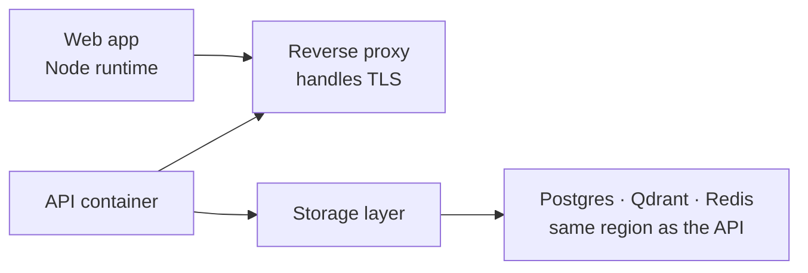

| Decision | Reason |
| :--- | :--- |
| **Node runtime, not a static host** | We use server components, so there is rendering to do at request time |
| **One image, non-root, behind a proxy** | Two images double build time and invite version skew between processes that must agree on one schema |
| **Migration runs once and exits; services wait for it** | Nothing can ever start against an un-migrated database |
| **Storage sits beside the API** | Split across regions, every query pays an internet round trip, so pages feel slow while query timings look fine |
| **90-second health-check grace period** | The embedding model loads at boot. A shorter window marks a healthy container dead and starts a restart loop |
| **Cross-origin isolation headers** | The code sandbox needs them. Without them it works locally and fails in production, exactly the kind of thing that surfaces mid-demo |

**Mobile.** A wrapper around the same web build, not a rewrite. Tokens go to the platform keystore, not local storage. Two features stay web-only. The code sandbox needs browser APIs the mobile webview does not reliably support, and server-rendered portfolios need a server. Both say "open on web" rather than shipping broken.

---

## 10. Challenges We Expect

Six real risks, and what each one is handled by:

| Challenge | How we handle it |
| :--- | :--- |
| **Cold start**: a fresher has no assessments and little history | Renormalize and label. The score is published with its confidence, never withheld or zeroed |
| **Gaming**: buy stars, stuff keywords, spin up empty repos | Ranking against real peers, and the most easily inflated signals carry the lowest weights |
| **Falsely accusing someone** | Every check is advisory and gated on human review. The AI-text detector is confidence-capped by design, so writing style alone never decides an outcome |
| **Bias** | Every score stores its components, which is what makes auditing possible at all |
| **A 4-minute GitHub crawl looks like a crash** | We record the pipeline stage and poll it, so the user sees real progress instead of a frozen spinner |
| **Tuning the weights** | Every component is stored separately, so the weights can be learned from real hiring outcomes with no migration needed |

---

## 11. MVP & Repository

**GitHub repository:** *(link)*

**Screenshots**

*(Candidate dashboard with the Talent Score radar and evidence receipt · recruiter match list with a score breakdown expanded · the hiring pipeline board · a hackathon leaderboard · the admin fraud review queue.)*

---

## 12. What We Do After Deployment

**Near-term**

- **Learn the scoring weights from outcomes.** With data on who advanced and who was hired, the weights move from hand-set to trained.
- **Score versioning.** Recompute historical scores under a new formula while preserving the old ones, so a candidate's trajectory doesn't jump discontinuously when weights change.
- **Upgrade the AI-content check** to a perplexity-based model for a stronger signal.

**Medium-term**

- **Recruiter-defined scoring profiles**: a startup weighting scrappiness and an enterprise weighting consistency share one platform
- **Bias auditing** across demographic proxies
- **Greenhouse and Lever webhooks**: no recruiter is abandoning their ATS, so we integrate instead of asking them to switch
- **Assessments in JavaScript and Java** alongside Python

**Longer-term**

Talent trajectory modeling over time, team composition analysis for organizers, multi-language resume parsing.

> **Deliberately never building: automated rejection.** We rank, explain and show evidence. **A human decides.** Every guardrail here assumes a person in the loop. Automating that away would invalidate the whole design.

---

**Overwatch** · Team The Big Oh's
