# TRACE — Talent Reliability & Assessment through Credential Evidence
### AI Talent Intelligence & Recruitment Platform
**Team: The Big Oh's** · Idea Submission

---

## Table of Contents

**Problem Statement**

1. **Executive Summary & Core Value Proposition**
   1. Executive Summary
   2. What TRACE Is, In Plain Terms
   3. The Problem
   4. System Vision & Engineering Objectives
   5. Our USP
   6. How We Compare
2. **System Architecture & Technical Design**
   1. Architecture & Data Flow
   2. Technology Stack
   3. Multi-Agent Architecture
   4. Scalability Strategy
3. **Repository Structure**
4. **Feature Breakdown & User Workflows**
   1. Security & Credential Management
   2. Candidate Intelligence
   3. How Every Module Feeds One Score
   4. Job Matching
   5. Skill Verification
   6. AI Interview
   7. Hackathon-to-Hiring
   8. Trust & Fraud Layer
   9. Role-Based Interfaces
5. **Quantitative Framework**
   1. Core Formulations
   2. Statistical Methods
   3. Formulation Summary Matrix
6. **Data Model & Security**
   1. Schema Overview
   2. Access Control
7. **How We Build It**
8. **Verification, Testing & Guardrails**
9. **Deployment**
10. **Challenges We Expect**
11. **MVP & Repository**
12. **What We Do After Deployment**

---

## Problem Statement

**Theme:** AI-Powered Talent Discovery, Verification & Recruitment Platform

> **The scope:** Build a platform that discovers, verifies, evaluates, and hires candidates on **real skills, technical contributions, hackathon performance, presentations, and AI-driven assessments**, not resumes alone. Connect candidates, recruiters, tech communities, and hackathons into one pipeline.

### Where the signal goes today

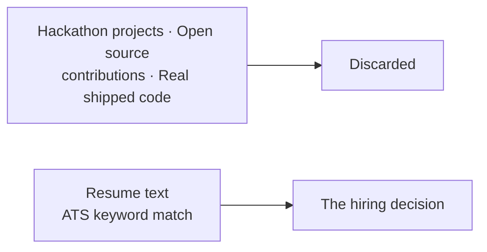

**The evidence that actually proves someone can code gets thrown away. Meanwhile, a PDF full of self-made claims dictates who gets hired.**

---

## 1. Executive Summary & Core Value Proposition

### 1.1 Executive Summary

Technical hiring is broken because it relies on documents nobody can verify. A resume claims five years of Python experience. A PDF certificate asserts cloud skills. Recruiters scan these documents for six seconds and take a wild guess. Too often, candidates who get interviewed aren't the best engineers—they're just the ones who write the best resumes.

**TRACE flips this entirely.** We evaluate developers on artifacts that are extremely hard to fake: git commit histories, merged pull requests in external projects, timed coding sandboxes, and live technical interviews. Resumes still exist in our system, but they act as initial context, not proof.

We built TRACE around **four interconnected processing engines**:

| Engine | What it actually does |
| :--- | :--- |
| **Talent Score** | Ingests GitHub activity, resumes, verified credentials, and assessment data to build 9 detailed sub-scores and a transparent composite rating. |
| **Job Matching** | Matches candidate profiles to job descriptions using semantic skill graphs, experience curves, and domain proximity. |
| **Hackathon → Hiring** | Ingests team submissions, evaluates code quality and pitch decks, and pushes top event performers directly into recruiter feeds. |
| **Trust Layer** | Checks certificates against issuers, detects code plagiarism, identifies duplicate accounts, and screens for AI-generated text patterns. |

**Three core engineering rules guide our system:**

1. **No automated punishment:** Fraud flags never alter a score automatically. A human admin must review and uphold the flag first.
2. **No magic zeros:** When data is missing (like a fresh graduate with no assessment history), we renormalize weights across remaining signals. We don't treat missing history as zero ability.
3. **Full audit trails:** Every composite score ships with an exact breakdown of its sub-components and backing evidence receipts.

### 1.2 What TRACE Is, In Plain Terms

**TRACE inspects what a developer has actually built and turns that work into an auditable score recruiters can search and candidates can understand.**

Here is how it works when a candidate links her profile:

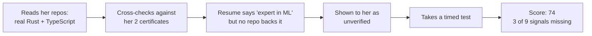

When a recruiter searches for a Rust developer using plain English ("looking for someone who's built network tools in Rust"), TRACE ranks candidates based on verified codebase artifacts, not keyword density. Clicking a candidate's score reveals the exact pull requests, repositories, and test scores behind the number.

### 1.3 The Problem

- **For Recruiters:** Traditional ATS tools look for exact keyword strings. They reward candidates who stuff keywords into resumes, ignore developers who phrase skills differently, and output ranked lists with zero explanation. When a recruiter has to explain a hiring decision months later, there's no audit trail on record.
- **For Candidates:** Strong engineers who write simple resumes get filtered out early. Meanwhile, fresh graduates and self-taught developers get penalized by algorithms that default missing history to zero.
- **For Hackathon Organizers:** Hackathons generate incredible signal—developers building working prototypes under tight deadlines. But once an event ends, that data vanishes. There's no pipeline connecting a third-place hackathon finish to a recruiter's hiring feed.

**The root cause is clear:** Current recruiting software treats unverified claims and verified proof of work as the exact same thing. We built TRACE to fix that.

### 1.4 System Vision & Engineering Objectives

We designed our codebase around six strict operational targets:

| # | Objective | How we enforce it in code |
| :--- | :--- | :--- |
| 1 | **Strict Non-Zero Missing Data** | Missing metrics return `undefined`, not `0.0`. Weights renormalize across active signals dynamically. |
| 2 | **Anti-Gaming Relative Ranks** | Candidates rank against live peer distributions, making fixed formula gaming impossible. |
| 3 | **Non-Blocking Async AI** | Heavy AI jobs run asynchronously in background queues so API responses return in under 200ms. |
| 4 | **Graceful System Fallbacks** | PostgreSQL is our only hard requirement. Vector search, LLMs, and Redis fallback cleanly if offline. |
| 5 | **Human Review Gates Penalties** | Fraud scores remain untouched until a human administrator reviews and upholds an alert. |
| 6 | **Sub-Second Database Reads** | Foreign keys carry explicit indexes; read paths never execute blocking LLM calls. |

### 1.5 Our USP

Six algorithmic features set TRACE apart:

| # | Feature | Why it matters in practice |
| :--- | :--- | :--- |
| **1** | **Verified vs. Claimed Skill Multipliers** | Verified git skills get a 1.0 weight multiplier; unverified resume claims get 0.6. Resume stuffing scores lower than real code. |
| **2** | **Explicit `undefined` Handling** | One shared normalization function across 5 scoring engines ensures missing history doesn't drag a candidate score to zero. |
| **3** | **Dynamic Peer Relative Ranking** | Candidates score against active peer distribution curves rather than static formulas that people can game. |
| **4** | **Semantic Skill Proximity** | A candidate with strong React experience applying for a Vue role gets partial credit based on framework similarity, rather than a hard zero. |
| **5** | **Job-Contextual Scoring** | Candidates are re-scored per job. A developer might score an 88 for a systems Rust role, but a 62 for a frontend React role. |
| **6** | **Advisory-Only Fraud Detection** | Fraud algorithms flag potential issues for human review, but can't change scores on their own. |

> **Evidence Confidence Index:** Every score displays an explicit confidence ratio (`active_signals / 9`). A score of 75 built on 8 signals carries far more weight than a 75 built on 2 signals, and recruiters can see that distinction instantly.

### 1.6 How We Compare

We designed TRACE to connect the dots across existing tool categories:

| Feature | LinkedIn / Naukri | HackerRank / Codility | Greenhouse / Lever | Unstop / Devfolio | **TRACE** |
| :--- | :--- | :--- | :--- | :--- | :--- |
| **Primary Data Source** | Self-written text | Timed coding tests | Resume documents | Event submissions | **Commits, PRs, timed code, live audio answers** |
| **Recruitment Scope** | Sourcing | Testing | Application tracking | Event management | **Full end-to-end recruitment lifecycle** |
| **Score Clarity** | None | Single test number | None | Subjective judge rating | **Full mathematical breakdown & evidence receipt** |
| **Cold-Start Support** | Hidden | Requires test completion | Keyword filtering | Event-only scope | **Dynamic renormalization & explicit confidence score** |
| **Post-Event Data** | N/A | N/A | N/A | Static leaderboard | **Direct integration into active recruiter pipelines** |

---

## 2. System Architecture & Technical Design

### 2.1 Architecture & Data Flow

**Our core design rule:** API routers own database transactions. AI agent state machines operate as stateless functions, taking in typed data and returning structured results. This separation makes our scoring logic simple to unit test without database mocks.

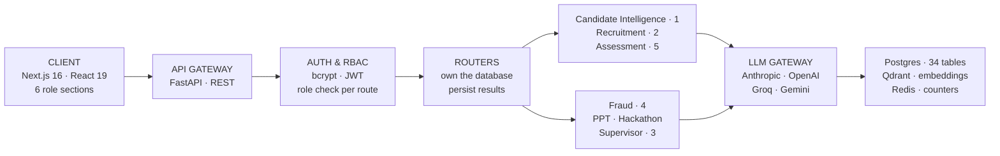

### Ingestion Flow when a Candidate Links GitHub

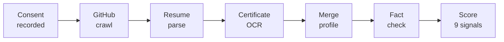

The ingestion route returns immediately after starting the job. Background tasks update progress markers in the database, allowing the client UI to poll real progress stages instead of showing an endless loading spinner during long GitHub crawls.

### Service Degradation Paths

| Service | When it fails | System behavior & recovery |
| :--- | :--- | :--- |
| **PostgreSQL** | Database down | Fatal state. HTTP 500 returned (our only hard dependency). |
| **AI LLM Gateway** | Provider outage / rate limit | Automatically falls back to rule-based scoring models. |
| **Qdrant Vector DB** | Timeout / search error | Reverts to exact SQL text matching and relational filters. |
| **Redis** | Connection dropped | In-memory atomic counters take over without crashing requests. |

---

### 2.2 Technology Stack

We chose our stack based on real operational needs:

| Choice | Engineering Reason |
| :--- | :--- |
| **FastAPI (Python 3.12)** | Asynchronous execution native to Python's AI libraries and background pipelines. |
| **LangGraph Core** | Explicit state machines for AI workflows, giving us auditable execution trails. |
| **Multi-Model Routing** | Fast models for data extraction, high-reasoning models for evaluation. Zero vendor lock-in. |
| **Local Sentence Transformers** | Eliminates external API costs, rate limits, and latency for vector embeddings. |
| **PostgreSQL 16** | Strict relational integrity, transaction safety, and native row-level security. |
| **Qdrant Vector Engine** | Fast payload filtering for combined vector similarity and attribute queries (e.g. "Rust + Remote"). |
| **Pyodide WebAssembly** | Runs candidate code directly in the user's browser sandbox, keeping untrusted code off our servers. |

---

### 2.3 Multi-Agent Architecture

TRACE runs **12 LangGraph state machines across 7 functional domains**. These aren't unstructured chatbot threads. Each graph uses explicit transition nodes and typed state schemas.

| Domain Module | Active Graphs | Responsibility |
| :--- | :---: | :--- |
| **Candidate Intelligence** | 1 | Resume parsing, GitHub crawling, OCR certificate parsing, profile merging, and evidence scoring. |
| **Recruitment** | 2 | Job-candidate vector matching and natural language recruiter query translation. |
| **Assessment** | 5 | Code evaluation, interview plan generation, live voice interview loops, report writing, and PR contribution analysis. |
| **Trust & Fraud** | 4 | Certificate verification, code plagiarism checks, duplicate account detection, and AI text style analysis. |
| **Pitch Analyzer** | 1 | Parallel presentation deck rubric evaluation and cross-submission similarity checking. |
| **Hackathon Engine** | 1 | Repository-deck linking, project novelty scoring, leaderboard generation, and recruiter alerts. |
| **Supervisor Domain** | 1 | Intent routing for natural language user queries to dedicated backend services. |

#### Core Rules for Graph Execution

- **Nodes stay out of the database:** Handlers pass data into nodes as plain objects. Scoring stays pure and easy to test.
- **No silent error defaults:** Node failures raise typed exceptions rather than returning fake numbers like `0.0` or `"unknown"`.
- **Full execution history:** Every run logs inputs, outputs, model versions, and timings into `agent_runs` for auditability.

#### Adaptive Conversational Routing in Interviews

The interview engine adapts based on candidate performance during live voice responses:

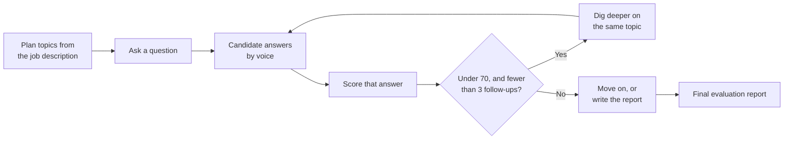

Instead of following a rigid script, the system evaluates incoming voice responses on the fly. If an answer shows weak understanding, it asks targeted follow-ups before moving to the next topic.

---

### 2.4 Scalability Strategy

- **API Web Tier:** Scales horizontally behind load balancers. Auth tokens are stateless JWTs and rate limits live in Redis.
- **Background Workers:** Memory-tuned worker queues process embedding jobs (each local sentence-transformer instance consumes ~1.3 GB RAM).
- **Read Operations:** Read replicas handle analytical dashboards and recruiter talent searches to protect primary write performance.

---

## 3. Repository Structure

We organized TRACE as a clean monorepo: `apps/web` holds the Next.js frontend, `packages/` contains shared code, and `services/` houses backend APIs and agents:

```
trace-platform/
├── apps/
│   └── web/                   # Next.js 16 app & role-based routes
├── packages/
│   ├── database/              # Schema definitions, migrations, & DB client
│   ├── types/                 # Shared TypeScript types & interfaces
│   └── utils/                 # Math helpers & formatting utilities
└── services/
    ├── api/                   # FastAPI REST gateway & endpoints
    └── agents/                # LangGraph state machine domains
        ├── candidate_intel/   # Profile crawling & score generation
        ├── recruitment/       # Job matching & copilot domain
        ├── assessment/        # Coding sandbox & AI interview engines
        ├── fraud/             # Certificate, plagiarism, & trust layer
        ├── pitch/             # Deck evaluation & rubric analyzers
        ├── hackathon/         # Event leaderboards & submission tools
        └── supervisor/        # Natural language query router
```

In every agent folder, `graph.py` defines state transitions, `nodes/` handles step logic, `tools/` contains pure math functions, and `tests/` tests logic without database dependencies.

---

## 4. Feature Breakdown & User Workflows

### 4.1 Security & Credential Management

- **Authentication:** Built using salted bcrypt password hashing and signed JWT tokens. Verification happens statelessly in-process without third-party auth service overhead.
- **Authorization & RBAC:** Role requirements are enforced directly in route function signatures, not in endpoint bodies. Ownership checks ensure recruiters can't view candidates or jobs owned by other organizations.
- **Consent Tracking:** Operations touching candidate data (resume parsing, audio interviews, assessment logging) require explicit consent records. Revocations update active flags while keeping immutable audit history.
- **Rate Limiting:** Distributed Redis counters track requests by user ID (or IP for public routes), preventing rate limit evasion across multiple API instances.

### 4.2 Candidate Intelligence

When a candidate uploads a resume, links GitHub, or adds certificates:

1. **GitHub Ingestion:** Reads commit histories, PR merges, code quality metrics, language balances, and repo ownership.
2. **Resume Parsing:** Extracts career history, education, and claimed skills.
3. **Certificate Validation:** Scans text, issuing body, and credential IDs against verified databases using OCR.
4. **Contradiction Detection:** Cross-checks resume claims against real code. If a candidate claims 4 years of Go but has no Go repositories, TRACE flags the discrepancy for candidate review rather than guessing.

**Output:** 9 sub-scores, a composite Talent Score, evidence receipts, and verified skill badges tied directly to backing code artifacts.

### 4.3 How Every Module Feeds One Score

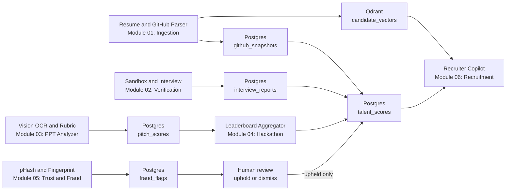

All subsystem metrics aggregate into the final candidate score. Fraud detection is the single pipeline that requires human admin sign-off before modifying candidate scores.

### 4.4 Job Matching

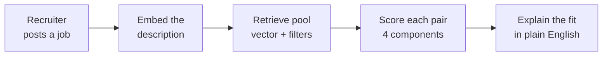

Recruiters see transparent sub-component match scores (skill overlap, semantic fit, experience alignment, talent match) instead of arbitrary percentages.

### 4.5 Skill Verification

Candidates solve real coding problems in an interactive browser editor. Upon submission, static analysis and automated test suites evaluate correctness, runtime efficiency, and code style. Timed assessments carry the highest weight in the Coding Ability sub-score.

### 4.6 AI Interview

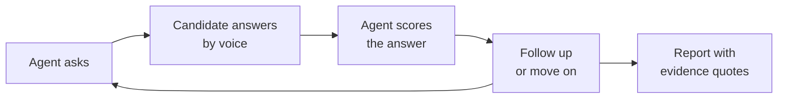

Voice interviews require explicit candidate consent before starting. The system generates structured reports complete with transcript quotes and scoring rationales.

### 4.7 Hackathon-to-Hiring

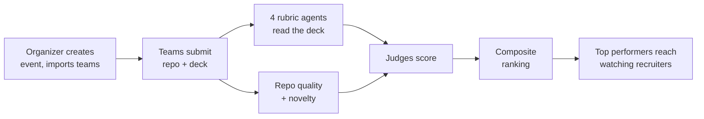

Organizers configure rubric weights per event. High-ranking hackathon teams automatically surface in recruiter talent feeds.

### 4.8 Trust & Fraud Layer

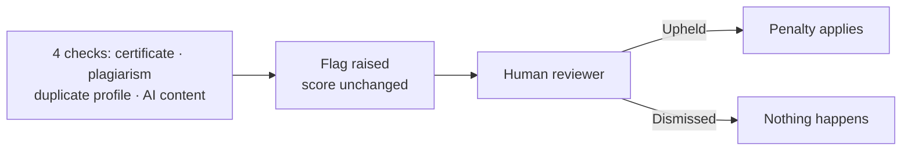

> **Human Review Guarantee:** Automated algorithms raise flags, but authenticity penalties apply **only after a human administrator reviews and upholds the flag.**

AI text detection heuristics carry lower weight and use bounded confidence limits, serving as flags for review rather than proof of cheating.

### 4.9 Role-Based Interfaces

TRACE includes six dedicated role interfaces:

| Role | Available Features |
| :--- | :--- |
| **Candidate** | Personal dashboard, evidence receipts, GitHub activity heatmap, verified skill badges, skill gap analysis, career roadmaps, salary benchmarks, resume generator, coding sandbox, AI interview environment, and public portfolio manager. |
| **Recruiter** | Natural language search, job posting, match score breakdowns, drag-and-drop applicant pipelines, hackathon top-performer feeds, and analytics. |
| **Organizer** | Event creation, team roster importing, rubric weight settings, submission tracking, and leaderboard publishing. |
| **Judge** | Evaluation queue, rubric scoring cards, pitch deck summaries, and repository analysis views. |
| **Admin** | User RBAC controls, platform audit logs, fraud review queue, and trusted certificate issuer registry settings. |
| **Public View** | Shareable candidate portfolios and event leaderboards (no authentication required). |

Public portfolios are private by default and require explicit candidate opt-in to publish.

---

## 5. Quantitative Framework

### 5.1 Core Formulations

A major challenge in recruiting software is **scoring under incomplete information**. Most candidates are missing data—some have no assessment history, others have small git histories. Systems that treat missing data as zero unfairly punish junior developers. TRACE uses dynamic weight renormalization to solve this.

### Weight Renormalization Rule

When a signal is missing, its weight redistributes proportionally among available active signals:

$$S = \frac{\sum_{i \in A} w_i S_i}{\sum_{i \in A} w_i}$$

where $A$ represents the set of active signals. Normalized weights always sum to $1.0$.

If no signals exist for a category, TRACE returns `undefined` rather than numeric zero.

### Talent Composite Score

The Talent Score combines 9 weighted sub-scores:

| Sub-score Metric | Weight ($w_i$) | Primary Data Source |
| :--- | ---: | :--- |
| **Coding Ability** | 0.16 | Commit history, code syntax, timed assessments |
| **Problem Solving** | 0.16 | Coding assessment accuracy and performance |
| **Project Quality** | 0.12 | Repo structure, documentation, test coverage |
| **Innovation** | 0.12 | Algorithmic novelty and project uniqueness |
| **Open Source Contributions** | 0.10 | Merged PRs in external third-party repositories |
| **Hackathon Performance** | 0.10 | Verified hackathon results and rankings |
| **Technical Consistency** | 0.08 | Weekly commit cadence over time |
| **Community Engagement** | 0.08 | Stars, issue activity, community feedback |
| **Technical Leadership** | 0.08 | Owned repository maintenance and PR reviews |

Five of nine sub-scores use deterministic code analysis with zero LLM calls, ensuring fast, reproducible execution.

**Evidence Confidence Ratio:** Calculated as $|A| / 9$. This ratio accompanies every composite score, showing recruiters how much data backed the result.

### Job Match Score

$$M = 0.35\,(\text{skill overlap}) + 0.30\,(\text{semantic similarity}) + 0.15\,(\text{experience fit}) + 0.20\,(\text{talent alignment})$$

Skill overlap calculation accounts for verification state:

```
for each required skill:
    if candidate has verified skill        -> credit = 1.0
    else if candidate claims skill         -> credit = 0.6
    else if similar skill exists in graph  -> credit = 0.6 * similarity_score
    else                                   -> credit = 0.0

total_overlap = 100 * (sum(credits) / total_required_skills)
```

Experience fit caps at the job requirement ($1.0$), ensuring overqualified candidates don't receive skewed match numbers.

> **Dynamic Model Tuning:** Component scores are saved separately in PostgreSQL. As real hiring data accumulates, feature weights will update using models trained on actual placement outcomes.

### 5.2 Recency Decay & Commit Consistency

**Recency Decay:** Artifact value decays exponentially using a 180-day half-life:

$$w(t) = e^{-\lambda t}, \qquad \lambda = \frac{\ln 2}{180}$$

where $t$ is elapsed days.

**Commit Consistency:** Evaluates how evenly commits are distributed across active weeks. Consistent progress over months scores higher than short burst commits. Profiles with fewer than 4 active weeks return `undefined` to prevent cold-start penalties.

### 5.3 Formulation Summary Matrix

| Metric Name | Mathematical Formula | Range | Undefined Condition |
| :--- | :--- | :--- | :--- |
| **Renormalized Score** | $\sum_{i \in A} w_i S_i / \sum_{i \in A} w_i$ | 0–100 | $A = \varnothing$ (no active signals) |
| **Talent Composite Score** | Weighted sum of active sub-scores | 0–100 | All 9 sub-scores missing |
| **Evidence Confidence** | $|A| / 9$ | 0.0–1.0 | None (always computes) |
| **Job Match Score** | $0.35O + 0.30\Sigma + 0.15E + 0.20T$ | 0–100 | None (always computes) |
| **Skill Overlap Score** | Credit-weighted skill ratio | 0–100 | No required job skills |
| **Experience Fit** | $100 \times \min(y_C / y_{\min},\, 1.0)$ | 0–100 | No minimum years specified |
| **Recency Decay Weight** | $e^{-t\ln 2 / 180}$ | 0.0–1.0 | None (always computes) |
| **Technical Consistency** | Normalized weekly commit variance | 0–100 | Active history $< 4$ weeks |
| **Authenticity Score** | $100 - \sum(\text{upheld fraud penalties})$ | 0–100 | None (defaults to 100) |

---

## 6. Data Model & Security

### 6.1 Schema Overview

TRACE manages state across 34 PostgreSQL tables across 7 functional domains:

| Relational Domain | Primary Entities Stored |
| :--- | :--- |
| **Identity & Access** | Users, tenant orgs, roles, consent records, audit logs. |
| **Candidate Intelligence** | Profiles, GitHub snapshots, certificates, talent scores, badges. |
| **Recruitment Pipeline** | Jobs, applications, pipeline stage tracking, match score components. |
| **Assessment Engine** | Problem sets, candidate code submissions, interview sessions, turns. |
| **Hackathon Domain** | Events, team registrations, code/deck submissions, judge ratings, leaderboards. |
| **Trust & Integrity** | Fraud flags, authenticity scores, dispute records, trusted issuers. |
| **System Operations** | Agent execution telemetry (`agent_runs`), transactional outbox. |

**Database Schema Rules:**

- **Component Sub-Score Preservation:** Composite scores store their underlying sub-components to support long-term auditing.
- **Immutable Consent Records:** Consent changes append new rows with timestamps rather than overwriting existing records.
- **Explicit Nullable Attributes:** Score columns use nullable values to distinguish missing evidence from zero scores.
- **Indexed Foreign Keys:** All foreign keys carry explicit indexes to keep relational query latencies low.

### 6.2 Access Control

- **Route Declarations:** Roles are declared in API route signatures, preventing authorization bypass.
- **Ownership Checks:** Handlers verify tenant resource ownership independently of user roles.
- **Token Identity:** User endpoints extract identity directly from verified JWT payloads rather than client-supplied IDs.
- **PostgreSQL RLS:** Row-level security policies enforce tenant isolation at the database layer.

---

## 7. How We Build It

We followed a strict dependency-first build order:

| Phase | Milestone Focus | Engineering Rationale |
| :--- | :--- | :--- |
| **1. Core Foundation** | Schema, auth, RBAC enforcement | Sets security boundaries required before testing component APIs. |
| **2. Scoring Functions** | Pure scoring functions & test suites | Evaluates mathematical scoring logic without database dependencies. |
| **3. Agent Pipelines** | Ingestion, recruitment, assessment, & fraud agents | Builds async processing pipelines, starting with candidate intelligence. |
| **4. User Interfaces** | Six role-scoped web dashboards | Connects user workflows directly to live backend endpoints. |
| **5. System Hardening** | Indexing, task resilience, rate limits, fallbacks | Ensures system stability, low latency, and fault recovery. |

### Validation Approach

- **Boundary Testing:** Confirms ideal candidate profiles reach maximum score thresholds (100).
- **Cold-Start Verification:** Tests weight renormalization across missing signal combinations.
- **Profile Benchmarking:** Validates scoring distributions against real open-source developer profiles.
- **Fault Simulation:** Tests service fallbacks by intentionally taking vector search and LLM services offline.

---

## 8. Verification, Testing & Guardrails

- **Quality Checks:** TypeScript strict mode, frontend/backend linting, migration checks, and scoring unit test suites.
- **Service Fallbacks:** Database failures return clean HTTP 500 errors; vector search timeouts fall back to exact text matching; LLM outages fall back to deterministic rule scoring without taking down core APIs.
- **Execution Sandboxing:** Candidate code runs inside browser WebAssembly sandboxes, protecting backend infrastructure from untrusted code.

---

## 9. Deployment

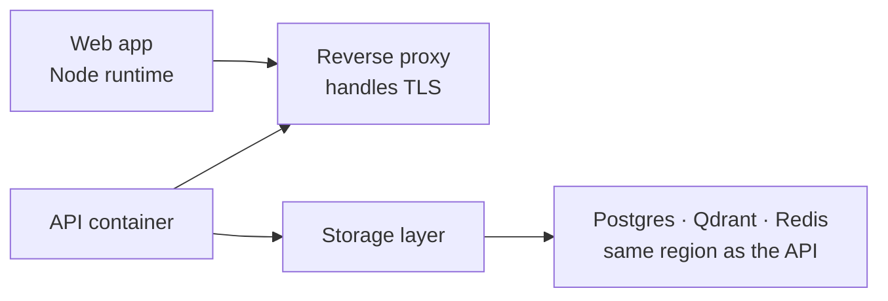

### Production Setup

- **Node.js Production Server:** Handles Next.js server rendering and API routes.
- **Containerized Services:** Runs single non-root application images behind an NGINX proxy to prevent environment drift.
- **Sequential DB Migrations:** Migration tasks complete fully before main API services boot up.
- **Regional Co-location:** Database, vector storage, and API containers run in the same cloud region to eliminate cross-region network latency.
- **90-Second Health Grace Period:** Gives local sentence-transformer models time to load memory during cold starts.
- **COOP/COEP Headers:** Enforces cross-origin isolation headers required for browser WebAssembly sandbox execution.

---

## 10. Challenges We Expect

| Risk | Mitigation |
| :--- | :--- |
| **Cold-Start Profiles** | Uses weight renormalization and confidence indicators to present partial data fairly without zero-filling. |
| **Gaming & Inflation** | Evaluates candidates relative to peer distributions and assigns lower weights to easily farmable metrics. |
| **False Fraud Penalties** | Enforces human admin review for all fraud flags and caps AI text detection confidence limits. |
| **Algorithmic Bias** | Persists complete sub-score breakdowns to enable transparent algorithmic auditing. |
| **Long Crawl Latencies** | Updates processing stage indicators in real time so users see actual progress during background crawls. |
| **Weight Optimization** | Stores sub-components independently to allow automated weight tuning using placement data over time. |

---

## 11. MVP & Repository

**GitHub Repository:** https://github.com/prasadbhalerao1/TRACE

The repository contains the full monorepo described in §3: the Next.js frontend, the FastAPI gateway, all seven agent domains, and the migration and seed scripts needed to bring the stack up locally.

---

## 12. What We Do After Deployment

**Phase 1: Immediate Post-Launch**

- Train scoring weights on empirical hiring data to improve score prediction.
- Implement scoring versioning to support formula updates without invalidating historical candidate records.
- Add perplexity-based text models for improved writing style detection.

**Phase 2: Medium-Term Expansion**

- Allow recruiters to define custom scoring profiles based on company hiring priorities.
- Conduct demographic bias auditing across scoring algorithms.
- Add ATS webhooks for Greenhouse and Lever integration.
- Expand coding assessment runtimes to support JavaScript, Java, and C++.

**Phase 3: Long-Term Vision**

Build predictive career trajectory modeling, team optimization tools for hackathon organizers, and multi-language resume processing.

> **Non-Goal (Human-in-the-Loop Guarantee):** TRACE intentionally excludes automated rejection features. The system ranks, explains, and highlights evidence—human hiring managers retain complete authority over all hiring decisions.

---

**TRACE** · Team The Big Oh's
