# TRACE: Talent Reliability & Assessment through Credential Evidence
### AI Talent Intelligence & Recruitment Platform
**Team: The Big Oh's** · Idea Submission

---

## Table of Contents

**Problem Statement**

1. **Executive Summary & Core Value Proposition**
   1. Executive Summary
   2. What TRACE Is, In Plain Terms
   3. The Problem
   4. System Vision & Engineering Objectives
   5. Our USP
   6. How We Compare
2. **System Architecture & Technical Design**
   1. Architecture & Data Flow
   2. Technology Stack
   3. Multi-Agent Architecture
   4. Scalability Strategy
3. **Repository Structure**
4. **Feature Breakdown & User Workflows**
   1. Security & Credential Management
   2. Candidate Intelligence
   3. How Every Module Feeds One Score
   4. Job Matching
   5. Skill Verification
   6. AI Interview
   7. Hackathon-to-Hiring
   8. Trust & Fraud Layer
   9. Role-Based Interfaces
5. **Quantitative Framework**
   1. Core Formulations
   2. Recency Decay & Commit Consistency
   3. Formulation Summary Matrix
6. **Data Model & Security**
   1. Schema Overview
   2. Access Control
7. **How We Build It**
8. **Verification, Testing & Guardrails**
9. **Deployment**
10. **Challenges We Expect**
11. **MVP & Repository**
12. **What We Do After Deployment**

---

## Problem Statement

**Theme:** AI-Powered Talent Discovery, Verification & Recruitment Platform

> **The scope:** Build a platform that discovers, verifies, evaluates, and hires candidates on **real skills, technical contributions, hackathon performance, presentations, and AI-driven assessments**, not resumes alone. Connect candidates, recruiters, tech communities, and hackathons into one pipeline.

### Where the signal goes today

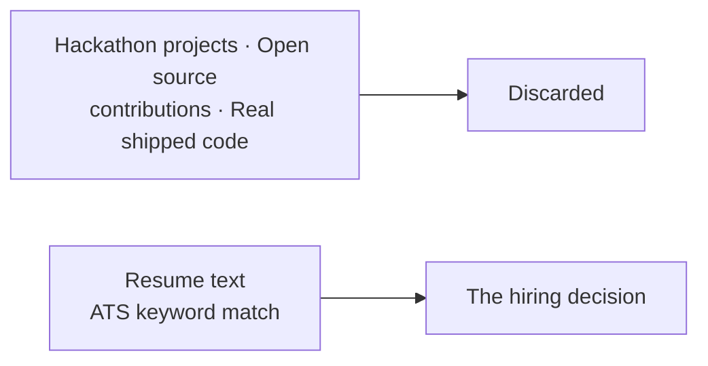

The work that proves someone can code is thrown away. A PDF of self-made claims decides who gets hired.

---

## 1. Executive Summary & Core Value Proposition

### 1.1 Executive Summary

Technical hiring runs on documents nobody checks. A resume claims five years of Python. A certificate asserts cloud skills. A recruiter skims for six seconds and guesses. The people who make it to an interview are often the people who write good resumes, which is a different skill from the one being hired for.

TRACE scores developers on artifacts that are hard to fake instead: commit histories, pull requests merged into projects the candidate does not control, timed coding sandboxes, and live technical interviews. Resumes still enter the system. They just enter as context to be checked, not as evidence.

Four engines do the processing.

| Engine | What it actually does |
| :--- | :--- |
| **Talent Score** | Ingests GitHub activity, resumes, verified credentials, and assessment data to build 9 detailed sub-scores and a transparent composite rating. |
| **Job Matching** | Matches candidate profiles to job descriptions using semantic skill graphs, experience curves, and domain proximity. |
| **Hackathon → Hiring** | Ingests team submissions, evaluates code quality and pitch decks, and pushes top event performers directly into recruiter feeds. |
| **Trust Layer** | Checks certificates against issuers, detects code plagiarism, identifies duplicate accounts, and screens for AI-generated text patterns. |

Three rules constrain the whole system. Fraud flags never move a score on their own. An admin has to review the flag and uphold it before any penalty lands. Missing data is never read as zero; a fresh graduate with no assessment history has weights renormalized across whatever signals do exist, because absence of evidence about someone is not evidence about their ability. And every composite score carries its own breakdown, down to the sub-components and the artifacts behind them.

### 1.2 What TRACE Is, In Plain Terms

TRACE reads what a developer has built and turns it into a score recruiters can search against and candidates can argue with.

Here is a real path through the system. A candidate links her profile:

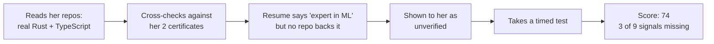

On the other side, a recruiter types "looking for someone who's built network tools in Rust" and gets a ranking built from verified code rather than keyword density. Clicking any score opens the pull requests, repositories, and test results it was computed from.

### 1.3 The Problem

Recruiters get tools that match keyword strings. That rewards resume stuffing, misses developers who describe the same skill in different words, and produces ranked lists with no reasoning attached. Months later, when someone asks why a particular candidate was passed over, there is nothing on record to answer with.

Candidates face the mirror image. Good engineers who write plain resumes get filtered out in the first pass, and anyone without a long history (new graduates, career changers, self-taught developers) gets scored against algorithms that quietly read "no data" as "no ability."

Hackathon organizers sit on the best signal of all and cannot use it. People build working software under a deadline, someone wins, and then the event ends and all of it evaporates. A third-place finish never reaches a recruiter's feed because no pipeline connects the two.

Underneath all three is the same defect: current software treats a claim and a verified artifact as interchangeable inputs.

### 1.4 System Vision & Engineering Objectives

Six targets shaped the codebase, and each one is enforced somewhere specific rather than left as an aspiration:

| # | Objective | Where it lives in the code |
| :--- | :--- | :--- |
| 1 | Missing data stays missing | Absent metrics return `undefined`, never `0.0`; weights renormalize across whatever remains. |
| 2 | Ranks are relative, not fixed | Candidates are placed against a live peer distribution, so there is no static formula to reverse-engineer. |
| 3 | AI work never blocks a response | Heavy jobs go to background queues; API responses come back under 200ms. |
| 4 | One hard dependency, not four | PostgreSQL must be up. Vector search, the LLM gateway, and Redis each degrade to a working fallback. |
| 5 | Penalties wait for a human | Fraud scores are untouched until an administrator reviews the alert and upholds it. |
| 6 | Reads stay under a second | Every foreign key is indexed, and no read path makes a blocking LLM call. |

### 1.5 Our USP

Six design decisions separate this from the tools it would replace:

| # | Feature | What it changes |
| :--- | :--- | :--- |
| **1** | Verified and claimed skills weigh differently | A skill backed by git carries a 1.0 multiplier; the same skill claimed only on a resume carries 0.6. Stuffing a resume scores below writing the code. |
| **2** | `undefined` is handled once, centrally | A single normalization function serves all 5 scoring engines, so no engine can quietly turn a gap into a zero. |
| **3** | Ranking follows the peer distribution | Scores are placed against the active candidate curve, which moves as the pool moves. |
| **4** | Adjacent skills earn partial credit | Strong React experience against a Vue requirement scores on framework proximity instead of failing to a hard zero. |
| **5** | Scores are computed per job | The same developer can be an 88 for a systems Rust role and a 62 for a frontend React one. |
| **6** | Fraud detection only advises | The algorithms raise flags. They have no authority to move a score. |

Every score also carries a confidence ratio, `active_signals / 9`. A 75 assembled from 8 signals and a 75 assembled from 2 are not the same claim, and the interface never lets those look alike.

### 1.6 How We Compare

Each existing category solves one slice of the problem. TRACE spans them:

| Feature | LinkedIn / Naukri | HackerRank / Codility | Greenhouse / Lever | Unstop / Devfolio | **TRACE** |
| :--- | :--- | :--- | :--- | :--- | :--- |
| **Primary Data Source** | Self-written text | Timed coding tests | Resume documents | Event submissions | **Commits, PRs, timed code, live audio answers** |
| **Recruitment Scope** | Sourcing | Testing | Application tracking | Event management | **Full end-to-end recruitment lifecycle** |
| **Score Clarity** | None | Single test number | None | Subjective judge rating | **Full mathematical breakdown & evidence receipt** |
| **Cold-Start Support** | Hidden | Requires test completion | Keyword filtering | Event-only scope | **Dynamic renormalization & explicit confidence score** |
| **Post-Event Data** | N/A | N/A | N/A | Static leaderboard | **Direct integration into active recruiter pipelines** |

---

## 2. System Architecture & Technical Design

### 2.1 Architecture & Data Flow

One rule organizes the backend: routers own database transactions, and agent state machines are stateless functions that take typed input and return structured output. Keeping those apart is what lets the scoring logic be unit tested without a single database mock.

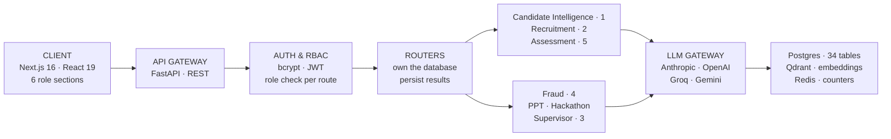

### Ingestion Flow when a Candidate Links GitHub

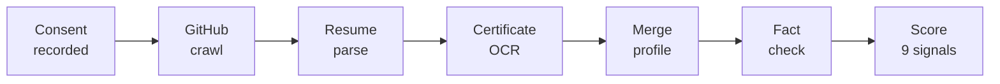

The ingestion route returns as soon as the job is queued. Background tasks write progress markers as they go, so the client polls actual stages, crawling and parsing and scoring, rather than spinning for however long a large GitHub history takes to walk.

### Service Degradation Paths

| Service | When it fails | System behavior & recovery |
| :--- | :--- | :--- |
| **PostgreSQL** | Database down | Fatal state. HTTP 500 returned (our only hard dependency). |
| **AI LLM Gateway** | Provider outage / rate limit | Automatically falls back to rule-based scoring models. |
| **Qdrant Vector DB** | Timeout / search error | Reverts to exact SQL text matching and relational filters. |
| **Redis** | Connection dropped | In-memory atomic counters take over without crashing requests. |

---

### 2.2 Technology Stack

Each choice below was made against a specific constraint, not a preference:

| Choice | Reason |
| :--- | :--- |
| **FastAPI (Python 3.12)** | Async execution sitting natively alongside the AI libraries and background pipelines. |
| **LangGraph** | State machines with explicit transitions, which is what makes an agent run auditable after the fact. |
| **Multi-model routing** | Cheap fast models for extraction, stronger models for evaluation, and no single vendor to be locked into. |
| **Local sentence transformers** | Embeddings with no per-call cost, no rate limit, and no network round trip. |
| **PostgreSQL 16** | Relational integrity, real transactions, and row-level security in the database rather than the application. |
| **Qdrant** | Payload filtering fast enough to combine vector similarity with hard attributes: "Rust" and "remote" in one query. |
| **Pyodide (WebAssembly)** | Candidate code executes in the candidate's own browser, so untrusted code never reaches our servers. |

---

### 2.3 Multi-Agent Architecture

Twelve LangGraph state machines run across seven domains. Every graph has typed state and explicitly declared transitions, which means a run can be replayed and inspected node by node.

| Domain Module | Active Graphs | Responsibility |
| :--- | :---: | :--- |
| **Candidate Intelligence** | 1 | Resume parsing, GitHub crawling, OCR certificate parsing, profile merging, and evidence scoring. |
| **Recruitment** | 2 | Job-candidate vector matching and natural language recruiter query translation. |
| **Assessment** | 5 | Code evaluation, interview plan generation, live voice interview loops, report writing, and PR contribution analysis. |
| **Trust & Fraud** | 4 | Certificate verification, code plagiarism checks, duplicate account detection, and AI text style analysis. |
| **Pitch Analyzer** | 1 | Parallel presentation deck rubric evaluation and cross-submission similarity checking. |
| **Hackathon Engine** | 1 | Repository-deck linking, project novelty scoring, leaderboard generation, and recruiter alerts. |
| **Supervisor Domain** | 1 | Intent routing for natural language user queries to dedicated backend services. |

#### Core Rules for Graph Execution

Nodes never touch the database. Handlers hand them plain objects, which keeps the scoring functions pure and testable in isolation. When a node fails it raises a typed exception rather than returning a plausible-looking `0.0` or `"unknown"` that would travel downstream unnoticed. Each run writes its inputs, outputs, model versions, and timings to `agent_runs`.

#### Adaptive Conversational Routing in Interviews

The interview engine changes course based on how the candidate is doing:

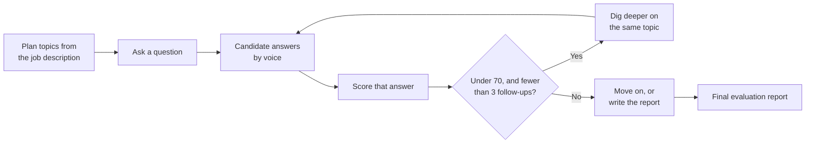

There is no fixed script. Answers are scored as they arrive, and a weak answer earns a narrower follow-up on the same topic before the interview moves on, up to three times, after which it moves on regardless.

---

### 2.4 Scalability Strategy

The web tier scales horizontally behind a load balancer, which works because JWTs are stateless and rate-limit counters live in Redis rather than in process memory. Background workers are sized by memory instead of CPU, since each local sentence-transformer instance holds roughly 1.3 GB resident. Analytics dashboards and recruiter searches are pointed at read replicas so that heavy queries cannot slow the write path.

---

## 3. Repository Structure

The project is a monorepo. `apps/web` is the Next.js frontend, `packages/` holds code shared across both sides, and `services/` contains the API and the agents:

```
trace-platform/
├── apps/
│   └── web/                   # Next.js 16 app & role-based routes
├── packages/
│   ├── database/              # Schema definitions, migrations, & DB client
│   ├── types/                 # Shared TypeScript types & interfaces
│   └── utils/                 # Math helpers & formatting utilities
└── services/
    ├── api/                   # FastAPI REST gateway & endpoints
    └── agents/                # LangGraph state machine domains
        ├── candidate_intel/   # Profile crawling & score generation
        ├── recruitment/       # Job matching & copilot domain
        ├── assessment/        # Coding sandbox & AI interview engines
        ├── fraud/             # Certificate, plagiarism, & trust layer
        ├── pitch/             # Deck evaluation & rubric analyzers
        ├── hackathon/         # Event leaderboards & submission tools
        └── supervisor/        # Natural language query router
```

Every agent folder follows the same internal shape: `graph.py` declares the state transitions, `nodes/` implements each step, `tools/` holds the pure math, and `tests/` covers the logic without needing a database.

---

## 4. Feature Breakdown & User Workflows

### 4.1 Security & Credential Management

Passwords are salted and hashed with bcrypt, and sessions are signed JWTs verified in-process, with no third-party auth service in the request path.

Role requirements sit in the route function signature rather than inside the handler body. That placement matters more than it looks: a check written into a function body can be skipped by an early return, while one declared in the signature cannot be reached around. On top of the role check, handlers verify ownership separately, so a recruiter with a valid recruiter token still cannot open another organization's candidates or jobs.

Anything that touches candidate data, whether that is parsing a resume, recording interview audio or logging an assessment, requires a consent record first. Revoking consent flips the active flag and appends a row; nothing is overwritten, so the history of what was permitted when stays intact.

Rate limits are Redis counters keyed by user ID, falling back to IP on public routes. Keeping them in Redis rather than in each process is what stops a client from evading the limit by spreading requests across API instances.

### 4.2 Candidate Intelligence

When a candidate uploads a resume, links GitHub, or adds a certificate, four passes run over the material.

The GitHub crawl reads commit history, merged pull requests, code quality signals, language distribution, and which repositories the candidate actually owns versus forked. Resume parsing pulls out career history, education, and claimed skills. Certificates go through OCR, and the extracted text, issuing body, and credential ID are checked against known issuers.

The fourth pass is the one that matters most. It compares what the resume claims against what the code shows. Someone claiming four years of Go with no Go repository anywhere is not accused of lying. The gap is surfaced to the candidate, who can link a private repo, explain that the work was at a previous employer, or let it stand as unverified. Guessing which of those is true is exactly what the system refuses to do.

What comes out: 9 sub-scores, a composite Talent Score, evidence receipts, and skill badges that each point back at the artifact that earned them.

### 4.3 How Every Module Feeds One Score

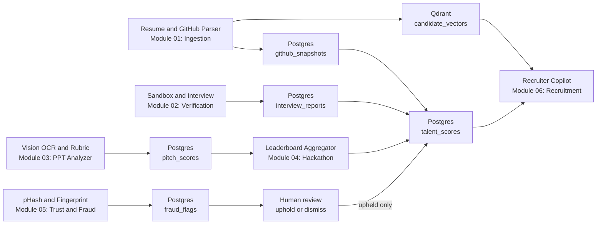

Every subsystem eventually writes into the same composite. Note the one asymmetry in the diagram: fraud is the only path that cannot reach `talent_scores` on its own, because it has to pass through a human first.

### 4.4 Job Matching

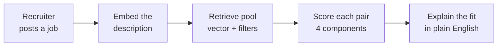

A recruiter never sees a bare percentage. The four components (skill overlap, semantic fit, experience alignment, talent match) are shown separately, so a 71 that comes from strong skills and thin experience is legible as such.

### 4.5 Skill Verification

Candidates write code in a browser editor against real problems. On submission, static analysis and a test suite check correctness, runtime behaviour, and style. Because the work is timed and observed, these results carry the heaviest weight inside the Coding Ability sub-score.

### 4.6 AI Interview

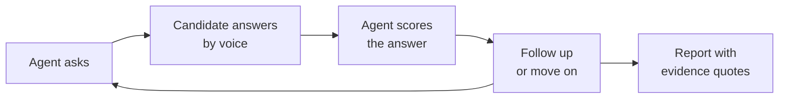

Nothing starts recording until the candidate consents. The report that comes out quotes the transcript directly and states why each score was given, so the candidate and the recruiter are reading the same evidence.

### 4.7 Hackathon-to-Hiring

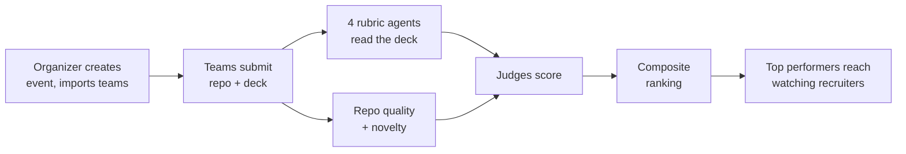

Rubric weights are set per event, since a design-focused hackathon should not be scored like a systems one. Teams that finish near the top surface in recruiter feeds automatically, which is the connection that does not exist today.

### 4.8 Trust & Fraud Layer

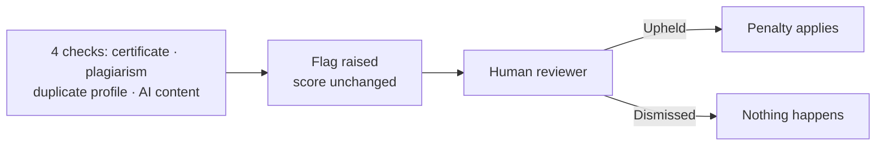

> Algorithms raise flags. Penalties apply only after an administrator has reviewed the flag and upheld it.

The AI-text heuristics are deliberately the weakest input in this layer, with a capped confidence ceiling. These detectors are unreliable enough that treating one as proof of cheating would cause more harm than the cheating does; it points a reviewer at something worth a look, and stops there.

### 4.9 Role-Based Interfaces

Six interfaces, each scoped to what that role is allowed to see:

| Role | Available Features |
| :--- | :--- |
| **Candidate** | Personal dashboard, evidence receipts, GitHub activity heatmap, verified skill badges, skill gap analysis, career roadmaps, salary benchmarks, resume generator, coding sandbox, AI interview environment, and public portfolio manager. |
| **Recruiter** | Natural language search, job posting, match score breakdowns, drag-and-drop applicant pipelines, hackathon top-performer feeds, and analytics. |
| **Organizer** | Event creation, team roster importing, rubric weight settings, submission tracking, and leaderboard publishing. |
| **Judge** | Evaluation queue, rubric scoring cards, pitch deck summaries, and repository analysis views. |
| **Admin** | User RBAC controls, platform audit logs, fraud review queue, and trusted certificate issuer registry settings. |
| **Public View** | Shareable candidate portfolios and event leaderboards (no authentication required). |

Portfolios start private. Publishing one is an explicit action the candidate takes.

---

## 5. Quantitative Framework

### 5.1 Core Formulations

The hard problem in scoring candidates is that the data is always incomplete. Someone has no assessment history; someone else has three commits and a strong interview. A system that fills those gaps with zeros is not being neutral. It is asserting that the candidate has no ability in that dimension, which it has no basis for. Renormalizing the weights instead is the difference between "we don't know" and "you scored nothing."

### Weight Renormalization Rule

A missing signal's weight is redistributed proportionally across the signals that remain:

$$S = \frac{\sum_{i \in A} w_i S_i}{\sum_{i \in A} w_i}$$

where $A$ is the set of active signals and the normalized weights always sum to $1.0$. When $A$ is empty the function returns `undefined`, not zero. There is no score to report, and saying so is more honest than inventing one.

### Talent Composite Score

The Talent Score combines 9 weighted sub-scores:

| Sub-score Metric | Weight ($w_i$) | Primary Data Source |
| :--- | ---: | :--- |
| **Coding Ability** | 0.16 | Commit history, code syntax, timed assessments |
| **Problem Solving** | 0.16 | Coding assessment accuracy and performance |
| **Project Quality** | 0.12 | Repo structure, documentation, test coverage |
| **Innovation** | 0.12 | Algorithmic novelty and project uniqueness |
| **Open Source Contributions** | 0.10 | Merged PRs in external third-party repositories |
| **Hackathon Performance** | 0.10 | Verified hackathon results and rankings |
| **Technical Consistency** | 0.08 | Weekly commit cadence over time |
| **Community Engagement** | 0.08 | Stars, issue activity, community feedback |
| **Technical Leadership** | 0.08 | Owned repository maintenance and PR reviews |

Five of the nine come from deterministic code analysis with no LLM involved, so those five produce the same number every time they run.

The evidence confidence ratio, $|A| / 9$, travels with every composite score and tells a recruiter how much of the picture was actually available.

### Job Match Score

$$M = 0.35\,(\text{skill overlap}) + 0.30\,(\text{semantic similarity}) + 0.15\,(\text{experience fit}) + 0.20\,(\text{talent alignment})$$

Skill overlap calculation accounts for verification state:

```
for each required skill:
    if candidate has verified skill        -> credit = 1.0
    else if candidate claims skill         -> credit = 0.6
    else if similar skill exists in graph  -> credit = 0.6 * similarity_score
    else                                   -> credit = 0.0

total_overlap = 100 * (sum(credits) / total_required_skills)
```

Experience fit is capped at the requirement itself ($1.0$), so ten years against a three-year role scores the same as three. Without that cap, seniority would quietly dominate a score that is supposed to measure fit.

Component scores are stored separately rather than only as a total. That is what makes it possible to retrain the weights later against real placement outcomes instead of keeping the initial guesses forever.

### 5.2 Recency Decay & Commit Consistency

Work loses weight as it ages, on a 180-day half-life:

$$w(t) = e^{-\lambda t}, \qquad \lambda = \frac{\ln 2}{180}$$

where $t$ is elapsed days. A Rust project from last month says more about someone's current ability than one from four years ago, and the curve encodes that without discarding the older work entirely.

Commit consistency looks at how evenly commits fall across active weeks, rewarding sustained work over a weekend of frantic activity before an application. Below four active weeks there is not enough history to say anything, so the metric returns `undefined` rather than a low score.

### 5.3 Formulation Summary Matrix

| Metric Name | Mathematical Formula | Range | Undefined Condition |
| :--- | :--- | :--- | :--- |
| **Renormalized Score** | $\sum_{i \in A} w_i S_i / \sum_{i \in A} w_i$ | 0–100 | $A = \varnothing$ (no active signals) |
| **Talent Composite Score** | Weighted sum of active sub-scores | 0–100 | All 9 sub-scores missing |
| **Evidence Confidence** | $|A| / 9$ | 0.0–1.0 | None (always computes) |
| **Job Match Score** | $0.35O + 0.30\Sigma + 0.15E + 0.20T$ | 0–100 | None (always computes) |
| **Skill Overlap Score** | Credit-weighted skill ratio | 0–100 | No required job skills |
| **Experience Fit** | $100 \times \min(y_C / y_{\min},\, 1.0)$ | 0–100 | No minimum years specified |
| **Recency Decay Weight** | $e^{-t\ln 2 / 180}$ | 0.0–1.0 | None (always computes) |
| **Technical Consistency** | Normalized weekly commit variance | 0–100 | Active history $< 4$ weeks |
| **Authenticity Score** | $100 - \sum(\text{upheld fraud penalties})$ | 0–100 | None (defaults to 100) |

---

## 6. Data Model & Security

### 6.1 Schema Overview

State lives in 34 PostgreSQL tables, grouped into seven domains:

| Relational Domain | Primary Entities Stored |
| :--- | :--- |
| **Identity & Access** | Users, tenant orgs, roles, consent records, audit logs. |
| **Candidate Intelligence** | Profiles, GitHub snapshots, certificates, talent scores, badges. |
| **Recruitment Pipeline** | Jobs, applications, pipeline stage tracking, match score components. |
| **Assessment Engine** | Problem sets, candidate code submissions, interview sessions, turns. |
| **Hackathon Domain** | Events, team registrations, code/deck submissions, judge ratings, leaderboards. |
| **Trust & Integrity** | Fraud flags, authenticity scores, dispute records, trusted issuers. |
| **System Operations** | Agent execution telemetry (`agent_runs`), transactional outbox. |

Four schema conventions hold across all of them. Composite scores keep their sub-components rather than collapsing to a single number, which is what makes an old score auditable a year later. Consent changes append timestamped rows instead of updating in place. Score columns are nullable on purpose, because the database has to be able to represent "no evidence" as something other than `0`. And every foreign key is indexed explicitly, since the ones that get missed are exactly the ones that surface as slow queries under load.

### 6.2 Access Control

Access control is layered deliberately, so that no single mistake opens a door. Roles are declared in route signatures. Ownership is checked separately from role, because holding the right role says nothing about owning the specific record. Identity is read from the verified JWT payload and never from a client-supplied ID, which closes the obvious "pass someone else's user_id" attack. Underneath all of that, row-level security enforces tenant isolation in PostgreSQL itself, so if the application layer is ever wrong, the database still refuses.

---

## 7. How We Build It

The build order follows the dependencies. Nothing in a later phase can be tested honestly until the phase above it is real:

| Phase | Milestone Focus | Engineering Rationale |
| :--- | :--- | :--- |
| **1. Core Foundation** | Schema, auth, RBAC enforcement | Sets security boundaries required before testing component APIs. |
| **2. Scoring Functions** | Pure scoring functions & test suites | Evaluates mathematical scoring logic without database dependencies. |
| **3. Agent Pipelines** | Ingestion, recruitment, assessment, & fraud agents | Builds async processing pipelines, starting with candidate intelligence. |
| **4. User Interfaces** | Six role-scoped web dashboards | Connects user workflows directly to live backend endpoints. |
| **5. System Hardening** | Indexing, task resilience, rate limits, fallbacks | Ensures system stability, low latency, and fault recovery. |

### Validation Approach

Boundary tests confirm that an ideal profile actually reaches 100 and that the formulas do not saturate early. Cold-start tests run the renormalization across combinations of missing signals, which is where the subtle bugs live. Scoring distributions are checked against real open-source developer profiles rather than synthetic ones, since invented test data tends to confirm whatever the author already believed. Fault handling is tested by taking Qdrant and the LLM gateway offline on purpose and confirming the fallbacks carry the request.

---

## 8. Verification, Testing & Guardrails

CI runs TypeScript in strict mode, lints both sides, checks migrations, and runs the scoring unit tests.

Failures are handled by degrading rather than crashing. A vector search timeout falls back to exact text matching; an LLM outage falls back to deterministic rule scoring; only a database failure returns a 500, because that is the one dependency with no meaningful fallback. Candidate code executes in a browser WebAssembly sandbox, which keeps untrusted code off our infrastructure entirely rather than trying to contain it after the fact.

---

## 9. Deployment

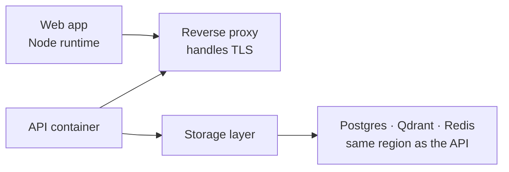

### Production Setup

A Node process serves the Next.js rendering and its API routes. Services run as single non-root container images behind NGINX, which is mostly about preventing the environment drift that makes production bugs unreproducible locally.

Migrations run to completion before the API boots, so a half-migrated schema is never serving traffic. Postgres, Qdrant, and the API containers sit in one region. The latency saved is small per call and considerable across a crawl. Health checks allow a 90-second grace period, because the local sentence-transformer models need that long to load into memory on a cold start and would otherwise be killed mid-boot. COOP and COEP headers are set on the frontend, which the WebAssembly sandbox requires to run at all.

---

## 10. Challenges We Expect

| Risk | How we handle it |
| :--- | :--- |
| Candidates with almost no history | Renormalized weights plus a visible confidence ratio, so a thin profile reads as thin rather than as bad. |
| Metric farming | Peer-relative scoring, with lower weights on the metrics that are cheapest to farm. |
| Wrongly penalising an honest candidate | Every flag goes to a human, and the AI-text detector has a hard confidence ceiling. |
| Bias in the scoring itself | Full sub-score breakdowns are persisted, which is the precondition for auditing the algorithm at all. |
| Crawls that take minutes | Real stage markers stream to the client instead of an indefinite spinner. |
| Weights being guesses | Components are stored separately so they can be retrained against placement outcomes. |

Two of these are worth being blunt about. The initial weights are informed guesses, and they stay guesses until there is enough placement data to fit them properly. And scoring on GitHub activity carries a bias of its own: people with time to contribute to open source are not a random sample of good engineers. Renormalization keeps an empty GitHub from becoming a zero, but it does not make the metric neutral. The demographic audit in Phase 2 exists because of this, not as an afterthought.

---

## 11. MVP & Repository

**GitHub Repository:** https://github.com/prasadbhalerao1/TRACE

The repository contains the full monorepo described in §3: the Next.js frontend, the FastAPI gateway, all seven agent domains, and the migration and seed scripts needed to bring the stack up locally.

---

## 12. What We Do After Deployment

The first work after launch is fitting the weights to real hiring data, which requires score versioning to land alongside it, because otherwise updating a formula silently invalidates every historical record. Perplexity-based models would also replace the current text-style heuristics, which are the weakest component in the system today.

After that: recruiter-defined scoring profiles for companies that weight things differently, a demographic bias audit across the scoring path, ATS webhooks for Greenhouse and Lever, and assessment runtimes for JavaScript, Java, and C++.

Further out sit career trajectory modelling, team composition tools for organizers, and resume parsing beyond English.

One thing is deliberately absent from all three phases. TRACE will not auto-reject anyone. It ranks, explains, and shows evidence; the decision stays with a person who can be asked to justify it.

---

**TRACE** · Talent Reliability & Assessment through Credential Evidence · Team The Big Oh's
