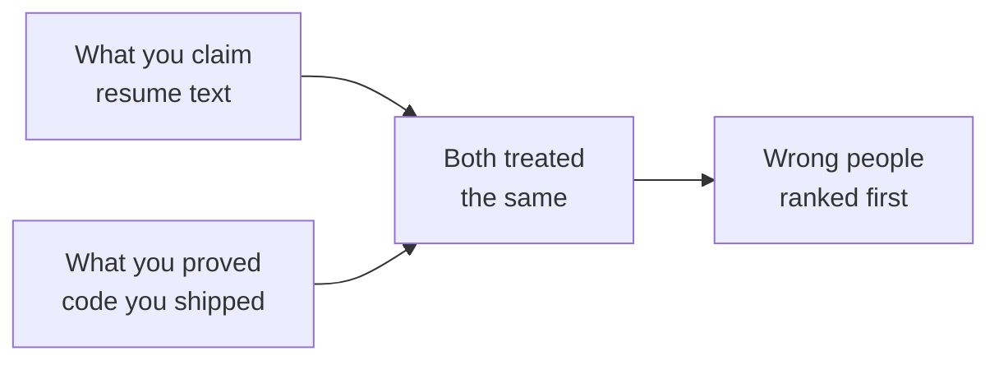
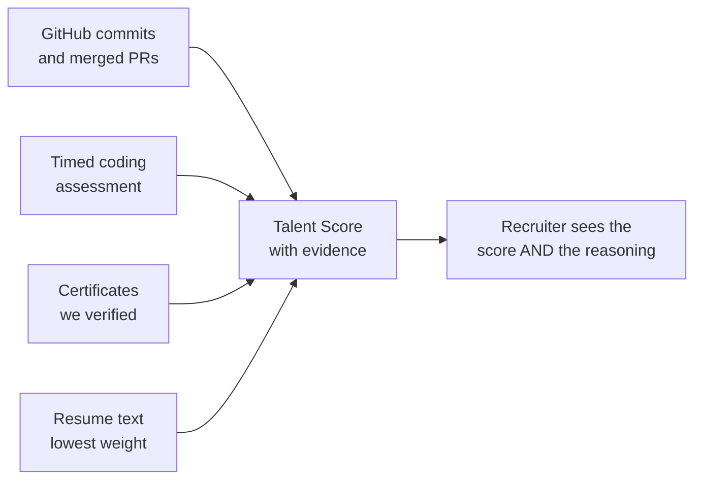
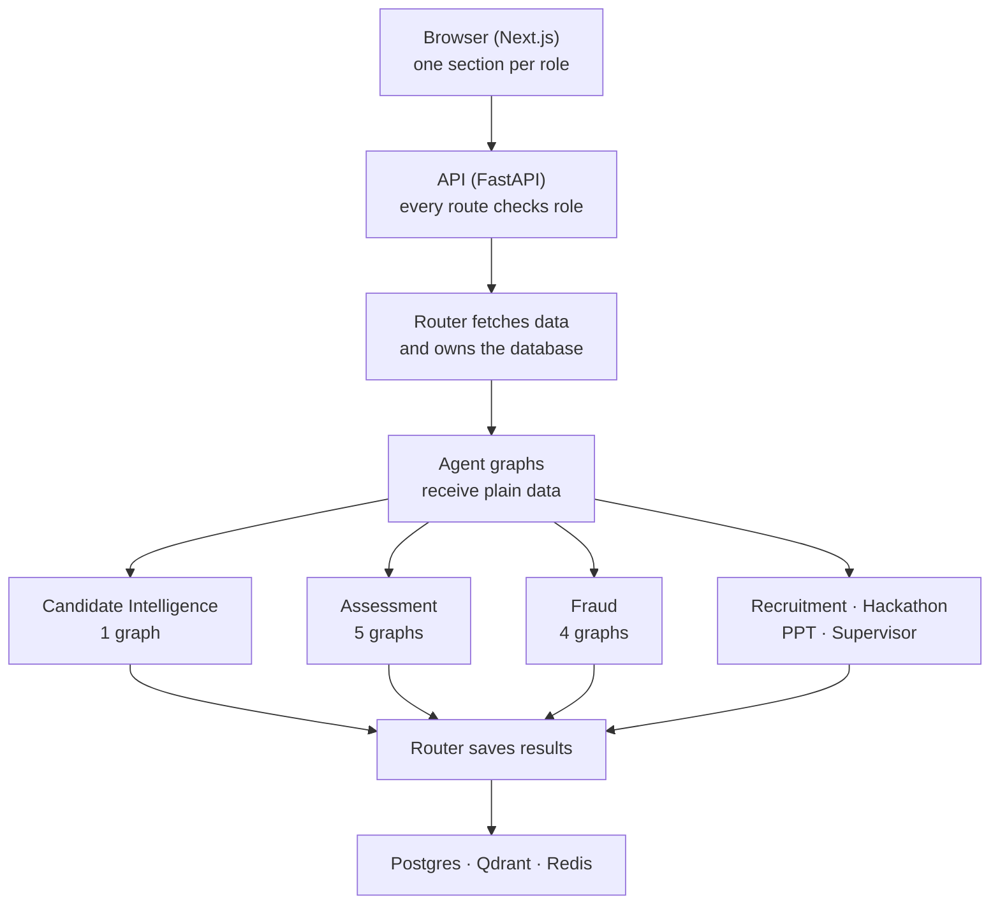
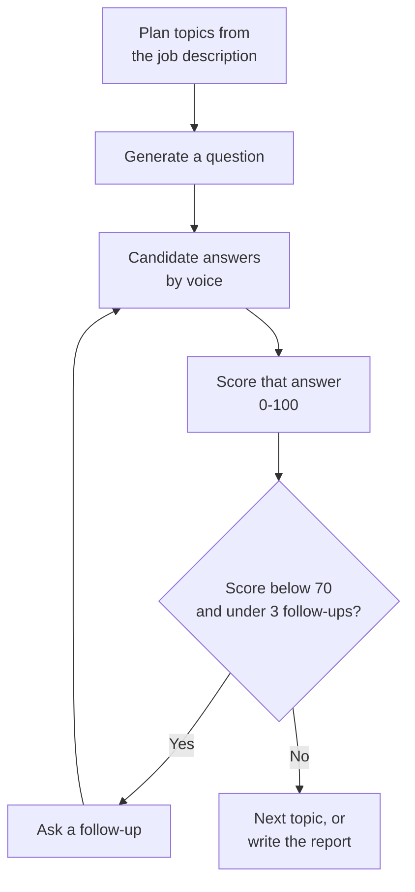
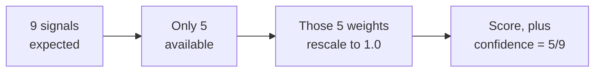
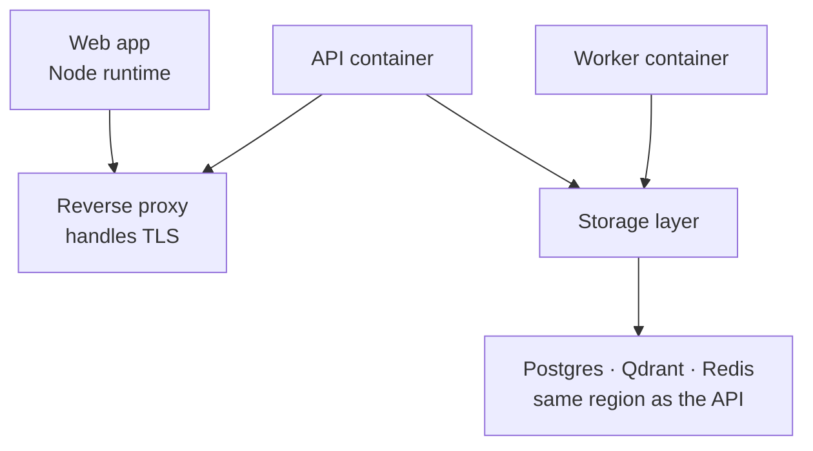
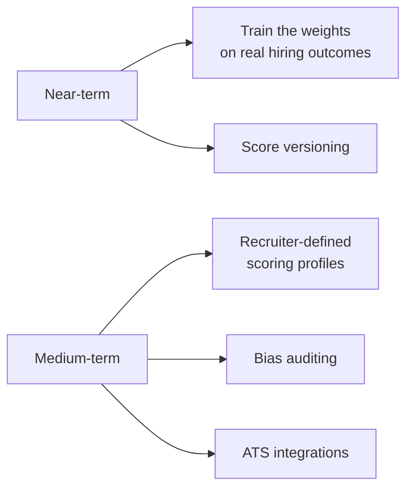
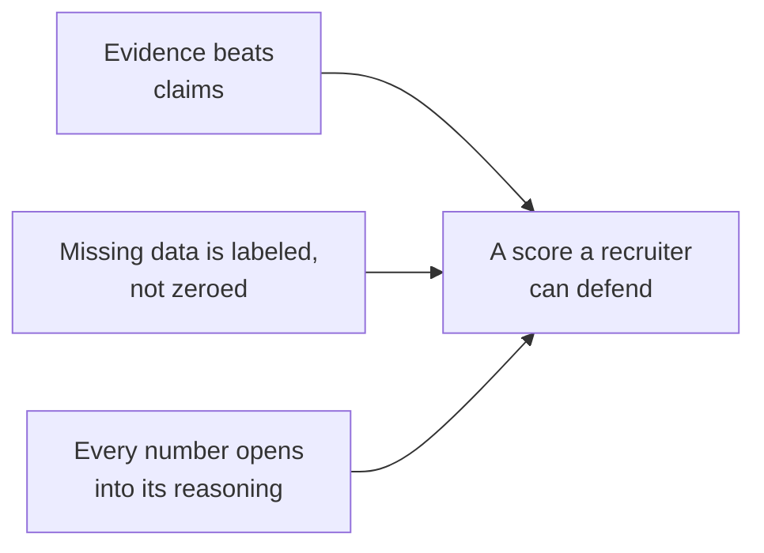

# Overwatch
### AI Talent Intelligence & Recruitment Platform
**Team: The Big Oh's** · Phase 1 Submission

*10 slides. Slide 1 opens, slide 10 closes, slides 2–9 carry the eight required points.*

---

# Slide 1: Overwatch

## Hiring based on what people built, not what they wrote

**Team: The Big Oh's**

> A resume is a claim. A commit is evidence.
> We score the evidence.

---

# Slide 2: The Problem

## Hiring runs on documents nobody checks

A resume says five years of Python. A certificate says a credential. Recruiters read all of it and guess.

**Everything below comes from that one confusion.**

| Who | What breaks for them |
| :--- | :--- |
| **Recruiter** | Keyword search rewards keyword stuffing. It misses a candidate who wrote "Vue" when the job says "React". And the ranked list arrives with no reasoning. Challenged six months later, there is nothing to reconstruct |
| **Candidate** | A strong engineer with a plain resume loses to a weaker one with better wording. Freshers score near zero, because most systems read "no data" as "bad" |
| **Organizer** | A hackathon produces exactly what recruiters want: real code, under a timer, judged by experts. Then the event ends and all of it is deleted |

> **The people who get through are the ones who write the best claims, not the ones who write the best code.**

---

# Slide 3: Our Idea

## Flip which input gets trusted

We score people on things that are **expensive to fake**: commit history, pull requests merged into repos they don't own, code written under a timer, answers given live in an interview.

**The resume becomes the weakest input, not the main one.**

### What a candidate actually experiences

A student connects GitHub. We read her repos, find real Rust and TypeScript, and check that against her two certificates. Her resume says "expert in machine learning" but no repo backs it, so we show her that as unverified rather than quietly accepting it or quietly deleting it. She takes a timed test. **Score: 74, with a note that 3 of 9 signals are missing.**

A recruiter hiring for Rust searches in plain English. She ranks high because her *verified* Rust work fits, not because of her wording. He opens the score and sees which repos produced it.

### One rule holds the whole system together

# Nothing moves a number silently

- **Missing data is never zero.** The weight shifts to the signals we do have, and we tell the candidate which ones dropped.
- **No bare numbers.** Every score is stored with its parts, so any decision can be explained later.
- **Detection is not a verdict.** A fraud flag changes nothing until a human upholds it.

---

# Slide 4: How We Build It: Multi-Agent Architecture

**"Multi-agent" here means 12 LangGraph state machines across 7 domains, each with defined steps and typed state. Not chatbots negotiating with each other.**

### Three rules every graph follows

| Rule | Why it matters |
| :--- | :--- |
| **Graph nodes never touch the database** | The router fetches data first and passes it in. So scoring logic is a pure function, testable with no database, reviewable by someone who doesn't know the rest of the code |
| **Never invent a value on failure** | Missing data raises a typed error. The caller decides to skip or retry. No node ever returns `0.0` or `"unknown"` as a stand-in for a real answer |
| **Every run is recorded** | Each graph run writes an `agent_runs` row with its inputs, output and model. That record is what the evidence receipt reads from |

### Real branching, not one big prompt: the interview graph

The route depends on the live score. Wrapping a whole interview in one prompt would be an hour of token soup with no decision points in it.

---

# Slide 5: The Math, In Plain Terms

### The one formula everything reuses

When a signal is missing, drop it and share its weight among the rest:

$$S = \frac{\sum_{i \in A} w_i S_i}{\sum_{i \in A} w_i}$$

$A$ is the set of signals we actually have. **If we have nothing, the answer is _undefined_, never 0.**

> Returning 0 would be easy and wrong. A candidate with no data would look identical to one who truly scored zero. Five modules share this one function.

### Talent Score: 9 signals

$$S_{\text{talent}} = \sum_{i \in A} w_i' S_i$$

| Signal | Weight | | Signal | Weight |
| :--- | ---: | :--- | :--- | ---: |
| Coding Ability | 0.16 | | Open Source | 0.10 |
| Problem Solving | 0.16 | | Hackathon | 0.10 |
| Project Quality | 0.12 | | Consistency | 0.08 |
| Innovation | 0.12 | | Community | 0.08 |
| | | | Leadership | 0.08 |

**Evidence Confidence** ships beside it: $C = |A| / 9$. Someone scoring 72 on three signals and someone scoring 72 on nine are different propositions. We never hide the score. **We label it.**

### Match Score: 4 parts

$$M = 0.35\,O + 0.30\,\Sigma + 0.15\,E + 0.20\,T$$

*skill overlap · semantic similarity · experience fit · talent alignment*

**Skill overlap is where anti-gaming lives.** For each skill the job requires:

$$c(r) = \begin{cases} 1.0 & \text{verified} \\ 0.6 & \text{claimed on resume only} \\ 0.6 \times \sigma(r) & \text{similar skill}, \ \sigma \geq 0.80 \\ 0 & \text{nothing} \end{cases}$$

That **0.6 is a real coefficient in the code**, not a UI badge, which is precisely why keyword stuffing scores lower than real work.

**Experience stops at the bar:** $E = 100\min(y_C / y_{\min},\ 1)$. A 20-year veteran isn't a "200% match" for a 2-year role.

### Anti-gaming: rank against real people

$$\text{pct}(x) = \frac{100}{|\mathcal{P}|}\bigl|\{v \in \mathcal{P} : v \leq x\}\bigr|$$

A fixed published formula is farmable. Buy stars until you clear it. A percentile isn't, because nobody controls everyone else's numbers. **Under 30 candidates we fall back**, rather than claim a precision we don't have.

**Old work counts less:** $w(t) = e^{-t\ln 2/180}$. A signal halves every 6 months.

---

# Slide 6: Tools, And Why Each One

| Layer | What we use | Why this one |
| :--- | :--- | :--- |
| **Backend** | Python, FastAPI, SQLAlchemy | Async throughout, and the AI ecosystem is Python-native |
| **Agents** | LangGraph | Explicit state machines beat opaque agent loops when a score has to be auditable |
| **Models** | Gateway over 5 providers, Anthropic default | Two tiers: a fast model to extract, a stronger one to judge |
| **Embeddings** | Local `bge-large-en-v1.5` | No per-call cost, no rate limit, works offline |
| **Database** | PostgreSQL, 34 tables | Relational integrity for data that decides careers |
| **Vector search** | Qdrant | Filtered search: "similar *and* remote-eligible", which pure vector stores handle that badly |
| **Frontend** | Next.js, React, TypeScript, Tailwind | One route group per role, so the access boundary is visible in the folder tree |
| **Code sandbox** | Pyodide (WebAssembly) | Candidate code runs **in their browser, never on our servers** |
| **Tracing** | Langfuse | Every model call is traceable; empty keys are a no-op, not a crash |

> **The security decision worth naming.** Running submitted code on our servers would need container isolation, syscall filtering and resource caps to be safe. In the browser sandbox, untrusted code never reaches our infrastructure. The worst case is a candidate hanging their own tab.

### What already runs

A working prototype is up, so the idea can be seen rather than just described: **12 agent graphs, 34 tables, 6 role-scoped interfaces, the full scoring core with tests, and self-hosted auth with role checks and consent records.**

---

# Slide 7: Challenges We Expect

| Challenge | How we handle it |
| :--- | :--- |
| **Cold start**: a fresher has no assessments and little history | Renormalize and label. The score is published with its confidence, never withheld or zeroed |
| **Gaming**: buy stars, stuff keywords, spin up empty repos | Percentile ranking against real peers; verified skills weighted above claimed ones in the arithmetic. Leadership is our most gameable signal, so it carries the lowest weight, 0.08 |
| **Falsely accusing someone** | Every check is advisory. Penalties apply only after a human upholds a flag. Our AI-text detector is capped at "medium" confidence forever and states plainly that false positives hit non-native English writers hardest |
| **Bias** | Every score stores its components, which is what makes auditing possible at all. Bias auditing across demographic proxies is on the roadmap |
| **A 4-minute GitHub crawl looks like a crash** | We record the pipeline stage and poll it, so the user sees real progress instead of a spinner that never changes |
| **Our weights are reasoned, not proven** | We say so openly. Every component is stored separately, so turning this into supervised learning later needs no migration |

> **A crash announces itself. A believable wrong score does not.** The dangerous failures are the ones that produce plausible output from bad input, so the architecture makes those structurally hard: undefined instead of zero, typed errors instead of fallbacks, human review before any penalty.

---

# Slide 8: Deploy & Maintain

**Today:** local servers against managed cloud data: Neon Postgres and Qdrant Cloud, Redis in Docker. The data layer is already production-shaped. The packaging is what's missing.

| Decision | Reason |
| :--- | :--- |
| **One image, two entrypoints** for API and worker | Two images double build time and invite version skew between processes that must agree on one schema |
| **Migration runs once and exits**; both services wait for it | Neither can ever start against an un-migrated database |
| **Storage sits beside the API** | Split across regions, every query pays an internet round trip, so pages feel slow while query timings look perfectly fine |
| **90-second health-check grace period** | The embedding model loads at boot. A shorter window marks a healthy container dead and starts a restart loop |
| **Cross-origin isolation headers** | The code sandbox needs them. Without them it works locally and fails in production, the kind of thing that surfaces during a demo |

---

# Slide 9: Our USP, And What Comes After

## Against the market

| | LinkedIn / Naukri | HackerRank / Codility | Greenhouse / Lever | Unstop / Devfolio | **Overwatch** |
| :--- | :--- | :--- | :--- | :--- | :--- |
| **Trusts** | Self-written profiles | One timed test | Resume text | Event submissions | Commits, PRs, timed code, live answers |
| **Covers** | Discovery only | Testing only | Pipeline only | Events only | **All four, one score** |
| **Explains a rank** | No | A single number | No | Judge opinion | Every number opens into its parts |
| **Freshers** | Invisible | Only if they test well | Filtered out | Only during an event | Renormalized and labeled |
| **After a hackathon** | — | — | — | Data dies with the event | Feeds recruiter pipelines |

Each is strong in its own lane, but none of them join up. A candidate is profiled on LinkedIn, tested on HackerRank, tracked in Greenhouse, and competes on Unstop. **Four disconnected records that never talk to each other. We make one verified identity across all four.**

## Where we focused our effort

The modules are specified. What we chose to get right is *how the arithmetic behaves at the edges*: five decisions that shaped the whole scoring layer:

| # | Decision | What it protects |
| :--- | :--- | :--- |
| **1** | **Missing data returns `None`, never `0.0`** | One shared function across five modules. A fresher gets renormalized and labeled with an Evidence Confidence figure, instead of scored near zero |
| **2** | **Verified skills weighted 1.0, claimed skills 0.6** | A real coefficient in `matching.py`, not a UI badge, which is what makes keyword stuffing score measurably lower than real work |
| **3** | **Percentile ranking, not a fixed formula** | `log1p(stars)/log1p(100)` is farmable the moment it's published. Ranking against live peers isn't, because no one controls everyone else's numbers |
| **4** | **Fraud flags do nothing until a human upholds one** | The scoring function only accepts already-upheld flags, so a detection alone structurally cannot touch a score |
| **5** | **Job-contextual scores, not one global number** | The same person legitimately scores differently for a Rust systems role than a React frontend role |

> **Computing a Talent Score is the straightforward part. The hard part is what the formula does to a candidate who has three signals instead of nine**, and that question shaped our entire scoring layer.

## After deployment

**Near-term:** every weight today is a reasoned default. Once we have outcome data (who advanced, who got hired) this becomes a supervised learning problem instead of a judgment call. Plus score versioning, so nobody's history jumps when weights change.

**Medium-term:** recruiter-defined profiles, so a startup weighting scrappiness and an enterprise weighting consistency can share one platform. Bias auditing. **Greenhouse and Lever webhooks**: no recruiter is abandoning their existing ATS, so we integrate rather than ask them to switch. Assessments in JavaScript and Java alongside Python.

### Deliberately never building: **automated rejection**

We rank, explain, and show evidence. **A human decides.** Every guardrail here assumes a person in the loop, and automating that away would invalidate the whole design.

---

# Slide 10: Thank You

# Overwatch

### Hiring based on what people built, not what they wrote

**Team: The Big Oh's**

---

## Appendix: Formulas, With Their Source Files

| Metric | Formula | Undefined when | Implemented in |
| :--- | :--- | :--- | :--- |
| Renormalized mean | $\sum_{A} w_i S_i / \sum_{A} w_i$ | No signals at all | `common/scoring.py` |
| Talent Score | $\sum_{A} w_i' S_i$, 9 terms | All sub-scores absent | `ci/tools/aggregate.py` |
| Evidence Confidence | $\lvert A \rvert / 9$ | Never | `ci/tools/aggregate.py` |
| Match Score | $0.35O + 0.30\Sigma + 0.15E + 0.20T$ | Never | `recruitment/tools/matching.py` |
| Skill Overlap | $\frac{100}{\lvert R \rvert}\sum_r c(r)$ | No required skills | `recruitment/tools/matching.py` |
| Semantic Similarity | $100[0.7\cos + 0.3F]$ | Never | `recruitment/tools/matching.py` |
| Experience Fit | $100\min(y_C/y_{\min}, 1)$ | No stated minimum | `recruitment/tools/matching.py` |
| Percentile Rank | $100\lvert\{v \leq x\}\rvert / \lvert\mathcal{P}\rvert$ | Population under 30 | `ci/tools/normalization.py` |
| Recency Weight | $e^{-t\ln 2/180}$ | Never | `ci/tools/normalization.py` |
| Coding Ability | $0.25L + 0.35Q + 0.40A$ | No repos, no assessment | `ci/tools/mechanical_scores.py` |
| Community | $0.6\,\text{pct}(s) + \min(40, 8e)$ | No GitHub activity | `ci/tools/mechanical_scores.py` |
| Leadership | $\text{pct}(\min(50,10r_o) + \min(50,5r_p))$ | No repos, no reviews | `ci/tools/mechanical_scores.py` |
| Open Source | $\text{pct}(\min(50,5e) + \min(30,3d) + \min(20,2.5\ell))$ | No external PRs | `ci/tools/open_source_score.py` |
| Technical Consistency | $\frac{100}{1+\text{CV}} - 20(1-w) + \text{bonus}$ | Under 4 active weeks | `ci/tools/github.py` |
| Hackathon Composite | $0.40J + 0.30P + 0.20Q + 0.10N$ | All components absent | `hackathon/tools/ranking.py` |
| Pitch Score | $\frac{1}{4}(I + T + Q + B)$ | All rubrics absent | `ppt_analyzer/tools/aggregate.py` |
| Authenticity | $\max(0,\ 100 - \sum p_k \mathbb{1}[\text{upheld}])$ | Never | `fraud/tools/aggregation.py` |

**Symbols:** $A$ = available signals · $w_i$ = weight · $S_i$ = component score · $\mathcal{P}$ = population of observed values · $y_C$ = candidate years · $y_{\min}$ = job minimum · $t$ = days elapsed · $\sigma(r)$ = skill embedding similarity · $O, \Sigma, E, T$ = overlap, semantic similarity, experience, talent alignment
