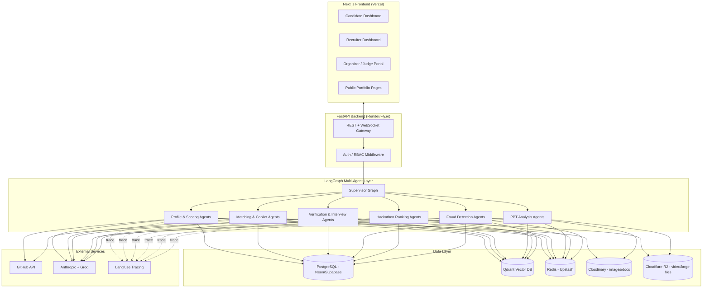

# AI Talent Intelligence & Recruitment Platform
## Master Analysis, Architecture & SRS Index

**Document set version:** 1.0
**Prepared for:** Hackathon build — treat each module below as an independently shippable full-stack AI product that plugs into one shared platform core.

---

## 1. How to use this document set

Because the problem statement explicitly says each module is "basically a completely different full-stack AI project," this deliverable is split into **one master document (this file) + seven module-level SRS documents**. This file owns everything that is *shared* across modules (tech stack, core schema, agent registry, deployment) so the module SRS docs don't repeat it — they only own what's unique to them.

| # | Document | Covers | Maps to deliverables |
|---|---|---|---|
| 00 | This file | Problem analysis, tech stack decisions, shared architecture, core schema, deployment, roadmap | Cross-cutting |
| 01 | Candidate Intelligence Platform | Talent Profile Engine, Talent Score™, Candidate Dashboard, Resume/Portfolio Builder, Career Guidance | #1, #3, #4 |
| 02 | AI Recruitment Platform | Recruiter Dashboard, Job Matching Engine, Recruiter AI Copilot, Hiring Analytics | #2, #5, #12 |
| 03 | AI Assessment & Verification System | Skill Verification, AI Interview Agent, Team Contribution Analytics | #6, #7, #8 |
| 04 | AI PPT Analyzer & Presentation Intelligence | Deck/PDF analysis, scoring, plagiarism/AI-content detection | #9 |
| 05 | Hackathon-to-Hiring Pipeline | Performance tracking, rankings, recruiter surfacing | #10 |
| 06 | Trust & Fraud Prevention System | Fake certs/projects, duplicate profiles, plagiarism, authenticity score | #11 |
| 07 | Multi-Agent Architecture (LangGraph deep-dive) | Agent registry, supervisor graph, state schema, memory, cost routing, guardrails | Cuts across all agents named in the brief |

---

## 2. Problem Analysis

### 2.1 What's actually broken today
Resume/keyword-matching ATS systems optimize for *searchability*, not *ability*. Three structural gaps show up repeatedly in the brief:

1. **Signal is scattered, not synthesized.** A candidate's real ability lives across GitHub, hackathon submissions, certificates, and pitch decks — none of which talk to each other today.
2. **Verification is manual and doesn't scale.** Recruiters can't check whether a certificate is real, whether a GitHub repo is solo work or a fork, or whether "5 years React experience" survives a 10-minute technical conversation.
3. **Hackathons are a dead end for hiring.** Thousands of judged, ranked, peer-reviewed performance data points (i.e. better signal than most interviews) evaporate the moment the event ends.

### 2.2 Design principles this SRS set follows
- **Agentic, not monolithic-prompt.** Every AI capability is a *graph of specialized agents* with typed state and explicit tool access — not one giant system prompt. This gives auditability (which agent produced which number) and lets us swap cheap/fast models in for high-volume, low-stakes steps.
- **Verification is first-class, not a bolt-on.** Every score the platform produces (Talent Score, Pitch Score, Match %) carries a *provenance trail* — which raw evidence and which agent produced it — because "AI-driven assessment" is worthless to a recruiter if it can't be justified.
- **Human-in-the-loop on adverse decisions.** Fraud flags and low scores are *risk signals with evidence*, not automatic rejections. This is both an ethical requirement and, practically, what makes recruiters trust the tool (see §7 in the Fraud Prevention SRS).
- **Everything free-tier-first, upgrade-path-ready.** Every infra choice below has a $0 tier that survives a hackathon demo and a clear paid upgrade path that doesn't require a rewrite.

---

## 3. Recommended Tech Stack (with reasoning)

Your proposed stack (Next.js / FastAPI / LangGraph / Qdrant / Postgres / Cloudinary / Redis) is genuinely close to optimal for this problem — it's kept almost entirely as-is below, with a few additions where the brief needs a capability your list didn't name yet (code execution sandboxing, background jobs, observability).

| Layer | Choice | Why this one | Free tier | Alternatives considered & why not |
|---|---|---|---|---|
| Frontend | **Next.js 14 (App Router) + TypeScript + Tailwind + shadcn/ui** | SSR for SEO on public candidate portfolios; React Server Components cut client bundle for data-heavy dashboards; shadcn gives accessible primitives without a heavy design-system lock-in | Vercel Hobby plan | Remix (smaller ecosystem for this use case), plain Vite SPA (loses SEO for portfolio pages) |
| Backend API | **FastAPI (Python 3.12), async, Pydantic v2** | Python-native = same language as the AI/agent layer, no serialization boundary between "web team" and "AI team"; auto OpenAPI docs speed up hackathon integration | Any free compute host | Node/Express (would fragment stack — AI code still has to be Python for LangGraph/ML libs) |
| ORM / migrations | **SQLAlchemy 2.0 (async) + Alembic** | Mature, async-first, plays well with FastAPI | — | Prisma-Python (less mature), raw SQL (harder to evolve schema across 7 modules) |
| AI Orchestration | **LangGraph** (your choice, confirmed optimal) | Only one of the three major frameworks with a real state machine + checkpointing + human-in-the-loop interrupts built in — exactly what's needed for the Interview Agent (multi-turn) and Recruiter Copilot (needs memory) | Open source, self-hosted | CrewAI (weaker at long-running/stateful flows), AutoGen (heavier, less production-shaped), raw function-calling loop (reinvents what LangGraph gives free) |
| LLM providers | **Anthropic Claude (Sonnet for reasoning-heavy: interviews, pitch scoring, fraud judgment) + Haiku or Groq-hosted Llama 3.3 70B (cheap, high-volume: MCQ generation, resume field extraction, tagging)** | Model routing by task cost/complexity is the single biggest lever for keeping this affordable at hackathon scale (see §7 of doc 07) | Anthropic free/dev credits; Groq has a generous free tier | Single-model-for-everything (burns budget fast on trivial tasks) |
| Embeddings | **Voyage AI `voyage-3` or OpenAI `text-embedding-3-small`**, with **open-source `bge-large-en-v1.5` via sentence-transformers** as a $0 fallback | Need both text (resume/README/pitch) and short-form (skill tag) embeddings; open fallback keeps cost at zero if API credits run out | Self-hosted fallback = permanently free | Cohere embed (fine, but one fewer vendor to manage) |
| Vector DB | **Qdrant** (your choice, confirmed optimal) | Native payload filtering (candidate location, skill tags) combined with vector search in one query — exactly the pattern the Recruiter Copilot needs ("React devs in Delhi with hackathon experience" = filter + semantic search in one call) | Qdrant Cloud free 1GB cluster, or self-host via Docker | Pinecone (no free self-host option), Weaviate (heavier ops overhead), pgvector-only (fine for MVP but loses payload-filter ergonomics at scale — kept as a fallback, see below) |
| Relational DB | **PostgreSQL** (your choice, confirmed optimal), via **Neon or Supabase** | Every module needs strong relational integrity (users, applications, pipelines) — this is not a NoSQL problem | Neon/Supabase free tier (0.5GB–3GB) | MySQL (no meaningful advantage here), Supabase-only lock-in (avoided by using plain Postgres conventions) |
| File storage | **Cloudinary** for images, resumes, and certificates (your choice, confirmed for this subset) **+ Cloudflare R2** for large files (recorded interview audio/video, original PPT/PDF decks) | Cloudinary's free tier (~25GB/25k transformations) is best-in-class for *image/document transforms* (thumbnailing certs, resizing profile photos) but is the wrong tool for large binary video; R2 has zero egress fees and a 10GB free tier | Both free-tier | Cloudinary-only (would burn transformation credits fast on video), raw S3 (has egress fees) |
| Cache / Queue | **Redis via Upstash** (your choice, confirmed) for caching + pub/sub events, **+ Arq** (async, Redis-native task queue) for background jobs | Every module has an async job (score a repo, process a PPT, run a fraud check) that must not block the request thread | Upstash free tier (10k commands/day covers hackathon demo traffic) | Celery (heavier, sync-first, more moving parts than needed here), RQ (not async-native) |
| Code execution sandbox | **Pyodide** (browser-native WASM) for candidate code execution; server-side **radon**, **lizard**, **bandit** for static analysis only | The brief needs "Coding Assessments" — sandbox runs in candidate's browser (Pyodide), eliminating server infra risk. Static analysis (complexity, coverage, security smells) stays server-side, deterministic, no execution. | Free, zero server infra | Piston/Judge0 self-hosting (adds container orchestration complexity and resource contention on free-tier hosts) |
| Auth | **Clerk** (Next.js-native DX) or **Supabase Auth** if already on Supabase Postgres | Needs multi-role auth (candidate/recruiter/organizer/judge/admin) with minimal boilerplate | Both have generous free tiers | Rolling your own JWT auth (unnecessary risk/time cost in a hackathon) |
| Realtime | **FastAPI native WebSockets** for the live Interview Agent conversation | Needed for streaming agent responses + live transcript | Free | Socket.IO (extra dependency FastAPI doesn't need) |
| Observability (LLM) | **Langfuse** (self-host free, or free cloud tier) | Every agent call needs to be traced — this is how you debug a 7-agent pipeline and how judges/recruiters get the "why this score" explainability the brief demands | Free self-host | LangSmith (great, but paid past a small quota) |
| Error monitoring | **Sentry** | Standard, free tier covers hackathon scale | Free tier | — |
| Deployment | **Vercel** (frontend) + **Render or Fly.io** (FastAPI backend) + **Neon/Supabase** (Postgres) + **Qdrant Cloud** + **Upstash** (Redis) | All have real $0 tiers that survive a demo | Free | Railway (also fine, similar free tier) |
| CI/CD | **GitHub Actions** | Free for public repos, standard | Free | — |

**On your original list:** nothing in it needs to change. The additions are: an explicit LLM-routing policy (Sonnet vs Haiku/Groq) to control cost, Arq for background jobs (Redis was already there — this just names the queue library), Pyodide for browser-side sandboxed code execution with server-side static analysis (no server container orchestration needed), R2 alongside Cloudinary for large binary files, and Clerk/Supabase-Auth + Langfuse + Sentry for auth and observability, which the original list didn't cover.

---

## 4. High-Level System Architecture



---

## 5. Shared Core Schema (every module builds on this)

These tables live in one Postgres database and are the only tables other modules are allowed to foreign-key into directly (each module's own tables stay in its own SRS doc).

```sql
-- Identity & access
CREATE TABLE organizations (
    id UUID PRIMARY KEY DEFAULT gen_random_uuid(),
    name TEXT NOT NULL,
    domain TEXT,
    org_type TEXT CHECK (org_type IN ('company','university','hackathon_organizer')),
    created_at TIMESTAMPTZ DEFAULT now()
);

CREATE TABLE users (
    id UUID PRIMARY KEY DEFAULT gen_random_uuid(),
    email TEXT UNIQUE NOT NULL,
    full_name TEXT,
    role TEXT NOT NULL CHECK (role IN ('candidate','recruiter','organizer','judge','admin')),
    organization_id UUID REFERENCES organizations(id),
    auth_provider_id TEXT,               -- Clerk/Supabase Auth subject id
    created_at TIMESTAMPTZ DEFAULT now(),
    is_active BOOLEAN DEFAULT true
);

-- Shared file registry (points into Cloudinary or R2, never store binaries in Postgres)
CREATE TABLE files (
    id UUID PRIMARY KEY DEFAULT gen_random_uuid(),
    owner_user_id UUID REFERENCES users(id),
    storage_provider TEXT CHECK (storage_provider IN ('cloudinary','r2')),
    storage_key TEXT NOT NULL,
    public_url TEXT,
    file_type TEXT,                       -- resume | certificate | ppt | interview_audio | photo
    uploaded_at TIMESTAMPTZ DEFAULT now()
);

-- Centralized Consent Management (PII, Biometrics, Photo Hash, Resume Scraping)
CREATE TABLE consents (
    consent_id UUID PRIMARY KEY DEFAULT gen_random_uuid(),
    candidate_id UUID NOT NULL REFERENCES users(id),
    consent_type TEXT NOT NULL CHECK (consent_type IN ('resume_parsing', 'linkedin_export', 'voice_interview', 'perceptual_photo_hash', 'ai_assessment')),
    status TEXT NOT NULL DEFAULT 'granted' CHECK (status IN ('granted', 'revoked')),
    granted_at TIMESTAMPTZ NOT NULL DEFAULT NOW(),
    revoked_at TIMESTAMPTZ,
    ip_address INET,
    terms_version TEXT NOT NULL DEFAULT '1.0'
);

-- Cross-module event bus (drives async agent jobs via Arq worker polling / Redis pub-sub)
CREATE TABLE events (
    id UUID PRIMARY KEY DEFAULT gen_random_uuid(),
    event_type TEXT NOT NULL,             -- e.g. 'hackathon.submission.scored', 'profile.updated'
    payload JSONB NOT NULL,
    created_at TIMESTAMPTZ DEFAULT now(),
    processed_at TIMESTAMPTZ
);

-- Every AI-produced score/verdict across all modules logs here for explainability & audit
CREATE TABLE agent_runs (
    id UUID PRIMARY KEY DEFAULT gen_random_uuid(),
    agent_name TEXT NOT NULL,
    subject_type TEXT NOT NULL,           -- 'candidate' | 'presentation' | 'application' | ...
    subject_id UUID NOT NULL,
    input_ref JSONB,
    output JSONB,
    model_used TEXT,
    langfuse_trace_id TEXT,
    created_at TIMESTAMPTZ DEFAULT now()
);

CREATE TABLE audit_logs (
    id UUID PRIMARY KEY DEFAULT gen_random_uuid(),
    actor_user_id UUID REFERENCES users(id),
    action TEXT NOT NULL,
    target_type TEXT,
    target_id UUID,
    created_at TIMESTAMPTZ DEFAULT now()
);
```

Every module SRS references `users.id`, `files.id`, `consents.consent_id`, and logs through `agent_runs` — this is what makes the "AI Talent Score has provenance" and "Fraud Risk Report has evidence" requirements actually implementable instead of just a UI label.

---

## 6. Cross-Cutting Concerns

- **RBAC & User Actors:** Five roles (`candidate`, `recruiter`, `organizer`, `judge`, `admin`) enforced in FastAPI dependency-injected middleware. Dedicated UI workflows are specified for all actors, including specialized Judge evaluation portals (rubric scoring, pitch feedback, team review) and Organizer management views.
- **Cross-Module Communication & Decoupling:** Modules never execute business-logic methods across module boundaries synchronously. Core domains maintain ownership of their internal entities, while cross-module updates (e.g. badge awards from assessment pass, certification verification status from fraud checks) are driven asynchronously via background event bus handlers (`events` table & Redis pub-sub) writing to dedicated status fields or read-model projections.
- **Model routing policy** (detailed in doc 07): cheap/fast model for extraction & classification (Haiku / Groq), Sonnet-tier for judgment calls that appear in a report a human will read and act on (interview verdicts, fraud verdicts, pitch scores).
- **Every score is explainable:** each `agent_runs` row stores the exact inputs and the model's rationale — this is a non-negotiable requirement, not a nice-to-have, because the brief's core value prop is "trusted," not just "automated."
- **PII & consent compliance:** Ingestion of GitHub/LinkedIn data, biometric/voice signals, photo perceptual hashing, and resume parsing strictly check the central `consents` table before processing and support candidate data deletion requests.

---

## 7. Suggested Build Order & Time-Boxing Strategy

Given 12 mandatory deliverables and a fixed judging window, build in this order — each phase is independently demoable:

1. **Foundation (Day 1):** shared schema, auth, Candidate Dashboard shell, Recruiter Dashboard shell, Judge/Organizer portal shell — no AI yet, just CRUD + navigation.
2. **Core AI loop (Day 1–2):** AI Talent Profile Engine + Talent Score (doc 01) — this is the data every other module consumes, build it first.
3. **Matching (Day 2):** Job Matching Engine + Recruiter Copilot (doc 02) — depends on #2.
4. **Verification (Day 2–3):** Skill Verification + Interview Agent (doc 03) — highest technical complexity.
   - *Sandbox Fallback Strategy:* Primary execution uses Docker-sandboxed Piston. If Piston container orchestration encounters latency or network failures, the engine falls back gracefully to restricted client-side WASM (Pyodide) execution + AST static analysis with explicit UI status banners.
   - *Voice Fallback:* Descope voice-interview to real-time text-chat WebSocket stream if time-constrained.
5. **PPT Analyzer (Day 3):** doc 04 — self-contained, can be built in parallel with #4 by a second sub-team.
6. **Hackathon Pipeline (Day 3–4):** doc 05 — depends on #2 (PPT scores) feeding rankings.
7. **Fraud Prevention (Day 4):** doc 06 — layer on top once real data exists to check against.
8. **Polish, Hiring Analytics Dashboard, demo script (Day 4–5).**

> [!NOTE]
> **v2 Bonus Feature Deferral Rationale:** Advanced bonus features (Campus Talent Heatmaps, Community Reputation Score, Graph-Based Talent Intelligence Engine, Predictive Hiring Analytics, Open Source Reputation System) are explicitly deferred to v2. This preserves dev velocity and ensures 100% test coverage and reliability across all 12 mandatory deliverables within the hackathon window.

---

## 8. Judging-Criteria Alignment

| Criteria | Weight | Where this SRS set addresses it |
|---|---|---|
| Innovation & Originality | 20% | Multi-agent provenance model (doc 07), hackathon-to-hiring live pipeline (doc 05), structural code-clone & perceptual image hashing |
| AI Implementation | 20% | LangGraph supervisor architecture, explicit model routing (Sonnet vs Haiku), structured-output scoring (all module docs + doc 07) |
| Technical Complexity | 15% | Piston sandbox execution with WASM fallback, embedding-based matching, multi-modal PPT analysis, fraud visual & code-clone forensics |
| User Experience | 15% | Role-specific candidate/recruiter/organizer dashboards, dedicated Judge rubric evaluation portal, explainable score breakdowns, real-time interview UI |
| Scalability & Architecture | 15% | Event-driven module decoupling, centralized consent ledger, free-tier-to-paid upgrade path with no rewrite (§3, §5, §6) |
| Business Impact | 15% | Reduced screening time (Recruiter Copilot), verified hiring signal (Fraud + Verification), direct hackathon-to-hire funnel |

---

*Continue to `01-SRS-Candidate-Intelligence-Platform.md` for the first module.*
