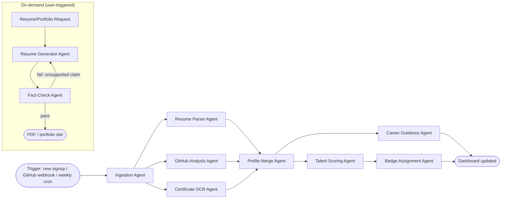

# SRS — Module 1: Candidate Intelligence Platform

**Depends on:** `00-Master-Architecture-and-Analysis.md` (shared schema, stack, agent conventions)
**Consumed by:** Recruitment Platform (doc 02), Hackathon Pipeline (doc 05), Fraud Prevention (doc 06)

---

## 1. Scope

This module owns everything about *building and presenting a verified candidate identity*: the AI Talent Profile Engine, the AI Talent Score™, the Candidate Dashboard, the AI Resume & Portfolio Builder, and the AI Career Guidance System. Treat this as the "candidate-facing product" — a self-contained app with its own onboarding, data ingestion, and dashboard.

## 2. Actors

| Actor | Interaction |
|---|---|
| Candidate | Owns their profile, triggers ingestion, views score/dashboard, generates resume/portfolio |
| Recruiter (read-only here) | Views a candidate's public/shared profile via doc 02 |
| System (background agents) | Periodic re-scoring on new GitHub activity |

## 3. Functional Requirements

### FR-1: AI Talent Profile Engine
- FR-1.1 Candidate connects GitHub (OAuth) → system pulls repos, commit history, languages, stars, PR/issue activity via GitHub REST + GraphQL APIs. Each candidate authorizes with their own GitHub account token; no shared server-side token is used.
- FR-1.2 Candidate uploads resume (PDF/DOCX) → parsed into structured fields (education, experience, skills, projects).
- FR-1.3 Candidate optionally imports LinkedIn profile data via manual export upload (LinkedIn "Download your data" ZIP/PDF export; no third-party scrapers or paid enrichment APIs used).
- FR-1.4 Candidate uploads certifications (image/PDF) → OCR + structured extraction (issuer, title, date, credential ID).
- FR-1.5 System merges all sources into one canonical `candidate_profile` record, flagging conflicts (e.g., resume says "5 yrs Python," GitHub activity says 1 yr) for the candidate to resolve.
- FR-1.6 Profile auto-refreshes weekly via background job (Arq scheduled task) pulling new GitHub activity.

### FR-2: AI Talent Score™
- FR-2.1 Compute 7 sub-scores (0–100 each): Coding Ability, Project Quality, Leadership, Problem Solving, Innovation, Community Participation, Technical Consistency.
- FR-2.2 Compute weighted overall score with configurable weights (admin-tunable, defaults below).
- FR-2.3 Every sub-score stores its evidence trail in `agent_runs` (which repos/commits/assessment results produced the number).
- FR-2.4 Score recalculates on: new GitHub activity, new assessment result (doc 03), new hackathon result (doc 05).
- FR-2.5 Candidate can view score history (`score_history` table) as a trend line.

**Default sub-score weighting** (tunable):

| Sub-score | Weight | Primary inputs |
|---|---|---|
| Coding Ability | 20% | GitHub language depth, commit quality, doc 03 coding-assessment results |
| Project Quality | 20% | LLM review of README/architecture + code complexity metrics |
| Problem Solving | 15% | doc 03 assessment results (MCQ + coding) |
| Innovation | 15% | Embedding-uniqueness of projects vs corpus, LLM novelty judgment |
| Technical Consistency | 15% | Commit frequency/regularity over time, contribution graph |
| Community Participation | 10% | GitHub followers/stars, OSS contributions to external repos, hackathon participation count |
| Leadership | 5% | Maintainer status, PR review activity, team-lead flags from doc 03 team analytics |

### FR-3: Candidate Dashboard
- FR-3.1 Talent Analytics: score breakdown radar chart + trend line.
- FR-3.2 Skill Reports: extracted skill list with confidence + verification badges.
- FR-3.3 Job Recommendations: pulled from doc 02's matching engine (this module only renders, doesn't compute).
- FR-3.4 Career Insights: surfaced from FR-4 below.
- FR-3.5 Verified Skill Badges: awarded when a skill is corroborated by ≥2 independent sources (e.g., GitHub usage + passed assessment) — badge logic lives here, not in Fraud module.

### FR-4: AI Career Guidance System
- FR-4.1 Skill Gap Analysis: embed candidate's skill set, compare against embedded requirement sets of target roles (Qdrant similarity), output ranked gap list.
- FR-4.2 Recommended Certifications: map each gap to a curated course catalog (seed dataset of Coursera/freeCodeCamp/official-vendor course metadata — do not scrape live; use a maintained static catalog table to avoid ToS issues).
- FR-4.3 Career Roadmaps: LLM-generated staged roadmap (structured output: stages → skills → estimated timeline).
- FR-4.4 Salary Predictions: regression model (see §7) trained on the Stack Overflow Developer Survey (downloadable public dataset) — clearly labeled as an *estimate range*, never a single number, to avoid false precision.
- FR-4.5 Learning Recommendations: same catalog as FR-4.2, filtered by gap priority.

### FR-5: AI Resume & Portfolio Builder
- FR-5.1 Generate ATS-friendly resume (clean structure, no tables/graphics that break ATS parsers) as PDF.
- FR-5.2 Generate dynamic portfolio website: a public Next.js route `/[username]` rendering profile + projects + verified badges, SSR'd for SEO.
- FR-5.3 Generate cover letters: LLM-drafted, parameterized by target job description (pulled from doc 02 when applying).
- FR-5.4 Company-specific resume optimization: given a target JD, re-rank/re-word bullet points to emphasize matching keywords/skills — must stay factually grounded in the candidate's actual profile (no fabrication; enforce via prompt + a post-generation fact-check agent that diffs claims against `candidate_profile`).

## 4. Agent Architecture (LangGraph)



**State schema (shared across this subgraph):**
```python
from typing import TypedDict, Optional
from pydantic import BaseModel

class SubScore(BaseModel):
    value: float          # 0-100
    evidence: list[str]   # agent_run ids / raw refs
    rationale: str

class CandidateProfileState(TypedDict):
    candidate_id: str
    raw_resume_text: Optional[str]
    github_username: Optional[str]
    github_raw: Optional[dict]
    linkedin_raw: Optional[dict]
    certificates: list[dict]
    merged_profile: Optional[dict]
    sub_scores: dict[str, SubScore]
    overall_score: Optional[float]
    conflicts: list[str]
    career_recommendations: Optional[dict]
```

**Agents & responsibilities:**

| Agent | Model tier | Tools | Notes |
|---|---|---|---|
| Ingestion Agent | n/a (orchestration only) | — | Fan-out router |
| Resume Parser Agent | Haiku/Groq (cheap, high-volume) | Structured-output extraction (Pydantic schema) over PDF text (extracted via `pdfplumber`/`PyMuPDF`) | Fast, deterministic-ish extraction task |
| GitHub Analysis Agent | Haiku for summarization, code metrics computed by tools (not LLM) | `PyGithub`/GraphQL client, `radon` (complexity), `lizard`, language stats | Quantitative metrics come from code, LLM only summarizes/judges quality |
| Certificate OCR Agent | Haiku + vision | Tesseract OCR or Claude vision on cert image, regex/structured extraction | Flags low-confidence extractions for manual review |
| Profile Merge Agent | Haiku | Rule-based conflict detection + LLM conflict summary | Deterministic merge rules first, LLM only explains conflicts to the user |
| Talent Scoring Agent | **Sonnet** for Project Quality & Innovation sub-scores (judgment calls); Haiku/rules for the rest | Qdrant similarity search (Innovation), `agent_runs` writer | This is the highest-stakes output in the module — use the stronger model here |
| Badge Assignment Agent | Rules-only (no LLM needed) | — | Deterministic corroboration-count logic |
| Career Guidance Agent | Sonnet (roadmap reasoning) + Haiku (course mapping) | Qdrant (skill-gap similarity), salary regression model (scikit-learn, served via a small internal endpoint) | |
| Resume Generator Agent | Sonnet | Templating + LLM rewriting | |
| Fact-Check Agent | Haiku | Diffs generated claims against `merged_profile` | Cheap but mandatory guardrail against fabrication |

## 5. Data Model (module-specific tables)

```sql
CREATE TABLE candidate_profiles (
    id UUID PRIMARY KEY DEFAULT gen_random_uuid(),
    user_id UUID UNIQUE REFERENCES users(id),
    github_username TEXT,
    headline TEXT,
    location TEXT,
    skills JSONB,                -- [{name, source, confidence}]
    experience JSONB,
    education JSONB,
    merged_conflicts JSONB,
    updated_at TIMESTAMPTZ DEFAULT now()
);

CREATE TABLE github_snapshots (
    id UUID PRIMARY KEY DEFAULT gen_random_uuid(),
    candidate_id UUID REFERENCES candidate_profiles(id),
    repo_full_name TEXT,
    stars INT, forks INT,
    commit_count INT, pr_count INT, issue_count INT,
    languages JSONB,
    is_fork BOOLEAN,
    fetched_at TIMESTAMPTZ DEFAULT now()
);

CREATE TABLE certifications (
    id UUID PRIMARY KEY DEFAULT gen_random_uuid(),
    candidate_id UUID REFERENCES candidate_profiles(id),
    file_id UUID REFERENCES files(id),
    issuer TEXT, title TEXT, issue_date DATE, credential_id TEXT,
    ocr_confidence FLOAT,
    verification_status TEXT DEFAULT 'unverified'  -- see doc 06
);

CREATE TABLE talent_scores (
    id UUID PRIMARY KEY DEFAULT gen_random_uuid(),
    candidate_id UUID REFERENCES candidate_profiles(id),
    coding_ability FLOAT, project_quality FLOAT, leadership FLOAT,
    problem_solving FLOAT, innovation FLOAT,
    community_participation FLOAT, technical_consistency FLOAT,
    overall FLOAT,
    computed_at TIMESTAMPTZ DEFAULT now()
);
CREATE INDEX idx_scores_candidate_time ON talent_scores(candidate_id, computed_at DESC);

CREATE TABLE badges (
    id UUID PRIMARY KEY DEFAULT gen_random_uuid(),
    candidate_id UUID REFERENCES candidate_profiles(id),
    skill_name TEXT,
    corroboration_sources JSONB,
    awarded_at TIMESTAMPTZ DEFAULT now()
);

CREATE TABLE career_recommendations (
    id UUID PRIMARY KEY DEFAULT gen_random_uuid(),
    candidate_id UUID REFERENCES candidate_profiles(id),
    skill_gaps JSONB,
    recommended_courses JSONB,
    roadmap JSONB,
    salary_estimate_low INT, salary_estimate_high INT,
    generated_at TIMESTAMPTZ DEFAULT now()
);
```

**Qdrant collections:**
- `candidate_project_embeddings` — payload: `{candidate_id, repo_name, description_embedding}`, used for Innovation sub-score (novelty vs corpus) and for doc 02's Project Relevance Score.
- `skill_taxonomy_embeddings` — canonical skill/role embeddings used for Skill Gap Analysis.

## 6. API Endpoints (FastAPI)

```
POST   /api/v1/candidates/{id}/ingest/github        # trigger GitHub pull
POST   /api/v1/candidates/{id}/ingest/resume         # multipart upload
POST   /api/v1/candidates/{id}/ingest/certificate     # multipart upload
GET    /api/v1/candidates/{id}/profile                # merged profile
GET    /api/v1/candidates/{id}/score                   # latest talent score
GET    /api/v1/candidates/{id}/score/history
GET    /api/v1/candidates/{id}/dashboard                # aggregated dashboard payload
GET    /api/v1/candidates/{id}/career-guidance
POST   /api/v1/candidates/{id}/resume/generate          # {target_job_id?: str} -> PDF url
POST   /api/v1/candidates/{id}/portfolio/publish
POST   /api/v1/candidates/{id}/cover-letter/generate    # {job_id: str}
```

Example response — `GET /score`:
```json
{
  "overall": 78.4,
  "sub_scores": {
    "coding_ability": {"value": 82, "evidence": ["agent_run:...","agent_run:..."]},
    "project_quality": {"value": 75, "evidence": ["agent_run:..."]},
    "innovation": {"value": 70, "rationale": "Project X shows above-median novelty vs 4,200 indexed submissions."}
  },
  "computed_at": "2026-07-20T10:00:00Z"
}
```

## 7. Career Guidance: model details
- **Skill Gap Analysis:** cosine similarity in Qdrant between candidate skill-embedding centroid and target-role embedding; gaps = role skills with similarity below threshold and no direct match in `candidate_profiles.skills`.
- **Salary Prediction:** gradient-boosted regression (`scikit-learn` `GradientBoostingRegressor` or `xgboost`) trained offline on Stack Overflow Developer Survey data, features = role, location, years-of-experience-proxy (from GitHub activity span), talent score. Output as a range (e.g. 25th–75th percentile), never a point estimate — this is both more honest statistically and avoids misleading candidates.

## 8. Frontend (Next.js)

```
app/
  (candidate)/
    dashboard/page.tsx            -- score radar (recharts), trend line, badges grid
    profile/edit/page.tsx         -- ingestion triggers, conflict resolution UI
    career/page.tsx               -- roadmap timeline, course cards, salary range chart
    resume-builder/page.tsx       -- live preview + "optimize for this JD" input
  [username]/page.tsx             -- PUBLIC portfolio (SSR, no auth)
components/
  ScoreRadarChart.tsx (recharts)
  ScoreTrendLine.tsx (recharts)
  BadgeGrid.tsx
  ConflictResolver.tsx
  RoadmapTimeline.tsx
```

## 9. Libraries & External APIs — full list

| Purpose | Library / API |
|---|---|
| GitHub data | `PyGithub`, GitHub GraphQL v4 API (for efficient batched queries) |
| Resume parsing | `pdfplumber`, `PyMuPDF` (fitz), `python-docx`; structured extraction via Claude/Haiku structured output (preferred over regex-heavy libs like `pyresparser`, which are brittle) |
| OCR | `pytesseract` (Tesseract) for certificates; Claude vision as fallback for low-quality scans |
| Code metrics | `radon`, `lizard` (complexity/maintainability), `tokei` (language line counts) |
| Embeddings | Voyage AI `voyage-3` / OpenAI `text-embedding-3-small`; `sentence-transformers` (`BAAI/bge-large-en-v1.5`) as free fallback |
| Vector search | `qdrant-client` |
| PDF generation | `WeasyPrint` (HTML/CSS → PDF, best for ATS-clean resumes) |
| Portfolio hosting | Next.js dynamic route, ISR (Incremental Static Regeneration) for public pages |
| Salary model | `scikit-learn` / `xgboost`, served via internal FastAPI route |
| Background jobs | `arq` (Redis-based) for weekly GitHub refresh cron |
| Task tracing | Langfuse SDK |
| LinkedIn note | LinkedIn does not expose third-party profile scraping APIs; do not use third-party scrapers or paid enrichment services. Candidates import their data by uploading their own LinkedIn "Download your data" ZIP/PDF export, parsed alongside candidate resume & GitHub signals. |

## 10. Non-Functional Requirements

- **Consent Ledger Verification:** All profile ingestion activities (GitHub parsing, resume parsing, LinkedIn data import) require active consent records in the central `consents` table (`consent_type = 'resume_parsing'` / `'linkedin_export'`).
- Profile ingestion (GitHub + resume) completes in **< 30s** for typical candidate (≤20 repos).
- Talent Score recompute triggered async (not blocking dashboard load) — dashboard shows last-computed score with a "recalculating…" indicator if a job is in flight.
- All LLM-derived claims in generated resumes must pass the Fact-Check Agent before being shown — zero tolerance for fabricated experience.
- Public portfolio pages must pass Lighthouse SEO ≥ 90.

## 11. Success Metrics
- % of profile fields auto-filled without manual edit.
- Score-to-hire correlation (tracked once doc 02 pipeline data exists).
- Time from signup to complete verified profile.
