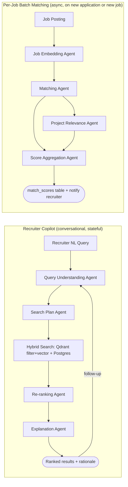

# SRS — Module 2: AI Recruitment Platform

**Depends on:** `00-Master-Architecture-and-Analysis.md`, reads candidate data produced by doc 01, receives assessment/interview results from doc 03, receives hackathon signals from doc 05, receives fraud flags from doc 06.

---

## 1. Scope

Everything recruiter-facing: the Recruiter Dashboard, the AI Job Matching Engine, the Recruiter AI Copilot (natural-language candidate search), the recruitment pipeline (kanban-style), and the Hiring Analytics Dashboard (deliverable #12).

## 2. Actors

| Actor | Interaction |
|---|---|
| Recruiter | Posts jobs, searches/shortlists candidates, moves applications through pipeline stages, views analytics |
| Candidate (external) | Applies to jobs, appears in match results (read-only from this module's perspective — profile owned by doc 01) |
| Admin | Manages org-level job posting permissions |

## 3. Functional Requirements

### FR-1: Recruiter Dashboard
- FR-1.1 Candidate Discovery: browse/search/filter the candidate pool (structured filters + NL search via Copilot).
- FR-1.2 AI Shortlisting: auto-rank applicants per job by Match %.
- FR-1.3 Hiring Analytics: funnel metrics, time-to-hire, source-of-hire breakdown.
- FR-1.4 Recruitment Pipeline Management: kanban board — stages `sourced → screened → assessed → interviewed → offer → hired/rejected`.

### FR-2: AI Job Matching Engine
- FR-2.1 Candidate Match Percentage: single composite score per (candidate, job) pair.
- FR-2.2 Skill Similarity Analysis: embedding cosine similarity between candidate skill set and job requirements.
- FR-2.3 Project Relevance Score: how relevant a candidate's actual project history is to the job's domain (Qdrant similarity over `candidate_project_embeddings` from doc 01 vs job description embedding).

### FR-3: Recruiter AI Copilot
- FR-3.1 Accepts natural-language queries: *"Find top AI developers from Delhi," "Find React developers with hackathon experience," "Find candidates skilled in GenAI and Open Source."*
- FR-3.2 Converts NL query → structured filter + semantic search plan (location filter, skill embedding query, hackathon-participation boolean).
- FR-3.3 Returns ranked candidate list with a one-line explanation per result ("matched because: 3 GenAI hackathon wins, active LangChain repo").
- FR-3.4 Supports follow-up refinement in conversation ("now only show ones open to remote").
- FR-3.5 Copilot must not surface any explicit fraud-flag detail as a filter criterion the recruiter can directly select (e.g., cannot query "show me candidates with fraud flags") — those go through doc 06's dedicated review flow instead.

### FR-4: Hiring Analytics Dashboard
- FR-4.1 Funnel conversion rates per stage.
- FR-4.2 Time-to-hire distribution.
- FR-4.3 Source-of-hire breakdown (direct application vs hackathon-sourced vs copilot-search).
- FR-4.4 Diversity-of-pipeline reporting at an aggregate, non-individual level (to support fair-hiring review without exposing protected attributes per-candidate in ranking logic).

## 4. Agent Architecture (LangGraph)



**State schema (Copilot subgraph):**
```python
class CopilotState(TypedDict):
    recruiter_id: str
    conversation_id: str
    raw_query: str
    structured_filters: dict       # {location, skills, min_score, hackathon_experience: bool, ...}
    semantic_query_embedding: Optional[list[float]]
    candidate_results: list[dict]
    explanations: dict[str, str]   # candidate_id -> why matched
```

**Agents & responsibilities:**

| Agent | Model tier | Tools |
|---|---|---|
| Query Understanding Agent | Haiku/Groq (fast, needs low latency for chat feel) | Structured-output parse of NL → filter schema |
| Search Plan Agent | Haiku | Decides which filters go to Postgres `WHERE`, which go to Qdrant payload filter, builds the combined query |
| Hybrid Search execution | tool call, no LLM | `qdrant-client` filtered vector search + async SQLAlchemy query |
| Re-ranking Agent | Sonnet (only re-ranks top ~50 candidates from the cheap retrieval step — keeps cost bounded) | |
| Explanation Agent | Haiku | One-line grounded explanation per result, must cite specific evidence fields, never invent |
| Job Embedding Agent | Haiku + embedding model | Embeds JD text once per job posting |
| Matching Agent | Rules + embedding similarity (no LLM needed for the numeric score itself) | Qdrant |
| Project Relevance Agent | rules + embedding | Qdrant |
| Score Aggregation Agent | rules-only | Weighted sum, writes `agent_runs` |

## 5. Data Model

```sql
CREATE TABLE jobs (
    id UUID PRIMARY KEY DEFAULT gen_random_uuid(),
    organization_id UUID NOT NULL REFERENCES organizations(id),
    title TEXT NOT NULL,
    description TEXT NOT NULL,
    required_skills JSONB,          -- ["React", "Python", "FastAPI"]
    min_experience_years INT,
    location TEXT,
    is_remote BOOLEAN DEFAULT true,
    created_at TIMESTAMPTZ DEFAULT now()
);

CREATE TABLE applications (
    id UUID PRIMARY KEY DEFAULT gen_random_uuid(),
    job_id UUID REFERENCES jobs(id),
    candidate_id UUID REFERENCES candidate_profiles(id),
    stage TEXT CHECK (stage IN ('sourced', 'screened', 'interview_scheduled', 'offered', 'rejected')),
    applied_at TIMESTAMPTZ DEFAULT now(),
    stage_updated_at TIMESTAMPTZ DEFAULT now()
);

CREATE TABLE match_scores (
    id UUID PRIMARY KEY DEFAULT gen_random_uuid(),
    job_id UUID REFERENCES jobs(id),
    candidate_id UUID REFERENCES candidate_profiles(id),
    match_percentage FLOAT,
    skill_similarity FLOAT,
    project_relevance FLOAT,
    explanation TEXT,
    computed_at TIMESTAMPTZ DEFAULT now(),
    UNIQUE(job_id, candidate_id)
);

CREATE TABLE copilot_conversations (
    id UUID PRIMARY KEY DEFAULT gen_random_uuid(),
    recruiter_id UUID REFERENCES users(id),
    messages JSONB,                 -- conversation history for LangGraph checkpointer
    created_at TIMESTAMPTZ DEFAULT now()
);
```

**Qdrant:** reuses `candidate_project_embeddings` and `skill_taxonomy_embeddings` from doc 01; adds `job_description_embeddings` collection (payload includes structured fields for filtering: location, remote_ok, required_skill_tags).

## 6. API Endpoints

```
POST   /api/v1/jobs                              # create job posting
GET    /api/v1/jobs/{id}/matches                  # ranked candidates for a job
POST   /api/v1/copilot/query                      # {conversation_id, message} -> ranked results + explanations
GET    /api/v1/applications?job_id=&stage=
PATCH  /api/v1/applications/{id}/stage            # move kanban stage
POST   /api/v1/judging/evaluations                # submission of judge rubric evaluation
GET    /api/v1/judging/submissions/{id}/scores   # aggregated AI + human judge scores
GET    /api/v1/analytics/hiring-funnel?job_id=
GET    /api/v1/analytics/time-to-hire
GET    /api/v1/analytics/source-breakdown
```

Example — Copilot query:
```json
POST /api/v1/copilot/query
{ "conversation_id": "c-123", "message": "Find React developers with hackathon experience in Delhi" }

Response:
{
  "results": [
    {
      "candidate_id": "u-88",
      "match_percentage": 87,
      "explanation": "3 React repos with active commits in last 90 days; won 2 hackathons tagged 'web'; located in Delhi."
    }
  ],
  "structured_filters_used": {"location": "Delhi", "skills": ["react"], "hackathon_experience": true}
}
```

## 7. Frontend (Next.js)

```
app/
  (recruiter)/
    dashboard/page.tsx
    jobs/[id]/matches/page.tsx        -- ranked list + score breakdown per candidate
    copilot/page.tsx                  -- chat UI, streams via WebSocket
    pipeline/[jobId]/page.tsx         -- kanban board (dnd-kit)
    analytics/page.tsx                -- funnel + time-to-hire charts (recharts)
  (judge)/
    evaluations/page.tsx              -- judge dashboard & rubric evaluation form
    submissions/[id]/page.tsx        -- team project & pitch deck evaluation view
  (organizer)/
    hackathons/[id]/leaderboard/page.tsx -- organizer ranking & anomaly review board
components/
  MatchScoreBadge.tsx
  KanbanBoard.tsx (dnd-kit)
  JudgeRubricForm.tsx
  OrganizerLeaderboardTable.tsx
  CopilotChat.tsx (streaming via WebSocket, sendPrompt-style UX)
  FunnelChart.tsx / TimeToHireHistogram.tsx (recharts)
```

## 8. Libraries & APIs

| Purpose | Library / API |
|---|---|
| Hybrid search | `qdrant-client` (filtered vector search) |
| NL → structured filters | Claude/Groq structured output (Pydantic schema for filters) |
| Kanban UI | `dnd-kit` (React) |
| Charts | `recharts` |
| Streaming chat | FastAPI native WebSocket + LangGraph streaming (`.astream()`) |
| Embeddings | shared with doc 01 (Voyage/OpenAI/bge) |

## 9. Non-Functional Requirements
- Copilot response latency target: first token < 2s (use Haiku/Groq for query understanding to hit this; only the re-ranking step uses Sonnet, on a bounded candidate set).
- Match score recompute is async and idempotent — re-running for the same (job, candidate) pair upserts, never duplicates.
- Cultural Fit score is **never** used to auto-reject; it's display-only alongside other scores, consistent with fair-hiring practice.

## 10. Success Metrics
- Reduction in recruiter screening time per hire (self-reported/simulated in demo).
- Copilot query → useful-candidate-found rate.
- Pipeline stage conversion rates.
