# SRS — Module 3: AI Assessment & Verification System

**Depends on:** `00-Master-Architecture-and-Analysis.md`. Feeds scores back into doc 01 (Talent Score sub-scores), consumed by doc 02 (application stage `assessed`/`interviewed`).

---

## 1. Scope

The technically heaviest module: coding/MCQ assessments with real sandboxed execution, GitHub repository static+AI analysis, an AI-conducted interview agent (technical/behavioral/communication), and team contribution analytics for hackathon/group projects.

## 2. Actors

| Actor | Interaction |
|---|---|
| Candidate | Takes assessments, participates in AI interview |
| Recruiter | Assigns assessments, reviews reports |
| System | Runs sandboxed code, scores, generates reports |

## 3. Functional Requirements

### FR-1: AI Skill Verification Engine
- FR-1.1 Coding Assessments: candidate writes code against a spec; system executes against hidden test cases in a **sandbox** (never executes untrusted code in the main app process).
- FR-1.2 MCQ Evaluations: auto-generated (topic-parameterized) or curated question bank; auto-graded.
- FR-1.3 Project Analysis: given a candidate-selected repo, run static analysis (complexity, test coverage, structure) + LLM code review (readability, architecture judgment, red flags like copy-pasted boilerplate).
- FR-1.4 GitHub Repository Analysis: commit authorship patterns, fork detection, "solo vs copied" heuristics (see also doc 06 for the fraud-specific plagiarism angle — this module's version is about *quality*, doc 06's is about *authenticity*).

### FR-2: AI Interview Agent
- FR-2.1 Conduct technical interviews: multi-turn, follows up on weak answers, adapts difficulty (LangGraph stateful conversation with interrupt/resume).
- FR-2.2 Conduct behavioral assessments: structured question set (STAR-method prompts), scored for structure/specificity.
- FR-2.3 Communication evaluation: derived from transcript (clarity, structure, filler-word rate) — **not** from voice biometrics/emotion-from-voice inference, which is scientifically unreliable and legally risky in several jurisdictions (e.g., Illinois AIVIA-style regulation). Text-transcript-based signals only.
- FR-2.4 Generate report: Confidence Score, Technical Rating, Communication Rating, Hiring Recommendation — **Hiring Recommendation is advisory text with rationale, never a bare "pass/fail"** the recruiter can't inspect.
- FR-2.5 Candidate consent captured before interview starts; recording (if any) auto-deleted per configurable retention policy.

### FR-3: Team Contribution Analytics
- FR-3.1 Analyze GitHub commits/PRs per team member for a shared repo (hackathon or group project).
- FR-3.2 Attribute fair "contribution share" per member (not just raw commit count — weight by lines-changed-that-survive, PR review activity, issue resolution).
- FR-3.3 Flag anomalies (one member with zero attributable contribution despite being listed on the team) as a *report note*, not an automatic penalty — team dynamics are genuinely ambiguous from git history alone.

## 4. Agent Architecture (LangGraph)

```mermaid
flowchart TB
    subgraph Verify["Skill Verification (async job per assessment)"]
        SUB[Candidate Submission] --> EXEC[Sandbox Execution Agent]
        EXEC --> GRADE[Grading Agent]
        SUB --> STATIC[Static Analysis Agent]
        STATIC --> REVIEW[LLM Code Review Agent]
        GRADE --> REPORT1[Verification Report Agent]
        REVIEW --> REPORT1
    end

    subgraph Interview["AI Interview Agent (live, stateful, WebSocket)"]
        START([Session start + consent check]) --> ASK[Question Agent]
        ASK --> USER([Candidate response])
        USER --> EVAL[Turn Evaluation Agent]
        EVAL -->|weak answer| FOLLOWUP[Follow-up Agent]
        FOLLOWUP --> ASK
        EVAL -->|sufficient / time up| NEXTQ{More topics?}
        NEXTQ -->|yes| ASK
        NEXTQ -->|no| REPORT2[Interview Report Agent]
    end

    subgraph TeamAnalytics["Team Contribution Analytics (batch)"]
        REPO[Shared Repo] --> COMMIT[Commit Attribution Agent]
        COMMIT --> WEIGHT[Contribution Weighting Agent]
        WEIGHT --> REPORT3[Contribution Report Agent]
    end
```



**State schema — Interview subgraph (the stateful, highest-complexity piece):**
```python
class InterviewState(TypedDict):
    session_id: str
    candidate_id: str
    job_context: Optional[dict]
    consent_given: bool
    topic_plan: list[str]              # ordered topics/skills to probe
    current_topic_idx: int
    transcript: list[dict]             # [{role, text, ts}]
    per_topic_scores: dict[str, float]
    follow_up_count_this_topic: int
    communication_signals: dict        # structure, specificity, filler-rate (from transcript, not audio biometrics)
    final_report: Optional[dict]
```

**Agents & responsibilities:**

| Agent | Model tier | Tools |
|---|---|---|
| Sandbox Execution Agent | n/a (deterministic tool call) | **Pyodide** (browser-side WASM execution) — code runs in candidate's browser against test cases with CPU/memory/time limits enforced by browser engine; no server-side container infra required |
| Grading Agent | rules (test pass/fail) + Haiku for partial-credit rationale on near-misses | |
| Static Analysis Agent | tools only | `radon`, `lizard`, `bandit` (security smells), test-coverage tools (`coverage.py` if test suite provided) |
| LLM Code Review Agent | Sonnet | Structured rubric output: readability, architecture, red flags |
| Question Agent | Sonnet (needs to adapt intelligently) | Question bank + dynamic generation grounded in candidate's own profile/resume for personalization |
| Turn Evaluation Agent | Sonnet | Scores each answer against a rubric, decides if follow-up needed |
| Follow-up Agent | Sonnet | Generates a targeted probing question |
| Interview Report Agent | Sonnet | Aggregates transcript + per-topic scores into final report with rationale |
| Commit Attribution Agent | tools only | GitHub GraphQL API (author, lines changed, PR review count) |
| Contribution Weighting Agent | rules + Haiku (narrative summary) | Weighted formula (see §7) |

## 5. Code Execution Security Design (non-negotiable)

- Candidate code **never** runs in the FastAPI process or with access to the main network/filesystem.
- Use **Pyodide** (browser-native WebAssembly): code executes in an isolated WASM instance within the candidate's browser, with CPU/memory limits enforced by the browser engine.
- Static analysis (security smells via `bandit`, complexity via `radon`, test coverage via `coverage.py`) runs deterministically server-side, no execution required.
- No `eval`/dynamic-import of candidate code in the backend — only submission validation and static tooling.

## 6. Data Model

```sql
CREATE TABLE assessments (
    id UUID PRIMARY KEY DEFAULT gen_random_uuid(),
    job_id UUID REFERENCES jobs(id),
    type TEXT CHECK (type IN ('coding','mcq','project_analysis')),
    spec JSONB,                     -- problem statement / question bank ref
    created_at TIMESTAMPTZ DEFAULT now()
);

CREATE TABLE submissions (
    id UUID PRIMARY KEY DEFAULT gen_random_uuid(),
    assessment_id UUID REFERENCES assessments(id),
    candidate_id UUID REFERENCES candidate_profiles(id),
    code_or_answers JSONB,
    test_results JSONB,
    static_analysis JSONB,
    llm_review JSONB,
    score FLOAT,
    submitted_at TIMESTAMPTZ DEFAULT now()
);

CREATE TABLE interview_sessions (
    id UUID PRIMARY KEY DEFAULT gen_random_uuid(),
    candidate_id UUID REFERENCES candidate_profiles(id),
    job_id UUID REFERENCES jobs(id),
    consent_id UUID NOT NULL REFERENCES consents(consent_id),
    status TEXT DEFAULT 'in_progress',
    started_at TIMESTAMPTZ DEFAULT now(),
    ended_at TIMESTAMPTZ
);

CREATE TABLE interview_transcripts (
    id UUID PRIMARY KEY DEFAULT gen_random_uuid(),
    session_id UUID REFERENCES interview_sessions(id),
    turn_index INT,
    role TEXT CHECK (role IN ('agent','candidate')),
    text TEXT,
    ts TIMESTAMPTZ DEFAULT now()
);

CREATE TABLE interview_reports (
    id UUID PRIMARY KEY DEFAULT gen_random_uuid(),
    session_id UUID REFERENCES interview_sessions(id),
    confidence_score FLOAT,           -- normalized 0-100: derived from per-topic answer consistency & depth signals (e.g., repeated hedging, vague answers lower this)
    technical_rating FLOAT,
    communication_rating FLOAT,
    hiring_recommendation TEXT,       -- free text w/ rationale, never a bare "pass/fail"
    generated_at TIMESTAMPTZ DEFAULT now()
);

CREATE TABLE contribution_reports (
    id UUID PRIMARY KEY DEFAULT gen_random_uuid(),
    repo_full_name TEXT,
    candidate_id UUID REFERENCES candidate_profiles(id),
    contribution_share FLOAT,          -- 0-1
    commits INT, lines_survived INT, prs_opened INT, prs_reviewed INT,
    anomaly_note TEXT,
    generated_at TIMESTAMPTZ DEFAULT now()
);
```

## 7. Contribution Weighting Formula (example)

```
contribution_share(member) = normalize(
    0.35 * lines_changed_that_survive_to_HEAD
  + 0.25 * commits_count
  + 0.20 * PRs_opened_and_merged
  + 0.20 * PR_reviews_given
)
```
Computed per repo, normalized to sum to 1 across the team; report includes the raw components, not just the final share, so a recruiter can see *why*.

## 8. Sandboxed Code Execution Architecture

**Browser-side WASM (Pyodide for Python, Web Workers for JS):** Code submitted by candidate is executed against test suites in the candidate's browser via WebAssembly, with CPU/memory/time limits enforced by the browser engine. No server-side container orchestration or network dependency — eliminating infrastructure risk and resource contention on free-tier hosts. Static analysis (`radon`, `lizard`, `bandit`) runs server-side post-submission for complexity/coverage/security scoring.

## 9. Frontend (Next.js)

```
app/
  (candidate)/
    assessments/[id]/page.tsx        -- coding editor + test runner + MCQ form
    interview/[sessionId]/page.tsx -- chat-style live interview (WebSocket), consent modal first
  (recruiter)/reports/submission/[id]/page.tsx
  (recruiter)/reports/interview/[id]/page.tsx
  (recruiter)/reports/contribution/[repo]/page.tsx
components/
  CodeEditor.tsx (Monaco)
  MCQForm.tsx
  InterviewChat.tsx (streaming, mic input optional via Web Speech API — free, browser-native STT, no paid API required)
  RubricBreakdown.tsx
  ContributionBarChart.tsx (recharts)
```

## 10. Libraries & APIs

| Purpose | Library / API |
|---|---|
| Sandboxed execution | **Piston** (self-hosted Docker sandbox) with **Pyodide WASM** as client-side fallback |
| Code editor | Monaco Editor (`@monaco-editor/react`) |
| Static analysis | `radon`, `lizard`, `bandit`, `coverage.py` |
| Speech-to-text | Browser-native **Web Speech API** (free, no server round-trip, works in all modern browsers) |
| Text-to-speech | Browser-native `SpeechSynthesis` API (free, no server round-trip) |
| GitHub data | `PyGithub`, GraphQL API |
| Realtime transport | FastAPI native WebSocket |
| Tracing | Langfuse |

## 11. Non-Functional Requirements
- Sandbox executions are rate-limited and resource-capped per §5 — this is a hard security requirement, not tunable per convenience. Browser WASM execution eliminates timeout/fallback latency concerns since it runs in the candidate's own browser.
- All interview recordings/transcripts require explicit, timestamped consent stored in central `consents` table before session start; retention period configurable, default 90 days, candidate can request deletion at any time.
- Communication/behavioral scoring must be explainable from transcript text — no undisclosed audio-biometric or facial-emotion inference.

## 12. Success Metrics
- Assessment-to-Talent-Score correlation.
- Interview report usefulness (recruiter feedback rating in demo).
- Sandbox uptime / execution success rate (including fallback execution rate).
