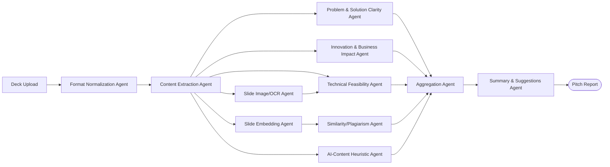

# SRS — Module 4: AI PPT Analyzer & Presentation Intelligence

**Depends on:** `00-Master-Architecture-and-Analysis.md`. Feeds scores into doc 05 (hackathon rankings) and can be invoked standalone by recruiters/judges/investors.

---

## 1. Scope

Analyze uploaded pitch decks/PPTs/PDFs and produce multi-dimensional scores, plagiarism/AI-content flags, auto-summaries, and improvement suggestions. Fully self-contained — a recruiter, hackathon judge, or investor can use this without any other module.

## 2. Actors

| Actor | Interaction |
|---|---|
| Candidate/Team | Uploads deck |
| Judge/Recruiter/Investor | Views scored report |
| System | Runs extraction + scoring pipeline |

## 3. Functional Requirements

- FR-1 Accept `.pptx`, `.ppt` (convert first), `.pdf` upload.
- FR-2 Extract per-slide: title, body text, speaker notes, embedded images, layout structure.
- FR-3 Evaluate problem understanding & solution clarity (rubric-based LLM scoring, grounded in extracted text).
- FR-4 Score business impact & innovation.
- FR-5 Analyze technical depth & feasibility (cross-check technical claims in the deck against the team's actual repo, if linked — reuses doc 01's `candidate_project_embeddings` / doc 03's static analysis where available).
- FR-6 Detect AI-generated or copied content — **framed as a best-effort heuristic signal with an explicit confidence/uncertainty range, never a definitive verdict** (AI-text detectors are known to be unreliable, especially with false positives on non-native-English writers; over-claiming accuracy here would itself be a design flaw).
- FR-7 Generate presentation summary automatically (2–3 sentence per-section summary, not slide-by-slide copy).
- FR-8 Provide improvement suggestions grounded in the specific rubric gaps found.
- FR-9 Generate 5 reports: Innovation Score, Technical Feasibility Score, Presentation Quality Score, Business Potential Score, Overall Pitch Score — each with rationale.

## 4. Agent Architecture (LangGraph)



**State schema:**
```python
class PitchAnalysisState(TypedDict):
    presentation_id: str
    slides: list[dict]                # {index, title, body, notes, image_refs}
    slide_embeddings: list[list[float]]
    plagiarism_matches: list[dict]    # [{matched_presentation_id, slide_idx, similarity}]
    ai_content_signal: dict           # {score: float, confidence: str, flagged_sections: list[str]}
    scores: dict[str, float]          # innovation, technical_feasibility, presentation_quality, business_potential
    overall_score: Optional[float]
    summary: Optional[str]
    suggestions: list[str]
```

**Agents & responsibilities:**

| Agent | Model tier | Tools |
|---|---|---|
| Format Normalization Agent | tool only | `python-pptx` for `.pptx`, LibreOffice headless (`soffice --headless --convert-to pdf`) for legacy `.ppt`, `PyMuPDF`/`pdfplumber` for `.pdf` |
| Content Extraction Agent | tool only | `python-pptx` (text/notes), `PyMuPDF` (pdf text + rasterize pages) |
| Slide Image/OCR Agent | Haiku + vision, or Tesseract | For text embedded as images/diagrams; Claude vision for diagram *understanding* (not just OCR) when a slide is mostly a chart/architecture diagram |
| Slide Embedding Agent | embedding model (no chat LLM) | Voyage/OpenAI/bge embeddings per slide (text) |
| Similarity/Plagiarism Agent | tool (vector search) + Haiku for narrative | Qdrant search against `presentation_slide_embeddings` corpus of prior submissions |
| Problem & Solution Clarity Agent | Sonnet | Structured rubric scoring |
| Innovation & Business Impact Agent | Sonnet | Structured rubric scoring + Qdrant novelty check (reuses doc 01 pattern) |
| Technical Feasibility Agent | Sonnet | Cross-references claims against linked repo's static analysis (doc 03) if available |
| AI-Content Heuristic Agent | Haiku + statistical tool | Perplexity/burstiness heuristics (`GPT-2`-based perplexity via `transformers`, or GPTZero-style API) — output as a *signal*, not a verdict |
| Aggregation Agent | rules | Weighted combination into Overall Pitch Score |
| Summary & Suggestions Agent | Sonnet | Grounded summary (2–3 sentence per section) + concrete, rubric-tied suggestions |

## 5. Data Model

```sql
CREATE TABLE presentations (
    id UUID PRIMARY KEY DEFAULT gen_random_uuid(),
    owner_user_id UUID REFERENCES users(id),
    file_id UUID REFERENCES files(id),
    linked_repo TEXT,
    hackathon_submission_id UUID,      -- FK to doc 05's table, nullable
    uploaded_at TIMESTAMPTZ DEFAULT now()
);

CREATE TABLE slides (
    id UUID PRIMARY KEY DEFAULT gen_random_uuid(),
    presentation_id UUID REFERENCES presentations(id),
    slide_index INT,
    title TEXT, body TEXT, notes TEXT,
    has_image BOOLEAN DEFAULT false
);

CREATE TABLE presentation_scores (
    id UUID PRIMARY KEY DEFAULT gen_random_uuid(),
    presentation_id UUID REFERENCES presentations(id),
    innovation_score FLOAT,
    technical_feasibility_score FLOAT,
    presentation_quality_score FLOAT,
    business_potential_score FLOAT,
    overall_pitch_score FLOAT,
    summary TEXT,
    suggestions JSONB,
    ai_content_signal JSONB,           -- {score, confidence_label, flagged_sections}
    computed_at TIMESTAMPTZ DEFAULT now()
);

CREATE TABLE plagiarism_matches (
    id UUID PRIMARY KEY DEFAULT gen_random_uuid(),
    presentation_id UUID REFERENCES presentations(id),
    matched_presentation_id UUID REFERENCES presentations(id),
    slide_index INT,
    similarity FLOAT,
    flagged_at TIMESTAMPTZ DEFAULT now()
);
```

**Qdrant:** `presentation_slide_embeddings` collection, payload `{presentation_id, slide_index, hackathon_id, submitted_at}` — this is the historical corpus every new upload is checked against.

## 6. API Endpoints

```
POST   /api/v1/presentations/upload             # multipart, returns presentation_id, kicks off async pipeline
GET    /api/v1/presentations/{id}/status         # processing | done
GET    /api/v1/presentations/{id}/report          # full scored report
GET    /api/v1/presentations/{id}/plagiarism-matches
```

## 7. Frontend (Next.js)

```
app/
  (shared)/pitch-analyzer/upload/page.tsx
  (shared)/pitch-analyzer/[id]/page.tsx     -- slide-by-slide viewer + score radar + suggestions panel
components/
  SlideViewer.tsx                            -- renders extracted slide + annotations
  ScoreRadarChart.tsx (recharts, shared component with doc 01)
  PlagiarismMatchList.tsx
  AIContentSignalBadge.tsx                   -- shows confidence label, not a bare "AI-generated: yes/no"
```

## 8. Libraries & APIs

| Purpose | Library / API |
|---|---|
| PPTX parsing | `python-pptx` |
| Legacy .ppt conversion | LibreOffice headless (`soffice`) |
| PDF parsing/rasterization | `PyMuPDF` (fitz), `pdf2image` |
| OCR | `pytesseract` |
| Vision understanding | Claude vision (for diagrams/architecture slides) |
| Embeddings | Voyage/OpenAI/bge (shared with doc 01) |
| AI-text heuristic | `transformers` (GPT-2 perplexity scoring) as a free self-hosted signal; optionally GPTZero API |
| Vector search | `qdrant-client` |
| Background processing | `arq` worker (pipeline is multi-step and shouldn't block the upload request) |
| Tracing | Langfuse |

## 9. Non-Functional Requirements
- Processing time target: < 60s for a 15–20 slide deck (async job with a status-polling UI — never block the upload response).
- File size cap (e.g., 50MB) enforced at upload; larger files routed to R2, not Cloudinary, per the master doc's storage split.
- AI-content and plagiarism signals always ship with a confidence label and evidence (matched slide + similarity score), never a bare boolean — this is a hard requirement given how unreliable AI-detection is at the state of the art.

## 10. Success Metrics
- Correlation between Overall Pitch Score and actual judge scores (validate against a labeled hackathon dataset if available).
- False-positive rate on plagiarism/AI-content flags (track and tune threshold).
