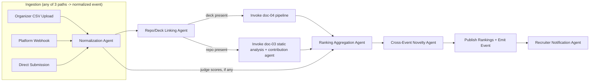

# SRS — Module 5: Hackathon-to-Hiring Pipeline

**Depends on:** `00-Master-Architecture-and-Analysis.md`, doc 04 (PPT scores feed rankings), doc 01 (candidate profiles), publishes events consumed by doc 02 (recruiter surfacing).

---

## 1. Scope

Turns hackathon participation into structured, queryable hiring signal: performance tracking, winner analytics, team rankings, and a direct recruiter-access path to top performers — the "dead end" the problem statement specifically calls out as wasted signal today.

## 2. Actors

| Actor | Interaction |
|---|---|
| Organizer | Creates hackathon event, imports/uploads results, manages judging |
| Judge | Scores submissions (or scores flow in from doc 04 automatically) |
| Candidate/Team | Submits project, links repo + deck |
| Recruiter | Watches hackathons, gets notified of top performers matching open roles |

## 3. Functional Requirements

- FR-1 Hackathon Performance Tracking: event metadata, tracks/tracks-categories, team roster, submission timestamps.
- FR-2 Winner Analytics: final placements, per-track winners, judge score breakdowns.
- FR-3 Team Rankings: composite ranking combining judge scores + doc 04's Overall Pitch Score + doc 03's repo/contribution analytics (when linked).
- FR-4 Project Evaluation: reuses doc 04 pipeline for any submitted deck; reuses doc 03's static analysis for any linked repo.
- FR-5 Innovation Scoring: reuses doc 04's Innovation Score plus a cross-hackathon novelty check (has this idea appeared in prior events indexed in Qdrant?).
- FR-6 Recruiter Access to Top Performers: recruiters can "watch" a hackathon or a skill/track; system publishes an event when rankings finalize, notifying matching recruiters (doc 02 consumes this to auto-suggest candidates).
- FR-7 **Data ingestion path** — since there is no single universal public API across hackathon platforms (Devpost/Devfolio/MLH each differ, and many events are run ad hoc), support three ingestion modes:
  - (a) Organizer manual CSV/XLSX upload (team roster + scores) — always available, zero integration risk.
  - (b) Webhook push from platforms that support it (Devpost/Devfolio webhook payload → normalized internally).
  - (c) Direct in-platform hackathon hosting (teams submit repo/deck links directly through this product) — the richest data path, recommended as the primary flow for the hackathon demo itself.

## 4. Agent Architecture (LangGraph)



**State schema:**
```python
class HackathonRankingState(TypedDict):
    hackathon_id: str
    teams: list[dict]                 # {team_id, members, repo_url, deck_presentation_id, judge_scores}
    pitch_scores: dict[str, dict]     # team_id -> doc-04 report
    repo_scores: dict[str, dict]      # team_id -> doc-03 static analysis + contribution shares
    novelty_scores: dict[str, float]
    final_rankings: list[dict]        # ordered [{team_id, rank, composite_score}]
```

**Agents & responsibilities:**

| Agent | Model tier | Tools |
|---|---|---|
| Normalization Agent | Haiku (schema mapping) + rules | Handles differing CSV column layouts / webhook payload shapes |
| Repo/Deck Linking Agent | rules | Validates/dedupes repo & deck references, triggers async invocation of doc 03/04 pipelines |
| Ranking Aggregation Agent | rules (weighted formula, transparent) | |
| Cross-Event Novelty Agent | embedding similarity (tool) + Haiku narrative | Qdrant search across `presentation_slide_embeddings` spanning *all* past hackathons, not just this one |
| Recruiter Notification Agent | rules + templated Haiku message | Matches finalized top performers against recruiter "watch" criteria, publishes to `events` table |

**Example composite ranking formula:**
```
composite_score = 0.40 * normalized(judge_score)      # if judges scored manually
                + 0.30 * doc04.overall_pitch_score
                + 0.20 * doc03.repo_quality_score
                + 0.10 * novelty_score
```
(Weights and which components exist are configurable per event — not every hackathon has manual judges.)

## 5. Data Model

```sql
CREATE TABLE hackathons (
    id UUID PRIMARY KEY DEFAULT gen_random_uuid(),
    organizer_org_id UUID REFERENCES organizations(id),
    name TEXT, start_date DATE, end_date DATE,
    tracks JSONB,
    ingestion_mode TEXT CHECK (ingestion_mode IN ('manual_csv','webhook','direct')),
    created_at TIMESTAMPTZ DEFAULT now()
);

CREATE TABLE hackathon_teams (
    id UUID PRIMARY KEY DEFAULT gen_random_uuid(),
    hackathon_id UUID REFERENCES hackathons(id),
    team_name TEXT,
    track TEXT
);

CREATE TABLE hackathon_team_members (
    team_id UUID REFERENCES hackathon_teams(id),
    candidate_id UUID REFERENCES candidate_profiles(id),
    role TEXT,                          -- e.g. 'lead', 'member'
    PRIMARY KEY (team_id, candidate_id)
);

CREATE TABLE hackathon_submissions (
    id UUID PRIMARY KEY DEFAULT gen_random_uuid(),
    team_id UUID REFERENCES hackathon_teams(id),
    repo_url TEXT,
    presentation_id UUID REFERENCES presentations(id),
    judge_score FLOAT,
    submitted_at TIMESTAMPTZ DEFAULT now()
);

CREATE TABLE hackathon_rankings (
    id UUID PRIMARY KEY DEFAULT gen_random_uuid(),
    hackathon_id UUID REFERENCES hackathons(id),
    team_id UUID REFERENCES hackathon_teams(id),
    rank INT,
    composite_score FLOAT,
    score_breakdown JSONB,
    finalized_at TIMESTAMPTZ DEFAULT now()
);

CREATE TABLE recruiter_watchlists (
    id UUID PRIMARY KEY DEFAULT gen_random_uuid(),
    recruiter_id UUID REFERENCES users(id),
    criteria JSONB,                      -- {track, min_rank, skills}
    created_at TIMESTAMPTZ DEFAULT now()
);
```

## 6. Event Publishing (drives doc 02 integration)

When `hackathon_rankings` finalizes for an event:
```json
// events table row
{
  "event_type": "hackathon.rankings.finalized",
  "payload": {
    "hackathon_id": "h-1",
    "top_teams": ["t-1","t-2","t-3"],
    "candidate_ids": ["u-10","u-11","u-20"]
  }
}
```
An Arq background worker in doc 02 subscribes to this event type and matches `candidate_ids` against active `recruiter_watchlists`, then creates a notification / surfaces them in the Recruiter Dashboard's "Top Performers" feed.

## 7. API Endpoints

```
POST   /api/v1/hackathons                          # create event
POST   /api/v1/hackathons/{id}/import/csv           # organizer manual upload
POST   /api/v1/hackathons/{id}/webhook              # platform push (Devpost/Devfolio-style payload)
POST   /api/v1/hackathons/{id}/submissions          # direct-submission mode
GET    /api/v1/hackathons/{id}/rankings
GET    /api/v1/hackathons/{id}/teams/{teamId}
POST   /api/v1/recruiters/{id}/watchlists
GET    /api/v1/recruiters/{id}/top-performers-feed
```

## 8. Frontend (Next.js)

```
app/
  (organizer)/hackathons/new/page.tsx
  (organizer)/hackathons/[id]/import/page.tsx        -- CSV upload UI, xlsx parsing preview (SheetJS)
  (public)/hackathons/[id]/leaderboard/page.tsx       -- public rankings page (SEO-friendly, SSR)
  (public)/hackathons/[id]/teams/[teamId]/page.tsx    -- team profile w/ pitch + repo scores
  (recruiter)/top-performers/page.tsx
components/
  LeaderboardTable.tsx
  ScoreBreakdownTooltip.tsx
  CSVImportPreview.tsx (SheetJS/xlsx.js for client-side preview before submit)
```

## 9. Libraries & APIs

| Purpose | Library / API |
|---|---|
| CSV/XLSX parsing | `pandas` (backend), SheetJS `xlsx` (frontend preview) |
| Webhook signature verification | HMAC verification per platform's documented scheme |
| Event bus | Postgres `events` table + Redis pub/sub for low-latency notification, Arq worker for durable processing |
| Vector search (novelty) | `qdrant-client`, reusing doc 04's collection |

## 10. Non-Functional Requirements
- Ranking finalization must be idempotent and re-runnable (organizers correct scores after the fact).
- CSV import must validate schema and show a preview/diff before committing (bad organizer data is the single biggest real-world failure mode here).
- Public leaderboard pages are cache-friendly (ISR) since they're read-heavy and rarely change after finalization.

## 11. Success Metrics
- % of hackathon participants who get at least one recruiter view within 7 days of rankings finalizing.
- Organizer time-to-import (manual CSV path) under 5 minutes for a 50-team event.
