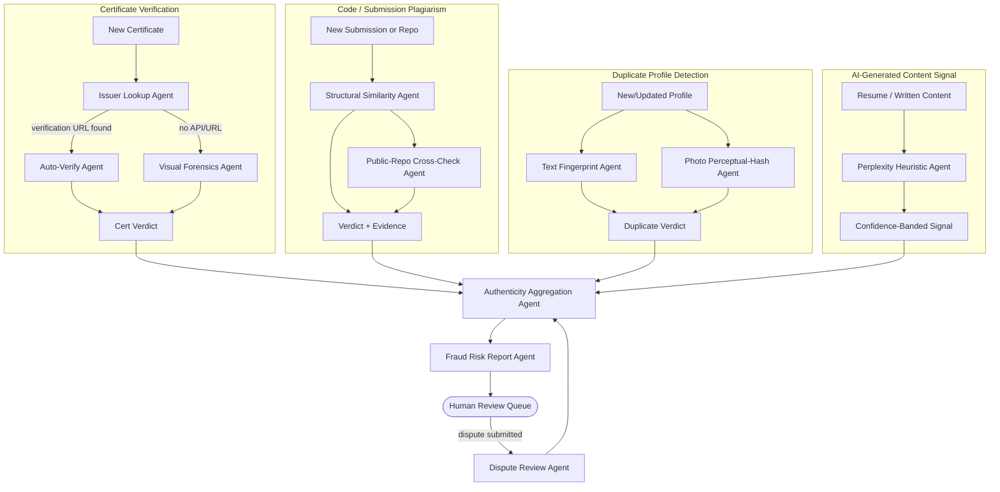

# SRS — Module 6: Trust & Fraud Prevention System

**Depends on:** `00-Master-Architecture-and-Analysis.md`. Reads from doc 01 (certificates, profiles), doc 03 (submissions), doc 04 (presentations). Writes flags consumed by doc 02 (never as an auto-reject filter — see §7).

---

## 1. Scope

Detects fake certificates, fake/plagiarized projects, likely-AI-generated resumes, duplicate profiles, and plagiarized submissions; produces a Candidate Authenticity Score and Fraud Risk Reports. **This module is the highest ethical-risk-surface component of the whole platform** — a false accusation of fraud can end a candidate's opportunity unfairly — so its design centers on evidence, uncertainty, and human review rather than automated verdicts.

## 2. Actors

| Actor | Interaction |
|---|---|
| System | Runs detection agents on new/updated data |
| Recruiter/Admin | Reviews fraud risk reports, makes the actual decision |
| Candidate | Can view flags raised against them and submit a dispute/appeal |

## 3. Functional Requirements

- FR-1 Fake Certificate Detection: cross-check extracted certificate metadata against issuer verification where available (e.g., a verification URL/credential ID that resolves), plus visual-forensics heuristics (font/layout consistency, template matching against known-genuine certificate templates) for issuers with no verification API.
- FR-2 Fake/Plagiarized Project Detection: code-similarity check against public repos and other platform submissions (structural code-clone detection, not just text diff — catches renamed-variable copies).
- FR-3 AI-Generated Resume/Content Detection: statistical heuristic signal (shared approach with doc 04's AI-content agent), always reported with a confidence band, **never** as a binary verdict.
- FR-4 Duplicate Profile Detection: same person creating multiple accounts (email variants, resume text fingerprinting, optionally profile-photo perceptual hashing — see §8 on biometric caution).
- FR-5 Plagiarized Submissions: structural similarity detection across doc 03 coding-assessment submissions (catches assessment cheating/answer-sharing).
- FR-6 Candidate Authenticity Score: an aggregate 0–100 score representing *evidence consistency*, not a guilt verdict — framed to recruiters as "corroboration strength," matching the positive framing used for Verified Skill Badges in doc 01.
- FR-7 Fraud Risk Reports: structured, evidence-linked report per flag — every flag must cite the specific evidence (e.g., "certificate credential ID does not resolve on issuer's verification page," "87% structural code similarity to submission #4521").
- FR-8 Candidate Dispute Flow: candidate can see any flag raised against their own profile and submit context/evidence; a flag's status moves `raised → under_review → upheld/dismissed`, always with a human (admin/recruiter) required to move it past `raised`.

## 4. Agent Architecture (LangGraph)



**State schema:**
```python
class FraudCheckState(TypedDict):
    subject_type: str                 # 'certificate' | 'submission' | 'profile' | 'resume'
    subject_id: str
    signals: list[dict]               # [{signal_type, score, confidence, evidence: [...]}]
    authenticity_score: Optional[float]
    flags: list[dict]                 # [{flag_type, status, evidence, raised_at}]
```

**Agents & responsibilities:**

| Agent | Model tier | Tools |
|---|---|---|
| Issuer Lookup Agent | rules + `httpx` fetch | Resolves credential-ID/verification-URL against issuer site where one exists |
| Auto-Verify Agent | rules | Simple match/no-match against fetched issuer page content |
| Visual Forensics Agent | Haiku + vision | Compares layout/font/seal against a small curated set of known-genuine templates per common issuer; flags anomalies as *low/medium/high suspicion*, never certainty |
| Structural Similarity Agent | tool only | `copydetect` or a Dolos-style token-based structural clone detector (robust to variable renaming, unlike raw text diff) |
| Public-Repo Cross-Check Agent | GitHub code-search API (tool) + Haiku narrative | Checks if submitted code closely matches a public repo not authored by the candidate |
| Text Fingerprint Agent | embedding + hashing (tool) | SimHash/MinHash + embedding similarity across resumes to catch near-duplicate accounts |
| Photo Perceptual-Hash Agent | `imagehash` (tool, not facial recognition) | See §8 — deliberately uses perceptual image hashing rather than facial biometric matching to reduce legal/ethical exposure while still catching literal duplicate photo reuse |
| Perplexity Heuristic Agent | statistical tool (`transformers` GPT-2 perplexity) | Same approach as doc 04, output confidence-banded, not binary |
| Authenticity Aggregation Agent | rules (transparent weighted formula) | |
| Fraud Risk Report Agent | Sonnet | Writes the human-readable report strictly from `signals`/evidence — never adds unsupported claims |
| Dispute Review Agent | Sonnet (assists, doesn't decide) | Summarizes candidate's submitted context alongside original evidence for the human reviewer; **cannot itself close a dispute** |

## 5. Data Model

```sql
CREATE TABLE verification_records (
    id UUID PRIMARY KEY DEFAULT gen_random_uuid(),
    subject_type TEXT,                -- 'certificate' | 'submission' | 'profile'
    subject_id UUID,
    signal_type TEXT,
    signal_score FLOAT,
    confidence_label TEXT CHECK (confidence_label IN ('low','medium','high')),
    evidence JSONB,
    created_at TIMESTAMPTZ DEFAULT now()
);

CREATE TABLE fraud_flags (
    id UUID PRIMARY KEY DEFAULT gen_random_uuid(),
    subject_type TEXT, subject_id UUID,
    flag_type TEXT,
    status TEXT DEFAULT 'raised' CHECK (status IN ('raised','under_review','upheld','dismissed')),
    evidence JSONB,
    raised_at TIMESTAMPTZ DEFAULT now(),
    reviewed_by UUID REFERENCES users(id),
    reviewed_at TIMESTAMPTZ,
    review_notes TEXT
);

CREATE TABLE authenticity_scores (
    id UUID PRIMARY KEY DEFAULT gen_random_uuid(),
    candidate_id UUID REFERENCES candidate_profiles(id),
    score FLOAT,                        -- "corroboration strength", 0-100
    components JSONB,
    computed_at TIMESTAMPTZ DEFAULT now()
);

CREATE TABLE disputes (
    id UUID PRIMARY KEY DEFAULT gen_random_uuid(),
    fraud_flag_id UUID REFERENCES fraud_flags(id),
    candidate_id UUID REFERENCES candidate_profiles(id),
    candidate_statement TEXT,
    supporting_files JSONB,             -- file ids
    submitted_at TIMESTAMPTZ DEFAULT now()
);
```

## 6. API Endpoints

```
POST   /api/v1/verification/certificates/{id}/check
POST   /api/v1/verification/submissions/{id}/check
POST   /api/v1/verification/profiles/{id}/duplicate-check
GET    /api/v1/candidates/{id}/authenticity-score
GET    /api/v1/candidates/{id}/flags                    # candidate-visible view of flags against them
POST   /api/v1/flags/{id}/dispute                        # candidate submits dispute
PATCH  /api/v1/flags/{id}/review                         # admin/recruiter resolves (upheld/dismissed)
GET    /api/v1/admin/fraud-review-queue
```

## 7. Fraud Flags Are Never a Silent Filter

- Fraud flags **must not** be usable as a Recruiter Copilot (doc 02) search/filter criterion — a recruiter cannot query "exclude flagged candidates" and silently narrow a pool. Flags surface only in a dedicated review panel with full evidence, always requiring a human decision.
- `raised` status has **zero** effect on visibility, ranking, or Talent Score until a human reviewer moves it to `upheld`.
- Every `upheld` decision requires `review_notes` — an unexplained adverse action is not permitted by this design.

## 8. Legal & Ethical Considerations (binding design constraints, not optional notes)

- **Explicit Consent Ledger Integration:** All photo perceptual hashing and resume text fingerprint checks MUST verify an active consent record (`consent_type = 'perceptual_photo_hash'` or `'resume_parsing'`) in the central `consents` table before executing analysis.
- **No facial recognition/biometric matching.** Duplicate-photo detection uses perceptual image hashing (`imagehash`), which detects literal image reuse, not biometric identity matching — this avoids BIPA/GDPR-special-category-data exposure while still catching the common "same photo, different account" pattern. If true face-matching is later desired, it requires separate legal review and explicit candidate consent per jurisdiction — out of scope for this build.
- **AI-content and plagiarism detectors are probabilistic, not forensic-grade.** Every such signal ships with a confidence label and must never be the sole basis for an `upheld` flag — it must be corroborated by at least one independent signal or human review of the underlying evidence.
- **Right to dispute and human review are mandatory**, not a nice-to-have — this mirrors general good practice around automated adverse decisions (e.g., GDPR Article 22-style expectations around meaningful human review of automated decisions, and general EEOC guidance on explainable, contestable hiring-adjacent scoring).
- **False-positive cost awareness:** track and report false-positive rate on dismissed disputes as a first-class metric (§10) — a high false-positive rate is a product failure, not just a tuning parameter.

## 9. Frontend (Next.js)

```
app/
  (candidate)/my-flags/page.tsx              -- view flags against self, submit dispute
  (admin)/fraud-review/page.tsx               -- review queue, evidence viewer, upheld/dismiss actions
  (admin)/fraud-review/[flagId]/page.tsx
components/
  AuthenticityScoreGauge.tsx
  EvidenceViewer.tsx                          -- shows exact matched text/cert page/similarity score
  DisputeForm.tsx
  ReviewQueueTable.tsx
```

## 10. Libraries & APIs

| Purpose | Library / API |
|---|---|
| Structural code clone detection | `copydetect`, or a Dolos-style tokenizer-based detector |
| Perceptual image hashing | `imagehash` |
| Text fingerprinting | `datasketch` (MinHash/LSH) |
| AI-text heuristic | `transformers` (GPT-2 perplexity), optionally GPTZero API |
| GitHub code search | GitHub REST/GraphQL code search API |
| HTTP verification lookups | `httpx` (async) |

## 11. Non-Functional Requirements
- All detection agents run async (never block profile/submission save).
- Every `fraud_flags` row must have non-null `evidence` — enforced at the DB/application layer, not just convention.
- Review queue SLA target (product goal, not hard system constraint): flags reviewed within 48 hours to avoid indefinitely limbo-ing a candidate.

## 12. Success Metrics
- Precision/recall on flags that reach `upheld` vs `dismissed` (track over time as ground truth accumulates from disputes).
- Median time-to-review.
- Candidate-reported fairness sentiment (post-dispute survey, if built).
