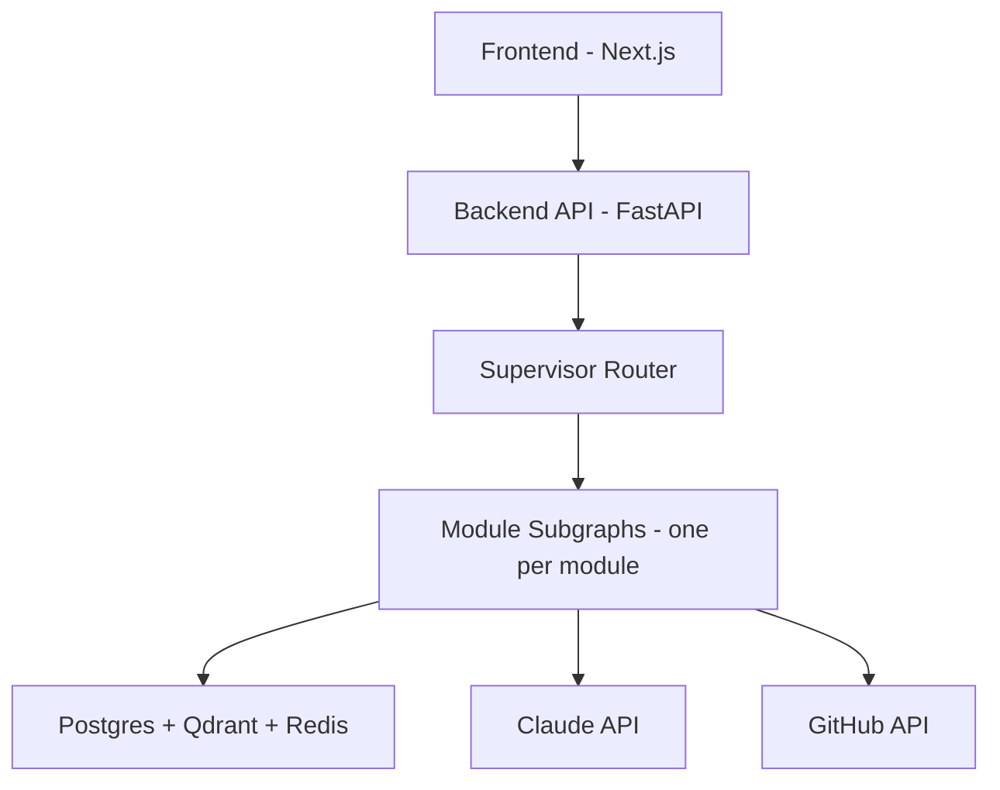

# AI Talent Intelligence & Recruitment Platform
## Master Architecture — v2 (Demo Scope: ≤20 users)

This revision incorporates every fix from the design review: sandbox simplified to client-side only,
interview pipeline simplified to browser-native STT/TTS with transcript-only storage, Cultural Fit
removed, single LLM provider, duplicate schema fields removed, unverified latency claims stripped.

---

## 1. Document Index

| # | Doc | Owns |
|---|---|---|
| 00 | This file | Shared schema, stack, deployment, agent conventions |
| 01 | Candidate Intelligence Platform | Talent Profile Engine, Talent Score™, Dashboard, Resume/Portfolio Builder, Career Guidance |
| 02 | AI Recruitment Platform | Recruiter Dashboard, Job Matching, Recruiter Copilot, Hiring Analytics |
| 03 | Assessment & Verification System | Skill Verification, Interview Agent, Team Contribution Analytics |
| 04 | PPT Analyzer | Deck/PDF analysis, scoring, plagiarism/AI-content signal |
| 05 | Hackathon-to-Hiring Pipeline | Performance tracking, rankings — **sole owner of judge scores** |
| 06 | Trust & Fraud Prevention | Fake certs/projects, duplicate profiles, authenticity score |
| 07 | Multi-Agent Architecture Deep-Dive | Supervisor graph, memory, model routing, guardrails |

Every module owns its own LangGraph subgraph and its own tables. Cross-module reads only ever go
through the tables listed in §4 (shared core) or the `events` bus — never a direct foreign key into
another module's private table.

---

## 2. Tech Stack (final, demo-scoped)

| Layer | Choice | Notes |
|---|---|---|
| Frontend | Next.js 14 (App Router) + TypeScript + Tailwind + shadcn/ui | Deployed on Vercel free tier |
| Backend | FastAPI (Python 3.12, async) + Pydantic v2 | Deployed on Render/Fly free tier |
| ORM | SQLAlchemy 2.0 (async) + Alembic | |
| Relational DB | PostgreSQL via Neon or Supabase (free tier) | |
| Vector DB | **Qdrant Cloud** (free tier) | Real vector DB, not pgvector — native payload filter + similarity in one query |
| Cache / Queue | Redis via Upstash (free tier) + **Arq** (async task queue) | |
| File storage | **Cloudinary only** — one provider, not two | Interview audio is no longer stored (see §5), so the R2/large-file tier is unnecessary at this scale |
| AI Orchestration | **LangGraph**, Postgres checkpointer | |
| LLM provider | **Anthropic Claude only** — Haiku for high-volume/low-ambiguity steps, Sonnet for judgment calls that a human reads and acts on | No second provider. One API key, one billing surface, one client library. |
| Embeddings | **`sentence-transformers` (`bge-large-en-v1.5`), self-hosted, free** | Not a "fallback" — this is the primary choice. No paid embedding API needed at this scale. |
| Code execution | **Pyodide (client-side WASM), browser-only** | No server-side sandbox (Piston/Judge0) — see §6 for why this was cut |
| STT / TTS | **Browser-native Web Speech API only** | No self-hosted Whisper/Coqui TTS — see §6 |
| Auth | Clerk or Supabase Auth (free tier) | Multi-role: candidate, recruiter, organizer, judge, admin |
| Observability | Langfuse (free self-host or cloud tier) — traces every agent call | Sentry (free tier) for exceptions |
| CI/CD | GitHub Actions | |

**Total external cost at 20-user demo scale: $0 infrastructure + variable Claude API spend, bounded per user action (never per-candidate-in-a-loop).**

---

## 2.1 Frontend/Backend Integration Boundary (read this before writing any page)

Next.js is kept, per team decision — but the setup risk (server/client component confusion costing
hours you don't have) is avoided by one hard rule: **Next.js never talks to the database, and never
runs business logic. FastAPI is the only backend.**

- **Only two routes use Server-Side Rendering** — the public portfolio (`[username]/page.tsx`) and the
  public hackathon leaderboard (`hackathons/[id]/leaderboard/page.tsx`). Both are read-only, unauthenticated,
  and fetch directly from FastAPI at request time. These are the only pages where SSR earns its keep.
- **Every other page is a Client Component** (`"use client"` at the top) — every dashboard
  (candidate/recruiter/organizer/judge/admin), the Copilot chat, the interview UI, the assessment
  editor. They fetch from FastAPI via `fetch`/WebSocket like any SPA would. This removes almost all of
  the App Router's real complexity — you're not mixing server and client state on the same page.
- **No Next.js Server Actions. No `app/api/*` routes.** If a feature seems to want one, it means "call
  FastAPI directly from the client," not "add a second backend." This is the single rule most likely to
  save you real hours — don't let Next.js quietly grow into a second API layer.
- **Typed API client via FastAPI's auto-generated OpenAPI schema.** FastAPI already emits an OpenAPI
  spec for free — run `openapi-typescript` against it once to generate a typed TS client, instead of
  hand-writing `fetch` calls that drift out of sync with the backend as it changes.
- **CORS configured on day one.** Add `CORSMiddleware` to the FastAPI app allowing the Next.js dev and
  prod origins before any other feature work — a classic "discovered at hour 30" bug, avoid it now.
- **Auth token flow:** Clerk/Supabase Auth issues the session token on the Next.js side; every FastAPI
  call attaches it as a Bearer token; FastAPI validates it against the auth provider's JWKS. Auth
  middleware lives only in FastAPI — Next.js's job is just to get the token and attach it, not to guard
  routes with its own logic.

---

## 3. High-Level Architecture



Each module subgraph (candidate intelligence, recruitment, verification, PPT analyzer, hackathon,
fraud) is detailed in its own doc — this diagram just shows the shared layers every module sits on top
of.

---

## 4. Shared Core Schema

Only these tables are cross-module foreign-key targets. Every module SRS references these; no module
duplicates them.

```sql
CREATE TABLE organizations (
    id UUID PRIMARY KEY DEFAULT gen_random_uuid(),
    name TEXT NOT NULL,
    domain TEXT,
    org_type TEXT CHECK (org_type IN ('company','university','hackathon_organizer')),
    created_at TIMESTAMPTZ DEFAULT now()
);

CREATE TABLE users (
    id UUID PRIMARY KEY DEFAULT gen_random_uuid(),
    email TEXT UNIQUE NOT NULL,
    full_name TEXT,
    role TEXT NOT NULL CHECK (role IN ('candidate','recruiter','organizer','judge','admin')),
    organization_id UUID REFERENCES organizations(id),
    auth_provider_id TEXT,
    created_at TIMESTAMPTZ DEFAULT now(),
    is_active BOOLEAN DEFAULT true
);

-- Single storage provider. No storage_provider enum needed anymore.
CREATE TABLE files (
    id UUID PRIMARY KEY DEFAULT gen_random_uuid(),
    owner_user_id UUID REFERENCES users(id),
    storage_key TEXT NOT NULL,
    public_url TEXT,
    file_type TEXT,                 -- resume | certificate | ppt | photo
    uploaded_at TIMESTAMPTZ DEFAULT now()
);

CREATE TABLE consents (
    consent_id UUID PRIMARY KEY DEFAULT gen_random_uuid(),
    candidate_id UUID NOT NULL REFERENCES users(id),
    consent_type TEXT NOT NULL CHECK (consent_type IN
        ('resume_parsing','linkedin_export','ai_interview','perceptual_photo_hash','ai_assessment')),
    status TEXT NOT NULL DEFAULT 'granted' CHECK (status IN ('granted','revoked')),
    granted_at TIMESTAMPTZ NOT NULL DEFAULT now(),
    revoked_at TIMESTAMPTZ,
    ip_address INET,
    terms_version TEXT NOT NULL DEFAULT '1.0'
);
-- This is the ONLY place consent status lives. No module stores its own
-- consent_given/consent_timestamp copy — always join to this table.

CREATE TABLE events (
    id UUID PRIMARY KEY DEFAULT gen_random_uuid(),
    event_type TEXT NOT NULL,        -- e.g. 'hackathon.rankings.finalized', 'profile.updated'
    payload JSONB NOT NULL,
    created_at TIMESTAMPTZ DEFAULT now(),
    processed_at TIMESTAMPTZ
);

CREATE TABLE agent_runs (
    id UUID PRIMARY KEY DEFAULT gen_random_uuid(),
    agent_name TEXT NOT NULL,
    subject_type TEXT NOT NULL,
    subject_id UUID NOT NULL,
    input_ref JSONB,
    output JSONB,
    model_used TEXT,
    langfuse_trace_id TEXT,
    created_at TIMESTAMPTZ DEFAULT now()
);

CREATE TABLE audit_logs (
    id UUID PRIMARY KEY DEFAULT gen_random_uuid(),
    actor_user_id UUID REFERENCES users(id),
    action TEXT NOT NULL,
    target_type TEXT,
    target_id UUID,
    created_at TIMESTAMPTZ DEFAULT now()
);
```

---

## 5. What Changed From v1 (explicit fix log)

| Area | v1 | v2 (this doc set) | Why |
|---|---|---|---|
| Code sandbox | Server-side Piston (Docker-in-Docker) | **Client-side Pyodide only** | Free-tier PaaS hosts don't grant Docker-socket access — the old design couldn't actually deploy |
| Interview STT/TTS | Self-hosted Whisper + Coqui TTS | **Browser-native Web Speech API** | Removes CPU contention with other self-hosted models; removes an unverified 3s latency claim |
| Interview audio | Recorded, stored, retention-policy deleted | **Transcript only — no raw audio stored** | Simpler consent/retention story, no large-file storage needed |
| File storage | Cloudinary + Cloudflare R2 split | **Cloudinary only** | R2 existed only to hold interview video/audio, which no longer exists |
| LLM providers | Anthropic + Groq | **Anthropic only** | One API key, one vendor, matches the stated budget constraint exactly |
| Embeddings | Voyage/OpenAI primary, bge "fallback" | **`bge-large-en-v1.5` self-hosted is the primary choice** | No paid embedding API needed at this scale |
| Cultural Fit Analysis | Present, caveated | **Removed entirely** | Explicit product decision, not a risk to manage |
| Judge scores | Duplicated in doc 02 (`judge_evaluations`) and doc 05 (`judge_score` column) | **Doc 05 is sole owner**, doc 02 reads via `events` | One source of truth |
| `jobs` table | Had both `organization_id` and `org_id` | **`organization_id` only** | Duplicate column removed |
| Interview consent | `consent_id` FK + duplicate `consent_given`/`consent_timestamp` columns | **`consent_id` FK only** | One source of truth, matches §4 |
| Confidence Score | Present, undefined derivation | **Renamed "Response Confidence Signal," explicitly transcript-derived** (hedging language, specificity, structure) — never voice tone/emotion | Matches the same rule already applied to Communication Rating |
| Salary prediction data | Stack Overflow Survey + AmbitionBox | **Stack Overflow Developer Survey only** | AmbitionBox has no public API/dataset — same ToS issue as LinkedIn scraping |
| Latency targets | "< 3s" interview turn, "< 60s" PPT analysis, stated as spec | **Explicitly marked "to be benchmarked," not guaranteed** | Numbers were asserted, never measured |

---

## 6. Deployment Notes for a 20-Person Demo

- Free tiers on Vercel, Render/Fly, Neon/Supabase, Qdrant Cloud, Upstash, and Cloudinary all comfortably
  cover this scale — no capacity planning needed.
- GitHub API calls must use **each candidate's own OAuth token**, not one shared server token, to avoid
  any rate-limit surprise if several people onboard at once.
- Because there is no server-side ML workload left (no Whisper, no TTS, no sandbox), the backend
  instance only needs to run FastAPI + Arq workers + lightweight embedding calls — comfortably within
  any free-tier compute/memory limit.

---

## 7. Build Order

1. **Foundation:** shared schema (§4), auth, dashboard shells (no AI yet).
2. **Candidate Intelligence (doc 01):** Talent Profile Engine + Talent Score — everything else consumes this.
3. **Recruitment (doc 02):** Job Matching + Copilot — depends on #2.
4. **Verification (doc 03):** Skill Verification (Pyodide) + Interview Agent (Web Speech API).
5. **PPT Analyzer (doc 04):** self-contained, buildable in parallel with #4.
6. **Hackathon Pipeline (doc 05):** depends on #4 (PPT scores feed rankings).
7. **Fraud Prevention (doc 06):** layered on once real data exists to check against.
8. **Polish, Hiring Analytics, demo script.**

---

*Continue to `01-candidate-intelligence-platform.md`.*
