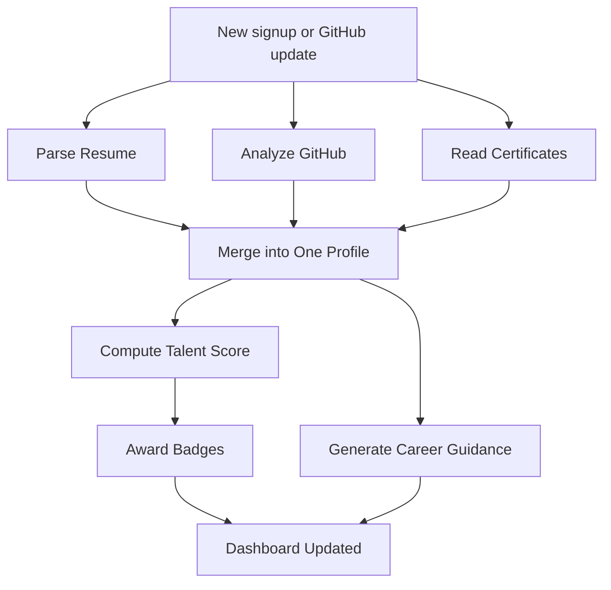
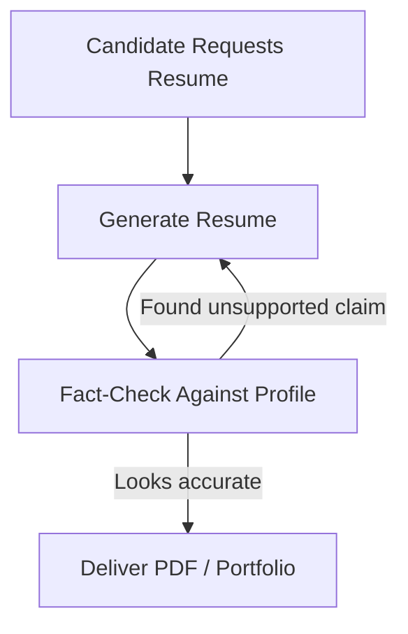

# Module 1 — Candidate Intelligence Platform

**Depends on:** `00-master-architecture.md` (schema, stack)
**Consumed by:** Recruitment (02), Hackathon Pipeline (05), Fraud Prevention (06)
**Owns:** Talent Profile Engine, Talent Score™, Candidate Dashboard, Resume/Portfolio Builder, Career Guidance

---

## 1. Scope

Building and presenting a verified candidate identity. Self-contained candidate-facing product with its
own onboarding, ingestion, and dashboard.

## 2. Data Sources (finalized)

| Source | Method |
|---|---|
| GitHub | OAuth, per-candidate token, REST + GraphQL |
| Resume | Candidate upload (PDF/DOCX), LLM-structured extraction |
| LinkedIn | Candidate uploads their own "Download your data" export — **no scraping, no third-party enrichment API** |
| Certifications | Candidate upload (image/PDF), OCR + structured extraction, verification status resolved in doc 06 |
| Hackathons | Only events run **inside this platform** (see doc 05) — no external scraping |

## 3. LangGraph Subgraph

**Flow A — ingestion & scoring** (runs on signup, GitHub update, or weekly refresh):



**Flow B — resume/portfolio builder** (runs on candidate request):



## 4. State Schema

```python
from typing import TypedDict, Optional
from pydantic import BaseModel

class SubScore(BaseModel):
    value: float          # 0-100
    evidence: list[str]   # agent_run ids
    rationale: str

class CandidateProfileState(TypedDict):
    candidate_id: str
    raw_resume_text: Optional[str]
    github_username: Optional[str]
    github_raw: Optional[dict]
    linkedin_export_raw: Optional[dict]
    certificates: list[dict]
    merged_profile: Optional[dict]
    sub_scores: dict[str, SubScore]
    overall_score: Optional[float]
    conflicts: list[str]
    career_recommendations: Optional[dict]
```

## 5. Agent Registry

| Agent | Model | Tools | Notes |
|---|---|---|---|
| Ingestion Router | none | fan-out only | |
| Resume Parser Agent | Haiku | `pdfplumber`/`PyMuPDF` + structured extraction | |
| GitHub Analysis Agent | Haiku (summary) + tools (metrics) | `PyGithub`/GraphQL, `radon`, `lizard` | Numeric metrics from tools, not the LLM |
| Certificate OCR Agent | Haiku + vision | Tesseract, Claude vision fallback | Low-confidence extractions flagged for manual review |
| Profile Merge Agent | Haiku | rule-based conflict detection + LLM conflict summary | Deterministic merge first |
| Talent Scoring Agent | **Sonnet** for Project Quality/Innovation; rules for the rest | Qdrant similarity (Innovation) | Highest-stakes output — strongest model |
| Badge Assignment Agent | rules only | — | Deterministic corroboration-count logic |
| Career Guidance Agent | Sonnet (roadmap) + Haiku (course mapping) | Qdrant (skill-gap similarity), salary regression model | |
| Resume Generator Agent | Sonnet | templating + rewriting | |
| Fact-Check Agent | Haiku | diffs claims against `merged_profile` | Mandatory guardrail — zero fabrication tolerance |

## 6. Talent Score — Formula (canonical version: see `08-algorithms-and-formulas.md` §1)

Mechanical (rule-based) vs subjective (LLM, rubric-grounded, temp=0):

| Sub-score | Type | Weight | Primary inputs |
|---|---|---|---|
| Coding Ability | Mechanical | 20% | GitHub language depth, commit quality, doc 03 assessment results |
| Problem Solving | Mechanical | 20% | doc 03 assessment results |
| Project Quality | Mixed | 15% | README/architecture LLM review + code complexity metrics (inverted penalty curve above cyclomatic complexity 15) |
| Innovation | Subjective | 15% | Qdrant novelty vs corpus + LLM judgment + hackathon percentile (doc 05) |
| Technical Consistency | Mechanical | 10% | Commit frequency/regularity over time |
| Community Participation | Mechanical | 10% | GitHub stars/OSS contributions, hackathon participation count |
| Leadership | Subjective/weak | 10% | Maintainer status, PR review activity, team-lead flags (doc 03) |

Each sub-score normalized 0–100 before weighting. If a sub-score has no data yet (cold start — e.g. no
hackathon history), its weight is zeroed and the rest re-normalized to sum to 1.0 (formula in
`08-algorithms-and-formulas.md` §1.1) — this avoids penalizing candidates for profile incompleteness.
Every score stores `score_version` + raw sub-scores + weights (including which were re-normalized) so
retuning weights never silently changes historical scores. Candidates see the full breakdown, never
just the final number.

**Authenticity/fraud status is never folded into this score** — it stays entirely owned by doc 06's
Candidate Authenticity Score, matching the brief's separate deliverable requirement.

## 7. Data Model

```sql
CREATE TABLE candidate_profiles (
    id UUID PRIMARY KEY DEFAULT gen_random_uuid(),
    user_id UUID UNIQUE REFERENCES users(id),
    github_username TEXT,
    headline TEXT,
    location TEXT,
    skills JSONB,                -- [{name, source, confidence}]
    experience JSONB,
    education JSONB,
    merged_conflicts JSONB,
    updated_at TIMESTAMPTZ DEFAULT now()
);

CREATE TABLE github_snapshots (
    id UUID PRIMARY KEY DEFAULT gen_random_uuid(),
    candidate_id UUID REFERENCES candidate_profiles(id),
    repo_full_name TEXT,
    stars INT, forks INT,
    commit_count INT, pr_count INT, issue_count INT,
    languages JSONB,
    is_fork BOOLEAN,
    fetched_at TIMESTAMPTZ DEFAULT now()
);

CREATE TABLE certifications (
    id UUID PRIMARY KEY DEFAULT gen_random_uuid(),
    candidate_id UUID REFERENCES candidate_profiles(id),
    file_id UUID REFERENCES files(id),
    issuer TEXT, title TEXT, issue_date DATE, credential_id TEXT,
    ocr_confidence FLOAT,
    verification_status TEXT DEFAULT 'unverified'  -- resolved by doc 06
);

CREATE TABLE talent_scores (
    id UUID PRIMARY KEY DEFAULT gen_random_uuid(),
    candidate_id UUID REFERENCES candidate_profiles(id),
    coding_ability FLOAT, project_quality FLOAT, leadership FLOAT,
    problem_solving FLOAT, innovation FLOAT,
    community_participation FLOAT, technical_consistency FLOAT,
    overall FLOAT,
    score_version TEXT NOT NULL DEFAULT 'v1',
    computed_at TIMESTAMPTZ DEFAULT now()
);
CREATE INDEX idx_scores_candidate_time ON talent_scores(candidate_id, computed_at DESC);

CREATE TABLE badges (
    id UUID PRIMARY KEY DEFAULT gen_random_uuid(),
    candidate_id UUID REFERENCES candidate_profiles(id),
    skill_name TEXT,
    corroboration_sources JSONB,   -- awarded when ≥2 independent sources agree
    awarded_at TIMESTAMPTZ DEFAULT now()
);

CREATE TABLE career_recommendations (
    id UUID PRIMARY KEY DEFAULT gen_random_uuid(),
    candidate_id UUID REFERENCES candidate_profiles(id),
    skill_gaps JSONB,
    recommended_courses JSONB,
    roadmap JSONB,
    salary_estimate_low INT, salary_estimate_high INT,  -- range only, never a point estimate
    generated_at TIMESTAMPTZ DEFAULT now()
);
```

**Qdrant collections:**
- `candidate_project_embeddings` — `{candidate_id, repo_name, description_embedding}`
- `skill_taxonomy_embeddings` — canonical skill/role embeddings

## 8. Career Guidance — Salary Prediction (fixed)

- Data source: **Stack Overflow Developer Survey only** (genuine public dataset). AmbitionBox and any
  other scrape-only source removed — same ToS reasoning applied to LinkedIn applies here.
- Model: gradient-boosted regression (`scikit-learn`/`xgboost`), features = role, location,
  years-of-experience-proxy (GitHub activity span), talent score. Output as a range, never a point
  estimate.
- Recommended-certification catalog is a maintained static table (Coursera/freeCodeCamp/vendor metadata
  entered manually), not scraped live.

## 9. API Endpoints

```
POST   /api/v1/candidates/{id}/ingest/github
POST   /api/v1/candidates/{id}/ingest/resume
POST   /api/v1/candidates/{id}/ingest/linkedin-export
POST   /api/v1/candidates/{id}/ingest/certificate
GET    /api/v1/candidates/{id}/profile
GET    /api/v1/candidates/{id}/score
GET    /api/v1/candidates/{id}/score/history
GET    /api/v1/candidates/{id}/dashboard
GET    /api/v1/candidates/{id}/career-guidance
POST   /api/v1/candidates/{id}/resume/generate
POST   /api/v1/candidates/{id}/portfolio/publish
POST   /api/v1/candidates/{id}/cover-letter/generate
```

## 10. Non-Functional Requirements

- All ingestion requires an active `consents` record (`resume_parsing` / `linkedin_export`) before
  processing.
- Talent Score recompute is async — dashboard shows last-computed score with a "recalculating…"
  indicator while a job is in flight.
- All LLM-generated resume/cover-letter claims must pass the Fact-Check Agent — zero tolerance for
  fabricated experience.

*Continue to `02-recruitment-platform.md`.*
