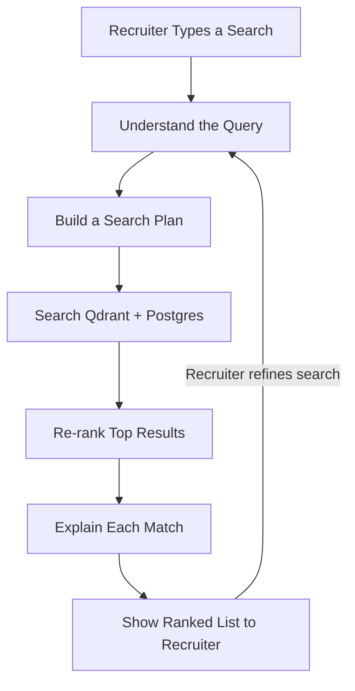
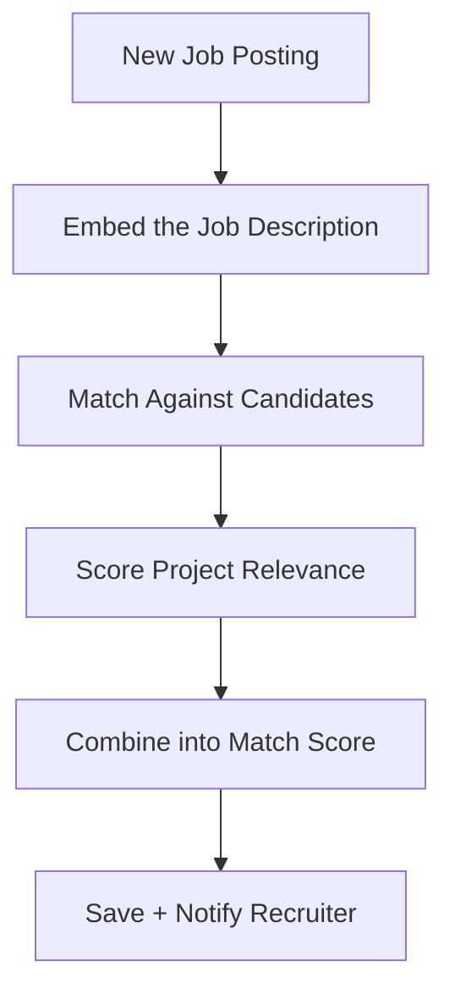

# Module 2 — AI Recruitment Platform

**Depends on:** `00-master-architecture.md`, reads candidate data from doc 01, assessment/interview
results from doc 03, hackathon rankings from doc 05, fraud flags from doc 06 (display-only, see §7).
**Cultural Fit Analysis has been removed from this module entirely** — not caveated, not present.

---

## 1. Scope

Recruiter Dashboard, AI Job Matching Engine, Recruiter AI Copilot (NL candidate search), recruitment
pipeline (kanban), Hiring Analytics Dashboard.

## 2. Matching Architecture (three-stage, cost-bounded)

The rule that keeps this module's LLM spend flat regardless of candidate pool size:
**the LLM is invoked once per recruiter action — never once per candidate in a loop.**

1. **Deterministic filter** — structured filters (skills, location, experience, hackathon participation)
   run as a normal query. Zero cost.
2. **Semantic re-rank** — self-hosted `bge-large-en-v1.5` embeddings, stored and queried in **Qdrant**
   with combined payload-filter + vector similarity in one call.
3. **LLM only on the final shortlist** — one Claude call generates the recruiter-facing "why this
   candidate fits" rationale; a second, optional call summarizes the result set. Capped at ~1–2 calls
   per recruiter search regardless of pool size.

## 3. LangGraph Subgraphs

**Flow A — Recruiter Copilot** (conversational, one search at a time):



**Flow B — Per-job batch matching** (runs async whenever a job or candidate changes):



Note: there is no Cultural Fit Agent in this graph — it was deliberately cut, not just left uncalled.

**State schema (Copilot):**
```python
from typing import TypedDict, Optional

class CopilotState(TypedDict):
    recruiter_id: str
    conversation_id: str
    raw_query: str
    structured_filters: dict     # {location, skills, min_score, hackathon_experience: bool, ...}
    candidate_results: list[dict]
    explanations: dict[str, str] # candidate_id -> why matched
```

## 4. Agent Registry

| Agent | Model | Tools | Notes |
|---|---|---|---|
| Query Understanding Agent | Haiku | structured-output NL → filter schema; **reject and re-prompt on schema-validation failure**, never silently accept a malformed filter | Main hallucination guard |
| Search Plan Agent | Haiku | decides Postgres vs Qdrant-payload filter split | |
| Hybrid Search execution | tool call, no LLM | `qdrant-client` filtered vector search | |
| Re-ranking Agent | Sonnet | only re-ranks the top ~20–50 from cheap retrieval | Bounds cost |
| Explanation Agent | Haiku | must cite specific evidence fields, never invent | |
| Job Embedding Agent | embedding model, no chat LLM | embeds JD text once per posting | |
| Matching Agent | rules + embedding similarity | Qdrant | No LLM needed for the numeric score |
| Project Relevance Agent | rules + embedding | Qdrant, `candidate_project_embeddings` (doc 01) | |
| Score Aggregation Agent | rules only | writes `agent_runs` | |

## 5. Candidate Match % — Formula

```
MatchScore = w1·SkillOverlap + w2·SemanticSimilarity + w3·ExperienceMatch + w4·TalentScoreAlignment
```
Never LLM-generated directly — always this deterministic formula, shown to recruiters as a breakdown,
not a bare percentage. `SkillOverlap` weights **verified** signals (GitHub repos, verified certs) over
raw self-declared resume text, to reduce keyword-stuffing gaming.

## 6. Data Model

```sql
CREATE TABLE jobs (
    id UUID PRIMARY KEY DEFAULT gen_random_uuid(),
    organization_id UUID REFERENCES organizations(id),   -- single column, no duplicate org_id
    title TEXT NOT NULL,
    description TEXT NOT NULL,
    required_skills JSONB,
    min_experience_years INT,
    location TEXT,
    is_remote BOOLEAN DEFAULT true,
    created_at TIMESTAMPTZ DEFAULT now()
);

CREATE TABLE applications (
    id UUID PRIMARY KEY DEFAULT gen_random_uuid(),
    job_id UUID REFERENCES jobs(id),
    candidate_id UUID REFERENCES candidate_profiles(id),
    stage TEXT CHECK (stage IN ('sourced','screened','interview_scheduled','offered','rejected','hired')),
    applied_at TIMESTAMPTZ DEFAULT now(),
    stage_updated_at TIMESTAMPTZ DEFAULT now()
);

-- No cultural_fit column. No judge_evaluations table — judge scores are owned
-- exclusively by doc 05 and read here via the events bus.
CREATE TABLE match_scores (
    id UUID PRIMARY KEY DEFAULT gen_random_uuid(),
    job_id UUID REFERENCES jobs(id),
    candidate_id UUID REFERENCES candidate_profiles(id),
    match_percentage FLOAT,
    skill_similarity FLOAT,
    project_relevance FLOAT,
    explanation TEXT,
    computed_at TIMESTAMPTZ DEFAULT now(),
    UNIQUE(job_id, candidate_id)
);

CREATE TABLE copilot_conversations (
    id UUID PRIMARY KEY DEFAULT gen_random_uuid(),
    recruiter_id UUID REFERENCES users(id),
    messages JSONB,             -- LangGraph checkpointer state
    created_at TIMESTAMPTZ DEFAULT now()
);

CREATE TABLE skill_taxonomy (
    canonical_name TEXT PRIMARY KEY,
    synonyms TEXT[]              -- e.g. "ML" / "Machine Learning" resolve to one entry
);

CREATE TABLE location_aliases (
    canonical_name TEXT PRIMARY KEY,
    aliases TEXT[]                -- e.g. "Delhi NCR" / "New Delhi"
);
```

**Qdrant:** reuses `candidate_project_embeddings`/`skill_taxonomy_embeddings` (doc 01); adds
`job_description_embeddings` (payload includes location, remote_ok, required_skill_tags for combined
filter+vector queries).

## 7. Fraud Flags — Read-Only, Never a Filter

Per doc 06's design, fraud flags **cannot** be used as a Copilot search criterion (no "exclude flagged
candidates" query). Flags are display-only in the dedicated review panel owned by doc 06.

## 8. API Endpoints

```
POST   /api/v1/jobs
GET    /api/v1/jobs/{id}/matches
POST   /api/v1/copilot/query
GET    /api/v1/applications?job_id=&stage=
PATCH  /api/v1/applications/{id}/stage
GET    /api/v1/analytics/hiring-funnel?job_id=
GET    /api/v1/analytics/time-to-hire
GET    /api/v1/analytics/source-breakdown
```

## 9. Non-Functional Requirements

- Copilot query-understanding step targets fast response (Haiku); re-ranking only runs on the
  pre-filtered top ~50 candidates, never the full pool.
- Match score recompute is async and idempotent (upsert, never duplicate rows).

*Continue to `03-assessment-verification.md`.*
