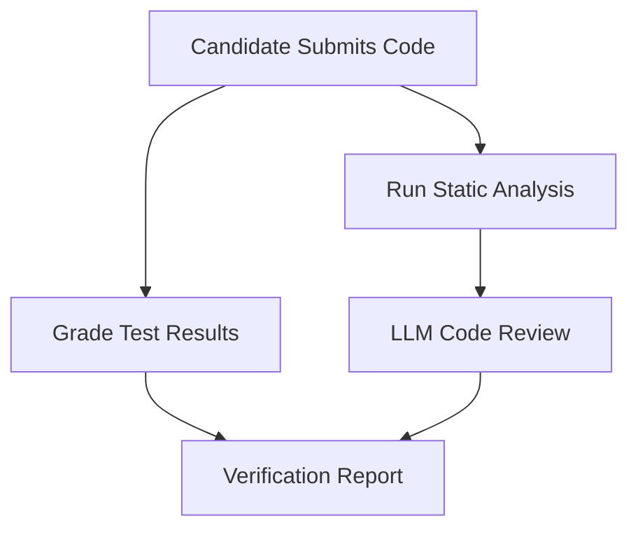
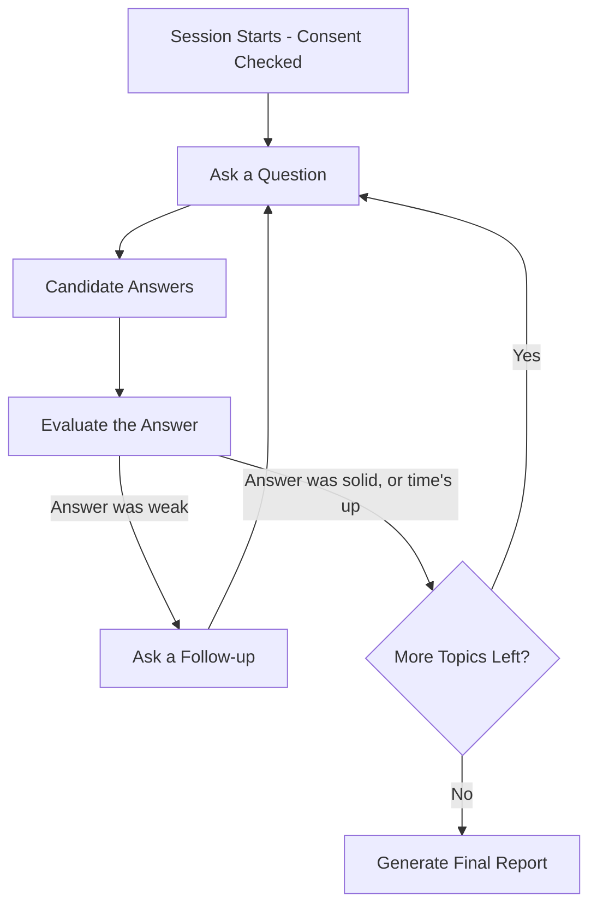
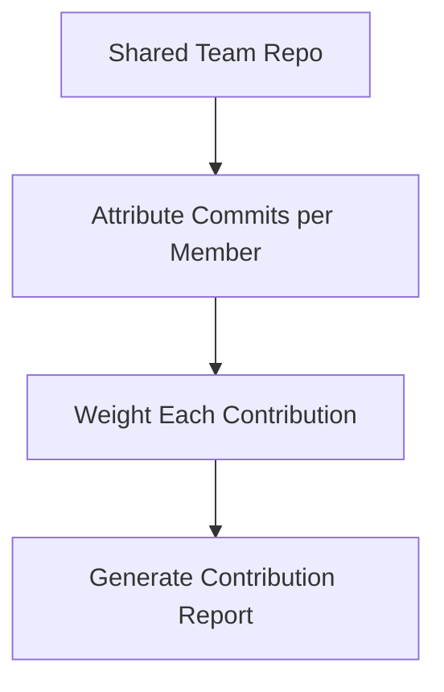

# Module 3 — AI Assessment & Verification System

**Depends on:** `00-master-architecture.md`. Feeds sub-scores back into doc 01, consumed by doc 02
(application stages `screened`/`interview_scheduled`).

---

## 1. Scope

Coding/MCQ assessments (client-side sandboxed execution), GitHub repo analysis, AI-conducted interview
(technical/behavioral/communication, browser-native voice), team contribution analytics.

## 2. Sandbox — Finalized Design (client-side only)

Server-side Piston/Judge0 is **not used**. All code execution runs in the candidate's browser via
**Pyodide (Python)** or an isolated Web Worker (JS), with backend static analysis (`radon`, `lizard`,
`bandit`) run on the submitted source afterward. This removes the Docker-socket dependency that made
server-side sandboxing undeployable on free-tier PaaS, and removes it as a security surface entirely —
nothing untrusted ever executes on the backend.

- Hidden test cases are still enforced: the test runner and expected outputs are fetched from the
  backend at runtime, executed in-browser, and only the **pass/fail result** (not the candidate's
  attempted workaround) is sent back — visible-only tests would be trivially gamed by hardcoded output.
- Hard execution timeout enforced client-side; submissions that don't complete in time are marked
  failed for that test case.

## 3. Interview Agent — Finalized Design (browser voice, transcript-only)

- **STT/TTS: browser-native Web Speech API only.** No self-hosted Whisper/Coqui TTS.
- **No raw audio is recorded or stored.** Only the transcript is persisted. This removes the
  audio-retention/consent-deletion complexity that a recorded-media approach would require.
- Turn-based (not full-duplex streaming): candidate speaks, taps done, transcript is evaluated, next
  question is spoken back. This is a stated scope choice, not a hidden gap.

## 4. LangGraph Subgraphs

**Flow A — Skill verification** (async job per assessment submission):



**Flow B — AI interview** (turn-based, one question/answer pair at a time):



**Flow C — Team contribution analytics** (batch job over a shared repo):



**State schema — Interview subgraph:**
```python
from typing import TypedDict, Optional

class InterviewState(TypedDict):
    session_id: str
    candidate_id: str
    job_context: Optional[dict]
    consent_confirmed: bool          # checked against consents table, not stored redundantly here
    topic_plan: list[str]
    current_topic_idx: int
    transcript: list[dict]           # [{role, text, ts}] — text only, no audio
    per_topic_scores: dict[str, float]
    follow_up_count_this_topic: int
    response_confidence_signals: dict  # structure, specificity, hedging-language rate — from transcript only
    final_report: Optional[dict]
```

## 5. Agent Registry

| Agent | Model | Tools | Notes |
|---|---|---|---|
| Static Analysis Agent | tools only | `radon`, `lizard`, `bandit` | Runs on submitted source after client-side execution |
| Grading Agent | rules (pass/fail count) + Haiku for partial-credit rationale | | |
| LLM Code Review Agent | Sonnet | structured rubric: readability, architecture, red flags | |
| Question Agent | Sonnet | question bank + personalization grounded in candidate profile | |
| Turn Evaluation Agent | Sonnet | scores each answer against rubric, decides follow-up | |
| Follow-up Agent | Sonnet | generates targeted probing question | |
| Interview Report Agent | Sonnet | aggregates transcript + scores into final report with rationale | |
| Commit Attribution Agent | tools only | GitHub GraphQL (author, lines changed, PR review count) | |
| Contribution Weighting Agent | rules + Haiku (narrative) | | |

## 6. Interview Report — Fields (fixed)

| Field | Derivation | Status |
|---|---|---|
| Technical Rating | Rubric-scored from transcript, temp=0 | unchanged |
| Communication Rating | Transcript-only: clarity, structure, filler-word rate — **never** voice biometrics/emotion | unchanged |
| **Response Confidence Signal** (renamed from "Confidence Score") | **Explicitly transcript-derived**: hedging language, answer specificity/structure — not vocal tone | fixed — was previously undefined |
| Hiring Recommendation | Advisory text + rationale, never a bare pass/fail | unchanged, human makes the actual call |

## 7. Team Contribution Weighting Formula

```
contribution_share(member) = normalize(
    0.35 * lines_changed_that_survive_to_HEAD
  + 0.25 * commits_count
  + 0.20 * PRs_opened_and_merged
  + 0.20 * PR_reviews_given
)
```
Report includes raw components, not just the final share. Anomalies (zero attributable contribution
despite team membership) are flagged as a **report note**, never an automatic penalty.

## 8. Data Model

```sql
CREATE TABLE assessments (
    id UUID PRIMARY KEY DEFAULT gen_random_uuid(),
    job_id UUID REFERENCES jobs(id),
    type TEXT CHECK (type IN ('coding','mcq','project_analysis')),
    spec JSONB,
    created_at TIMESTAMPTZ DEFAULT now()
);

CREATE TABLE submissions (
    id UUID PRIMARY KEY DEFAULT gen_random_uuid(),
    assessment_id UUID REFERENCES assessments(id),
    candidate_id UUID REFERENCES candidate_profiles(id),
    code_or_answers JSONB,
    test_results JSONB,          -- pass/fail per hidden test, reported from client execution
    static_analysis JSONB,
    llm_review JSONB,
    score FLOAT,
    submitted_at TIMESTAMPTZ DEFAULT now()
);

-- consent_id is the ONLY consent reference — no duplicate consent_given/consent_timestamp columns
CREATE TABLE interview_sessions (
    id UUID PRIMARY KEY DEFAULT gen_random_uuid(),
    candidate_id UUID REFERENCES candidate_profiles(id),
    job_id UUID REFERENCES jobs(id),
    consent_id UUID REFERENCES consents(consent_id) NOT NULL,
    status TEXT DEFAULT 'in_progress',
    started_at TIMESTAMPTZ DEFAULT now(),
    ended_at TIMESTAMPTZ
);

CREATE TABLE interview_transcripts (
    id UUID PRIMARY KEY DEFAULT gen_random_uuid(),
    session_id UUID REFERENCES interview_sessions(id),
    turn_index INT,
    role TEXT CHECK (role IN ('agent','candidate')),
    text TEXT,
    ts TIMESTAMPTZ DEFAULT now()
);

CREATE TABLE interview_reports (
    id UUID PRIMARY KEY DEFAULT gen_random_uuid(),
    session_id UUID REFERENCES interview_sessions(id),
    response_confidence_signal FLOAT,   -- renamed, transcript-derived
    technical_rating FLOAT,
    communication_rating FLOAT,
    hiring_recommendation TEXT,          -- free text w/ rationale, never boolean
    generated_at TIMESTAMPTZ DEFAULT now()
);

CREATE TABLE contribution_reports (
    id UUID PRIMARY KEY DEFAULT gen_random_uuid(),
    repo_full_name TEXT,
    candidate_id UUID REFERENCES candidate_profiles(id),
    contribution_share FLOAT,
    commits INT, lines_survived INT, prs_opened INT, prs_reviewed INT,
    anomaly_note TEXT,
    generated_at TIMESTAMPTZ DEFAULT now()
);
```

## 9. Frontend

```
app/
  (candidate)/
    assessments/[id]/page.tsx       -- Monaco editor, runs via Pyodide/WASM in-browser
    interview/[sessionId]/page.tsx  -- chat UI, Web Speech API mic/speaker, consent modal first
  (recruiter)/reports/submission/[id]/page.tsx
  (recruiter)/reports/interview/[id]/page.tsx
  (recruiter)/reports/contribution/[repo]/page.tsx
components/
  CodeEditor.tsx (Monaco)
  MCQForm.tsx
  InterviewChat.tsx (Web Speech API, no audio persisted)
  RubricBreakdown.tsx
  ContributionBarChart.tsx (recharts)
```

## 10. Non-Functional Requirements

- No server-side execution of candidate-submitted code, ever.
- Interview turn-latency and processing-time numbers are **to be benchmarked against this exact stack
  before being quoted in a demo** — not asserted as guaranteed targets.
- All interview sessions require an active `ai_interview` consent record before start.

*Continue to `04-ppt-analyzer.md`.*
