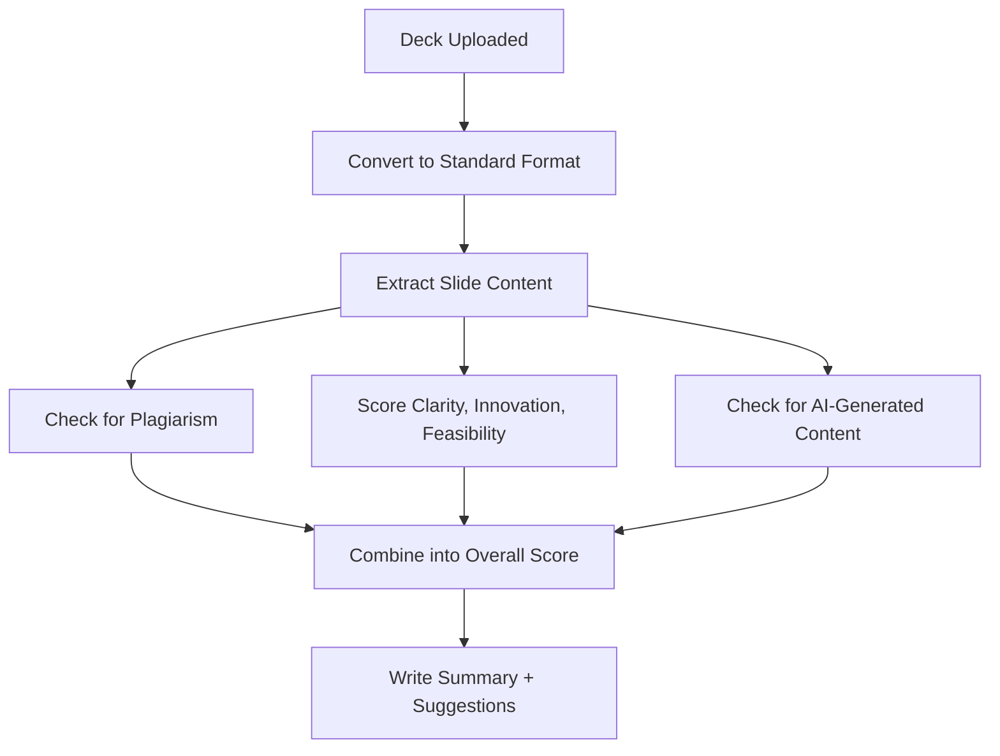

# Module 4 — AI PPT Analyzer & Presentation Intelligence

**Depends on:** `00-master-architecture.md`. Feeds scores into doc 05 (hackathon rankings). Fully
self-contained — usable standalone by a recruiter, judge, or investor.

---

## 1. Scope

Analyze uploaded decks/PDFs, produce multi-dimensional scores, plagiarism/AI-content signals, an
auto-summary, and improvement suggestions.

## 2. LangGraph Subgraph



D, E, and F run in parallel off the same extraction step ("Score Clarity, Innovation, Feasibility" is
really three agents running together) — this is what makes the processing-time target realistic in
principle; it must still be benchmarked on this exact stack before being quoted.

**State schema:**
```python
from typing import TypedDict, Optional

class PitchAnalysisState(TypedDict):
    presentation_id: str
    slides: list[dict]               # {index, title, body, notes, image_refs}
    slide_embeddings: list[list[float]]
    plagiarism_matches: list[dict]
    ai_content_signal: dict           # {score, confidence_label, flagged_sections} - never a bare boolean
    scores: dict[str, float]
    overall_score: Optional[float]
    summary: Optional[str]
    suggestions: list[str]
```

## 3. Agent Registry

| Agent | Model | Tools | Notes |
|---|---|---|---|
| Format Normalization Agent | tool only | `python-pptx`, LibreOffice headless (legacy `.ppt`), `PyMuPDF`/`pdfplumber` (`.pdf`) | |
| Content Extraction Agent | tool only | `python-pptx`, `PyMuPDF` | |
| Slide Image/OCR Agent | Haiku + vision, or Tesseract | Claude vision for diagram *understanding*, not just OCR | |
| Slide Embedding Agent | embedding model only | self-hosted `bge-large-en-v1.5` | |
| Similarity/Plagiarism Agent | tool (vector search) + Haiku narrative | Qdrant search vs prior-submission corpus | |
| Problem & Solution Clarity Agent | Sonnet | structured rubric | |
| Innovation & Business Impact Agent | Sonnet | rubric + Qdrant novelty check | |
| Technical Feasibility Agent | Sonnet | cross-references claims against linked repo's static analysis (doc 03) | |
| AI-Content Heuristic Agent | Haiku + statistical tool | `transformers` GPT-2 perplexity — **signal, never a verdict** | |
| Aggregation Agent | rules | weighted combination — **see `08-algorithms-and-formulas.md` §7 for the explicit formula**: equal-weighted (0.25 each) across Innovation, Technical Feasibility, Presentation Quality, and Business Potential | |
| Summary & Suggestions Agent | Sonnet | grounded 2–3 sentence summary + rubric-tied suggestions | |

## 4. Data Model

```sql
CREATE TABLE presentations (
    id UUID PRIMARY KEY DEFAULT gen_random_uuid(),
    owner_user_id UUID REFERENCES users(id),
    file_id UUID REFERENCES files(id),
    linked_repo TEXT,
    hackathon_submission_id UUID,       -- FK to doc 05, nullable
    uploaded_at TIMESTAMPTZ DEFAULT now()
);

CREATE TABLE slides (
    id UUID PRIMARY KEY DEFAULT gen_random_uuid(),
    presentation_id UUID REFERENCES presentations(id),
    slide_index INT,
    title TEXT, body TEXT, notes TEXT,
    has_image BOOLEAN DEFAULT false
);

CREATE TABLE presentation_scores (
    id UUID PRIMARY KEY DEFAULT gen_random_uuid(),
    presentation_id UUID REFERENCES presentations(id),
    innovation_score FLOAT,
    technical_feasibility_score FLOAT,
    presentation_quality_score FLOAT,
    business_potential_score FLOAT,
    overall_pitch_score FLOAT,
    summary TEXT,
    suggestions JSONB,
    ai_content_signal JSONB,            -- {score, confidence_label, flagged_sections}
    computed_at TIMESTAMPTZ DEFAULT now()
);

CREATE TABLE plagiarism_matches (
    id UUID PRIMARY KEY DEFAULT gen_random_uuid(),
    presentation_id UUID REFERENCES presentations(id),
    matched_presentation_id UUID REFERENCES presentations(id),
    slide_index INT,
    similarity FLOAT,
    flagged_at TIMESTAMPTZ DEFAULT now()
);
```

**Qdrant:** `presentation_slide_embeddings` — payload `{presentation_id, slide_index, hackathon_id,
submitted_at}`, the historical corpus every new upload is checked against.

## 5. API Endpoints

```
POST   /api/v1/presentations/upload
GET    /api/v1/presentations/{id}/status
GET    /api/v1/presentations/{id}/report
GET    /api/v1/presentations/{id}/plagiarism-matches
```

## 6. Non-Functional Requirements

- Processing runs async (`arq` worker) — upload response never blocks on the pipeline.
- File size cap enforced at upload (single Cloudinary provider per doc 00 §2).
- AI-content and plagiarism signals always ship with a confidence label and evidence (matched slide +
  similarity score), never a bare boolean — this is a hard requirement given the known unreliability of
  AI-text detection.
- The "< 60s processing time" figure from earlier drafts is a **target to benchmark**, not a guarantee.

*Continue to `05-hackathon-pipeline.md`.*
