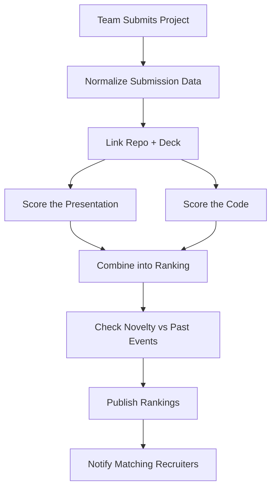

# Module 5 — Hackathon-to-Hiring Pipeline

**Depends on:** `00-master-architecture.md`, doc 04 (PPT scores feed rankings), doc 01 (candidate
profiles). Publishes events consumed by doc 02.
**This module is the sole owner of judge scores** — doc 02 no longer has its own `judge_evaluations`
table; it reads finalized rankings via the `events` bus only.

---

## 1. Scope

Turns hackathon participation into structured hiring signal: performance tracking, winner analytics,
team rankings, recruiter access to top performers.

## 2. Data Ingestion (finalized scope)

Per the demo-scope decision: **only hackathons run inside this platform** (direct-submission mode).
This is a deliberate cold-start tradeoff — no external-platform scraping/import for the demo — solved
by running your own hackathon(s) through the product to seed data. CSV-import and webhook modes remain
documented as a future extension but are not required for this build.

## 3. LangGraph Subgraph



**State schema:**
```python
from typing import TypedDict

class HackathonRankingState(TypedDict):
    hackathon_id: str
    teams: list[dict]                # {team_id, members, repo_url, deck_presentation_id, judge_scores}
    pitch_scores: dict[str, dict]    # team_id -> doc-04 report
    repo_scores: dict[str, dict]     # team_id -> doc-03 static analysis + contribution shares
    novelty_scores: dict[str, float]
    final_rankings: list[dict]       # ordered [{team_id, rank, composite_score}]
```

## 4. Agent Registry

| Agent | Model | Tools | Notes |
|---|---|---|---|
| Normalization Agent | Haiku + rules | schema mapping for submission payloads | |
| Repo/Deck Linking Agent | rules | validates/dedupes references, triggers doc 03/04 invocation | |
| Ranking Aggregation Agent | rules (transparent weighted formula) | | |
| Cross-Event Novelty Agent | embedding similarity (tool) + Haiku narrative | Qdrant search across all past hackathons | |
| Recruiter Notification Agent | rules + templated Haiku message | matches finalized top performers against recruiter watchlists | |

**Composite ranking formula:**
```
composite_score = 0.40 * normalized(judge_score)     # if judges scored manually
                + 0.30 * doc04.overall_pitch_score
                + 0.20 * doc03.repo_quality_score
                + 0.10 * novelty_score
```
Weights/components are configurable per event (not every hackathon has manual judges).

## 5. Data Model

```sql
CREATE TABLE hackathons (
    id UUID PRIMARY KEY DEFAULT gen_random_uuid(),
    organizer_org_id UUID REFERENCES organizations(id),
    name TEXT, start_date DATE, end_date DATE,
    tracks JSONB,
    created_at TIMESTAMPTZ DEFAULT now()
);

CREATE TABLE hackathon_teams (
    id UUID PRIMARY KEY DEFAULT gen_random_uuid(),
    hackathon_id UUID REFERENCES hackathons(id),
    team_name TEXT,
    track TEXT
);

CREATE TABLE hackathon_team_members (
    team_id UUID REFERENCES hackathon_teams(id),
    candidate_id UUID REFERENCES candidate_profiles(id),
    role TEXT,
    PRIMARY KEY (team_id, candidate_id)
);

CREATE TABLE hackathon_submissions (
    id UUID PRIMARY KEY DEFAULT gen_random_uuid(),
    team_id UUID REFERENCES hackathon_teams(id),
    repo_url TEXT,
    presentation_id UUID REFERENCES presentations(id),
    submitted_at TIMESTAMPTZ DEFAULT now()
);

-- Sole owner of judge scoring. Doc 02 has no equivalent table.
CREATE TABLE judge_evaluations (
    id UUID PRIMARY KEY DEFAULT gen_random_uuid(),
    hackathon_id UUID REFERENCES hackathons(id),
    submission_id UUID REFERENCES hackathon_submissions(id),
    judge_user_id UUID REFERENCES users(id),
    rubric_scores JSONB NOT NULL,     -- {"innovation": 9, "technical": 8, "presentation": 10}
    overall_score FLOAT NOT NULL,
    comments TEXT,
    evaluated_at TIMESTAMPTZ DEFAULT now()
);

CREATE TABLE hackathon_rankings (
    id UUID PRIMARY KEY DEFAULT gen_random_uuid(),
    hackathon_id UUID REFERENCES hackathons(id),
    team_id UUID REFERENCES hackathon_teams(id),
    rank INT,
    composite_score FLOAT,
    score_breakdown JSONB,
    finalized_at TIMESTAMPTZ DEFAULT now()
);

CREATE TABLE recruiter_watchlists (
    id UUID PRIMARY KEY DEFAULT gen_random_uuid(),
    recruiter_id UUID REFERENCES users(id),
    criteria JSONB,                     -- {track, min_rank, skills}
    created_at TIMESTAMPTZ DEFAULT now()
);
```

## 6. Event Publishing (drives doc 02 integration)

```json
// events table row
{
  "event_type": "hackathon.rankings.finalized",
  "payload": {
    "hackathon_id": "h-1",
    "top_teams": ["t-1","t-2","t-3"],
    "candidate_ids": ["u-10","u-11","u-20"]
  }
}
```
An Arq worker in doc 02 subscribes to this event type, matches `candidate_ids` against active
`recruiter_watchlists`, and surfaces them in the Recruiter Dashboard's "Top Performers" feed. Doc 02
never reads `judge_evaluations` directly — only this event payload and doc 05's finalized rankings.

## 7. API Endpoints

```
POST   /api/v1/hackathons
POST   /api/v1/hackathons/{id}/submissions        # direct-submission mode
POST   /api/v1/hackathons/{id}/judging/evaluations
GET    /api/v1/hackathons/{id}/rankings
GET    /api/v1/hackathons/{id}/teams/{teamId}
POST   /api/v1/recruiters/{id}/watchlists
GET    /api/v1/recruiters/{id}/top-performers-feed
```

## 8. Non-Functional Requirements

- Ranking finalization is idempotent and re-runnable (organizers can correct judge scores after the
  fact).
- Public leaderboard pages are cache-friendly (ISR) since they rarely change after finalization.

*Continue to `06-trust-fraud-prevention.md`.*
