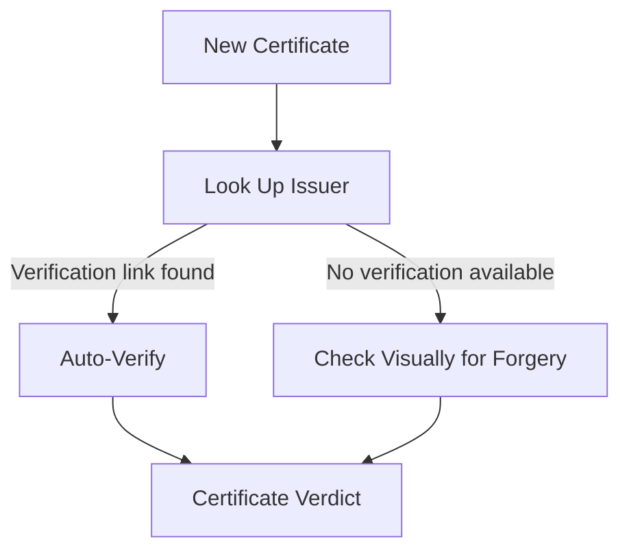
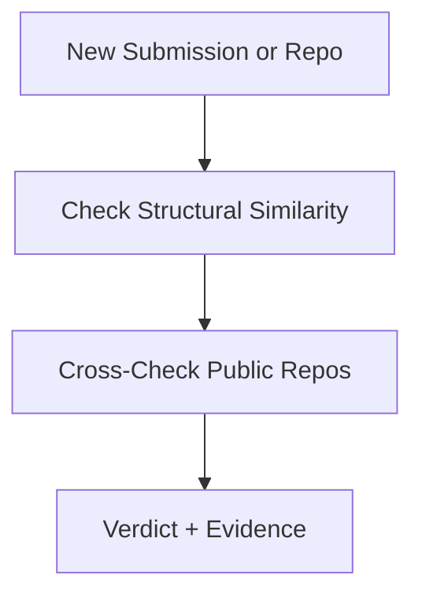
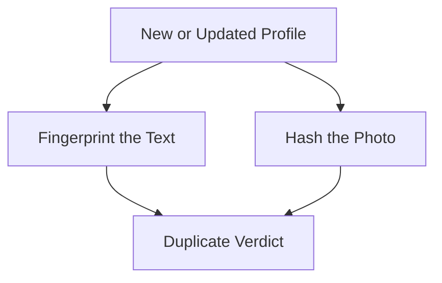
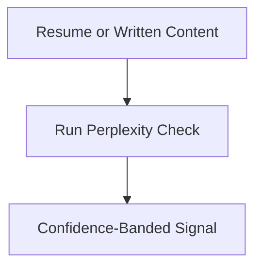
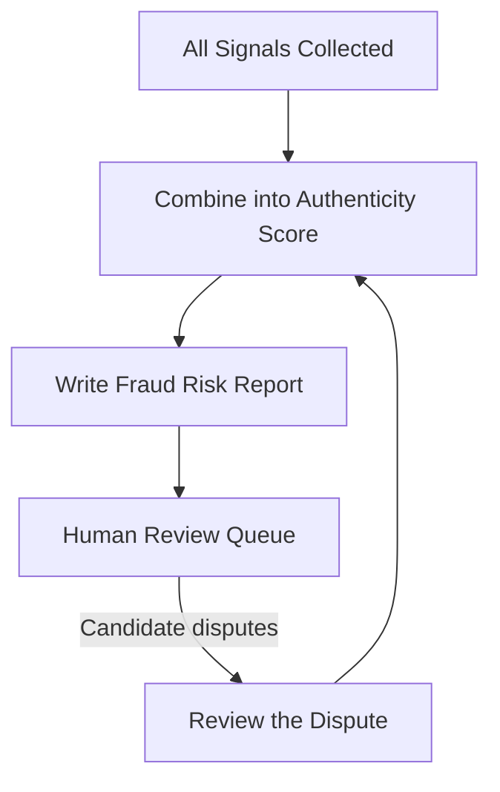

# Module 6 — Trust & Fraud Prevention System

**Depends on:** `00-master-architecture.md`. Reads from doc 01 (certs/profiles), doc 03 (submissions),
doc 04 (presentations). Writes flags consumed by doc 02 — **display-only, never a filter or
auto-reject.**

---

## 1. Scope

Detects fake certificates, plagiarized projects/submissions, likely-AI-generated resumes, duplicate
profiles. Produces a Candidate Authenticity Score and evidence-linked Fraud Risk Reports. This is the
highest ethical-risk module in the platform — every design choice below centers on evidence,
uncertainty, and mandatory human review rather than automated verdicts.

## 2. LangGraph Subgraph

Four independent detection flows feed one shared review process. Each flow is simple on its own:

**Certificate verification:**


**Code / submission plagiarism:**


**Duplicate profile detection:**


**AI-generated content signal:**


**Shared aggregation & review** (all four verdicts feed into this one flow):


**State schema:**
```python
from typing import TypedDict, Optional

class FraudCheckState(TypedDict):
    subject_type: str                # 'certificate' | 'submission' | 'profile' | 'resume'
    subject_id: str
    signals: list[dict]              # [{signal_type, score, confidence, evidence: [...]}]
    authenticity_score: Optional[float]
    flags: list[dict]                # [{flag_type, status, evidence, raised_at}]
```

## 3. Agent Registry

| Agent | Model | Tools | Notes |
|---|---|---|---|
| Issuer Lookup Agent | rules + `httpx` | resolves credential-ID/verification-URL where one exists | |
| Auto-Verify Agent | rules | match/no-match against fetched issuer page | |
| Visual Forensics Agent | Haiku + vision | layout/font/seal comparison vs known-genuine templates | Outputs low/medium/high suspicion, never certainty |
| Structural Similarity Agent | tool only | `copydetect` / Dolos-style token-based clone detector | Robust to variable renaming |
| Public-Repo Cross-Check Agent | GitHub code-search API + Haiku narrative | checks if code closely matches an un-authored public repo | |
| Text Fingerprint Agent | embedding + hashing | `datasketch` (MinHash/LSH) + embedding similarity | Catches near-duplicate accounts |
| Photo Perceptual-Hash Agent | `imagehash` | **perceptual hashing (plain center-crop, no face-alignment step), not facial recognition** | See §5 and `08-algorithms-and-formulas.md` §9 |
| Perplexity Heuristic Agent | statistical tool | `transformers` GPT-2 perplexity, shared approach with doc 04 | Confidence-banded, not binary |
| Authenticity Aggregation Agent | rules (transparent weighted formula — **see `08-algorithms-and-formulas.md` §10 for the explicit formula**: starts at 100, subtracts fixed penalties only for `upheld` flags, floored at 0) | | |
| Fraud Risk Report Agent | Sonnet | writes report strictly from `signals` — never adds unsupported claims | |
| Dispute Review Agent | Sonnet | summarizes candidate's context alongside evidence — **cannot itself close a dispute** | |

## 4. Fraud Flags Are Never a Silent Filter (binding rule)

- Cannot be used as a doc 02 Copilot search/filter criterion.
- `raised` status has zero effect on visibility, ranking, or Talent Score until a human reviewer moves
  it to `upheld`.
- Every `upheld` decision requires non-null `review_notes` — no unexplained adverse action.

## 5. Legal & Ethical Constraints (binding, not optional)

- **No facial recognition/biometric matching.** Duplicate-photo detection uses perceptual image hashing
  only — detects literal image reuse, not biometric identity. Avoids BIPA/GDPR special-category-data
  exposure while still catching "same photo, different account."
- **AI-content and plagiarism signals are probabilistic, never forensic-grade** — must ship with a
  confidence label and be corroborated by at least one independent signal before an `upheld` flag.
- **Right to dispute and human review are mandatory.**
- **False-positive rate on dismissed disputes is tracked as a first-class metric** — a high
  false-positive rate is a product failure, not a tuning parameter.
- All perceptual-hash and fingerprint checks verify an active `consents` record
  (`perceptual_photo_hash` / `resume_parsing`) before running.

## 6. Data Model

```sql
CREATE TABLE verification_records (
    id UUID PRIMARY KEY DEFAULT gen_random_uuid(),
    subject_type TEXT,
    subject_id UUID,
    signal_type TEXT,
    signal_score FLOAT,
    confidence_label TEXT CHECK (confidence_label IN ('low','medium','high')),
    evidence JSONB,
    created_at TIMESTAMPTZ DEFAULT now()
);

CREATE TABLE fraud_flags (
    id UUID PRIMARY KEY DEFAULT gen_random_uuid(),
    subject_type TEXT, subject_id UUID,
    flag_type TEXT,
    status TEXT DEFAULT 'raised' CHECK (status IN ('raised','under_review','upheld','dismissed')),
    evidence JSONB NOT NULL,
    raised_at TIMESTAMPTZ DEFAULT now(),
    reviewed_by UUID REFERENCES users(id),
    reviewed_at TIMESTAMPTZ,
    review_notes TEXT
);

CREATE TABLE authenticity_scores (
    id UUID PRIMARY KEY DEFAULT gen_random_uuid(),
    candidate_id UUID REFERENCES candidate_profiles(id),
    score FLOAT,                        -- "corroboration strength," 0-100
    components JSONB,
    computed_at TIMESTAMPTZ DEFAULT now()
);

CREATE TABLE disputes (
    id UUID PRIMARY KEY DEFAULT gen_random_uuid(),
    fraud_flag_id UUID REFERENCES fraud_flags(id),
    candidate_id UUID REFERENCES candidate_profiles(id),
    candidate_statement TEXT,
    supporting_files JSONB,
    submitted_at TIMESTAMPTZ DEFAULT now()
);
```

## 7. API Endpoints

```
POST   /api/v1/verification/certificates/{id}/check
POST   /api/v1/verification/submissions/{id}/check
POST   /api/v1/verification/profiles/{id}/duplicate-check
GET    /api/v1/candidates/{id}/authenticity-score
GET    /api/v1/candidates/{id}/flags
POST   /api/v1/flags/{id}/dispute
PATCH  /api/v1/flags/{id}/review
GET    /api/v1/admin/fraud-review-queue
```

## 8. Non-Functional Requirements

- All detection agents run async, never block profile/submission save.
- `fraud_flags.evidence` is enforced non-null at the application layer.

*Continue to `07-multi-agent-architecture.md`.*
