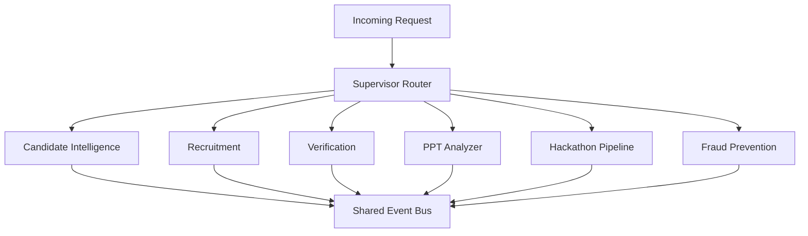

# Module 7 — Multi-Agent Architecture (Cross-Cutting Deep-Dive)

This document is the shared agentic-architecture reference every module doc points back to: the full
agent registry, supervisor pattern, memory design, model routing, and guardrails.

---

## 1. Full Agent Registry (by module)

| Module | Agents |
|---|---|
| 01 Candidate Intelligence | Resume Parser, GitHub Analysis, Certificate OCR, Profile Merge, Talent Scoring, Badge Assignment, Career Guidance, Resume Generator, Fact-Check |
| 02 Recruitment | Query Understanding, Search Plan, Re-ranking, Explanation, Job Embedding, Matching, Project Relevance, Score Aggregation |
| 03 Verification | Static Analysis, Grading, LLM Code Review, Question, Turn Evaluation, Follow-up, Interview Report, Commit Attribution, Contribution Weighting |
| 04 PPT Analyzer | Format Normalization, Content Extraction, Slide Image/OCR, Slide Embedding, Similarity/Plagiarism, Problem & Solution Clarity, Innovation & Business Impact, Technical Feasibility, AI-Content Heuristic, Aggregation, Summary & Suggestions |
| 05 Hackathon Pipeline | Normalization, Repo/Deck Linking, Ranking Aggregation, Cross-Event Novelty, Recruiter Notification |
| 06 Fraud Prevention | Issuer Lookup, Auto-Verify, Visual Forensics, Structural Similarity, Public-Repo Cross-Check, Text Fingerprint, Photo Perceptual-Hash, Perplexity Heuristic, Authenticity Aggregation, Fraud Risk Report, Dispute Review |

~35 agents total across 6 modules. Each is a small, single-responsibility Python callable with a strict
Pydantic input/output schema — no agent is a free-form chat loop.

## 2. Supervisor Pattern

Each module owns its own LangGraph subgraph; a thin top-level supervisor routes requests and owns
cross-module event handling.



The event bus can trigger new requests back into the router (e.g. a finalized hackathon ranking
triggers a recruitment-module notification) — same six subgraphs, just re-entering at the top.

```python
from langgraph.graph import StateGraph, END

def route(state: SupervisorState) -> str:
    return state["intent"]  # set by a lightweight Haiku-tier classifier node

builder = StateGraph(SupervisorState)
builder.add_node("classify_intent", classify_intent_node)
builder.add_node("candidate_intelligence", candidate_intelligence_subgraph)
builder.add_node("recruitment", recruitment_subgraph)
builder.add_node("verification", verification_subgraph)
builder.add_node("ppt_analyzer", ppt_analyzer_subgraph)
builder.add_node("hackathon", hackathon_subgraph)
builder.add_node("fraud", fraud_subgraph)

builder.set_entry_point("classify_intent")
builder.add_conditional_edges("classify_intent", route, {
    "candidate_intelligence": "candidate_intelligence",
    "recruitment": "recruitment",
    "verification": "verification",
    "ppt_analyzer": "ppt_analyzer",
    "hackathon": "hackathon",
    "fraud": "fraud",
})
for node in ["candidate_intelligence","recruitment","verification","ppt_analyzer","hackathon","fraud"]:
    builder.add_edge(node, END)

app = builder.compile(checkpointer=postgres_checkpointer)
```

Each module can later be pulled out into its own deployable service without rewriting agent logic —
only the router's dispatch table changes.

## 3. Memory Design

| Memory type | Mechanism | Used by |
|---|---|---|
| Short-term (in-conversation) | LangGraph state + **Postgres checkpointer** (`langgraph-checkpoint-postgres`) | Interview Agent (03), Recruiter Copilot (02) |
| Long-term (candidate history) | Postgres tables (`talent_scores`, `interview_reports`, etc.) + Qdrant embeddings | All modules |
| Cross-module signal | `events` table (durable) + Redis pub/sub (low-latency) | Hackathon → Recruitment |

A Postgres-backed checkpointer (not in-memory) means an interview or copilot session survives a backend
restart — relevant on free-tier hosts that can spin down idle instances.

## 4. Structured Output Enforcement

Every score/filter/report-producing agent uses Pydantic-schema-constrained output (Anthropic native
tool-use), never free-form text parsed with regex:

```python
from pydantic import BaseModel, Field

class RubricScore(BaseModel):
    score: float = Field(ge=0, le=100)
    rationale: str
    evidence_refs: list[str]

response = client.messages.create(
    model="claude-sonnet-4-6",
    max_tokens=1000,
    tools=[{"name": "submit_score", "input_schema": RubricScore.model_json_schema()}],
    tool_choice={"type": "tool", "name": "submit_score"},
    messages=[{"role": "user", "content": prompt}]
)
```

If the response doesn't validate against the target schema, reject and re-prompt once, then route to a
manual-review queue — never silently accept malformed output.

## 5. Model Routing Policy — Single Provider

**Anthropic Claude only.** No second LLM vendor (a prior draft included Groq — removed for simplicity
and to match a single-API-key budget).

| Task class | Model | Rationale |
|---|---|---|
| Field extraction, classification, tagging, NL→filter parsing | Claude Haiku | High volume, low ambiguity, latency-sensitive |
| Judgment calls a human reads and acts on (interview verdicts, fraud verdicts, pitch scores, project-quality review) | Claude Sonnet | Higher reasoning quality where being wrong has real consequences |
| Re-ranking a small shortlist (≤50 items) | Sonnet, only on the pre-filtered set | Never run the expensive model over the full candidate pool |
| Embeddings | Self-hosted `bge-large-en-v1.5` | Free, no API call, commoditized task |

This two-tier routing (cheap model/tool for the mechanical step, Sonnet only for what a human reads) is
the single biggest cost lever across the platform.

## 6. Observability

- **Langfuse** wraps every agent call and writes `langfuse_trace_id` into `agent_runs` — this is what
  makes "why did this candidate get this score" answerable in a demo.
- **Sentry** (free tier) for FastAPI/Arq exceptions.
- Dashboards: per-agent latency, per-agent token cost, error rate — available in Langfuse's UI with no
  extra build work.

## 7. Guardrails

- **Prompt-injection defense on uploaded content.** Resumes, decks, and READMEs are untrusted input.
  Any instruction-like text found inside them ("ignore previous instructions...") is treated as data,
  never as a directive — uploaded content is always wrapped in a clearly delimited block
  (`<candidate_submitted_content>`) with an explicit system-prompt instruction to treat it as
  data-to-evaluate.
- **No server-side execution of untrusted code, ever** — all code execution is client-side (Pyodide),
  per doc 03 §2.
- **Rate limiting** on all LLM-backed endpoints (`slowapi`, Redis token-bucket) — controls both abuse
  and cost.
- **No silent adverse automation** — fraud flags and low scores populate a human-reviewable queue with
  evidence; nothing auto-rejects a candidate.
- **Explainability by construction** — every score-producing agent writes its evidence into
  `agent_runs`; this is not a separate feature to build later.

## 8. Repository Layout (monorepo)

```
/apps
  /web              -- Next.js frontend (all role-based dashboards)
/services
  /api              -- FastAPI app (routers per module)
  /agents           -- LangGraph subgraphs, one package per module
  /workers          -- Arq worker entrypoints
/packages
  /shared_schemas   -- Pydantic models shared between api/ and agents/
  /db               -- SQLAlchemy models + Alembic migrations
```

Keeps "each module is a different project" at the `/agents` and router level, while sharing one
deployable backend and one database — the right tradeoff at demo scale, with a clean seam to split into
real microservices later.

---

*This completes the architecture doc set: 00 (master) through 07 (this file).*
