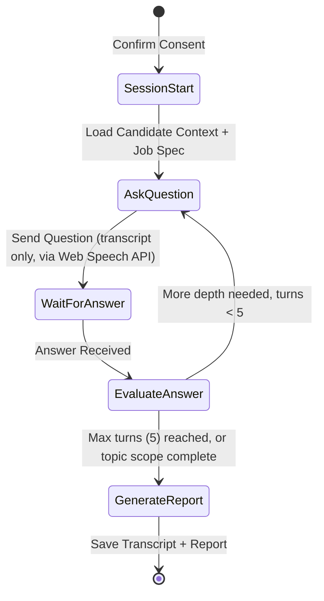

# Algorithms & Formulas — Consolidated Reference (48-Hour Build)

Single source of truth for every formula/algorithm across all modules. Where a number is a starting
default rather than a proven constant, it's labeled "tunable default" — don't present these as
validated in front of judges; say what they are.

**Ground rules that apply to everything below (reaffirmed from the fix log):**
- LLM provider: **Claude only** (Haiku for extraction/classification, Sonnet for judgment calls). No
  Groq, no second provider.
- Code execution: **Pyodide/WASM in the browser only.** No server-side Piston/Judge0 — free-tier PaaS
  hosts can't grant the Docker-socket access that requires.
- Every score-producing formula is deterministic and rule-based unless explicitly marked "LLM judgment."

---

## 1. Talent Score™ (Module 1)

**Canonical — matches the brief's 7 named sub-scores exactly. Do not rename these.**

$$S = \sum_{i=1}^{7} w_i' \cdot S_i$$

| Sub-score $S_i$ | Weight $w_i$ | Measured from |
|---|---|---|
| Coding Ability | 0.20 | Log-scaled commit frequency + contribution consistency + doc 03 coding-assessment pass rate |
| Problem Solving | 0.20 | doc 03 assessment pass rate + time-efficiency on hidden test cases |
| Project Quality | 0.15 | Cyclomatic complexity (`radon`), maintainability index (`lizard`), test coverage where present, LLM architecture review |
| Innovation | 0.15 | Qdrant novelty-vs-corpus similarity + hackathon percentile rank (doc 05) |
| Technical Consistency | 0.10 | Commit frequency regularity over time (variance, not just volume) |
| Community Participation | 0.10 | GitHub stars/OSS contributions to external repos + hackathon participation count |
| Leadership | 0.10 | Maintainer status, PR review activity, team-lead flag (doc 03 contribution report) |

**Practical note on Project Quality:** use an inverted penalty curve for cyclomatic complexity above 15
(mild penalty up to 15, steeper past it) rather than a flat linear scale — cheap to implement, avoids
punishing normal complexity.

**Practical note on Leadership:** this remains your weakest, most gameable signal. Keep the weight low
(as above) and keep it in the breakdown UI clearly labeled — don't hide that it's a soft signal.

### 1.1 Dynamic Weight Re-normalization (cold start)

If a sub-score has no data yet (e.g. no hackathon history → Innovation's hackathon-percentile term is
N/A), zero that weight and re-normalize the rest so the candidate isn't unfairly penalized for profile
incompleteness:

$$w_i' = \frac{w_i \cdot \mathbb{1}(S_i \neq \text{N/A})}{\sum_{j=1}^{7} w_j \cdot \mathbb{1}(S_j \neq \text{N/A})}$$

Store which weights were re-normalized alongside `score_version` in `talent_scores` — this is part of
the provenance trail, not a hidden adjustment.

### 1.2 What NOT to fold into this score

**Authenticity/fraud status stays entirely separate** (owned by doc 06's Candidate Authenticity Score,
§10 below). Do not add an 8th weighted sub-score for it — the brief lists it as its own deliverable, and
merging it here breaks the "fraud flags never silently affect a score" rule.

---

## 2. Job Matching Score (Module 2)

**Canonical — the existing 4-term formula, unchanged:**

$$\text{MatchScore} = w_1 \cdot \text{SkillOverlap} + w_2 \cdot \text{SemanticSimilarity} + w_3 \cdot \text{ExperienceMatch} + w_4 \cdot \text{TalentScoreAlignment}$$

**Implementation detail (not a formula change):** `SemanticSimilarity` is computed via a single Qdrant
query that blends dense vector similarity with hard payload filters. If you want an internal blend
ratio for that one term:

$$\text{SemanticSimilarity} = \alpha \cdot \cos(\vec{v}_C, \vec{v}_J) + (1-\alpha) \cdot \text{FilterMatchRatio}$$

with $\alpha = 0.70$ as a **tunable default**, not a validated constant. This only affects the internal
computation of one of the four terms — recruiters still see the full 4-term breakdown, never a bare
percentage.

`SkillOverlap` weights **verified** signals (GitHub repos, verified certs) over raw self-declared resume
text, to reduce keyword-stuffing.

---

## 3. Code Plagiarism / Structural Similarity (Modules 3 & 6, shared logic)

**Algorithm: AST-based winnowing.**

1. Parse source into an AST (`tree-sitter`).
2. Canonicalize identifiers/variable names into generic tokens (`VAR_1`, `FUNC_A`) — ignores cosmetic
   renaming.
3. Generate structural hashes via sliding-window winnowing ($k=15$, $w=10$).
4. **Boilerplate suppression:** subtract hashes matching a known starter-template corpus (framework
   boilerplate, provided starter code) before comparing — this is what prevents every student who used
   the required starter template from getting flagged.

$$J(A, B) = \frac{|(H(A) \setminus H_{\text{boiler}}) \cap (H(B) \setminus H_{\text{boiler}})|}{|(H(A) \setminus H_{\text{boiler}}) \cup (H(B) \setminus H_{\text{boiler}})|}$$

$J(A,B) > 0.75$ (tunable default) → raises a `fraud_flags` entry for human review. Never auto-rejects.

**48-hour practicality note:** don't hand-roll tree-sitter + winnowing from scratch under time pressure
— use an existing open-source implementation of this exact algorithm (e.g. **Dolos**, which already does
AST tokenization + winnowing for common languages) rather than reimplementing it. If integrating Dolos
is still too heavy in the time you have, a simpler fallback (token-shingling + hash comparison via
Python's `difflib` or a basic n-gram hash set) is a legitimate scope-reduction — just be upfront in the
demo that it's a simplified version, not the full AST pipeline.

---

## 4. Team Contribution Attribution (Module 3)

**Canonical, unchanged:**

$$\text{Share}_i = \frac{0.35 L_i + 0.25 C_i + 0.20 P_i + 0.20 R_i}{\sum_{j=1}^{M} (0.35 L_j + 0.25 C_j + 0.20 P_j + 0.20 R_j)}$$

- $L_i$: lines authored, excluding lockfiles/vendor assets/CSVs
- $C_i$: non-merge, non-automated commits
- $P_i$: PRs opened and merged
- $R_i$: code reviews submitted

Report includes the raw components, not just the final share — a recruiter needs to see *why*.

---

## 5. Interview State Machine (Module 3)

- **Max turns = 5** (tunable default) — a hard cap prevents a runaway interview loop, both for cost
  control and candidate experience.
- State persists via LangGraph's Postgres checkpointer (`AsyncPostgresSaver`) — if the candidate's
  browser disconnects mid-interview, the session resumes from the last completed turn rather than
  restarting.
- Everything above operates on **transcript text only** — no raw audio is sent, stored, or checkpointed
  (Web Speech API runs entirely in-browser; only the recognized text crosses the wire).

---

## 6. Sandboxed Code Execution (Module 3)

**Client-side only — Pyodide/WASM in the browser.** No server-side Piston/Judge0 container.

- Backend serves the problem spec + hidden test cases; the browser executes candidate code via Pyodide
  (Python) or an isolated Web Worker (JS) and reports back only pass/fail per test case.
- Backend then runs static analysis on the submitted source (`radon`, `lizard`, `bandit`) — this part
  *is* server-side, but it's read-only analysis of text, never execution.
- Client-side execution timeout: abort and mark failed after ~5–10s (tunable) to avoid a hung browser
  tab on an infinite-loop submission.
- No candidate code ever executes on the backend, under any fallback path — this is a hard rule, not a
  preference.

---

## 7. PPT Overall Pitch Score (Module 4)

**New — previously left as an unweighted "aggregation," now explicit:**

$$\text{OverallPitchScore} = 0.25 \cdot \text{Innovation} + 0.25 \cdot \text{TechnicalFeasibility} + 0.25 \cdot \text{PresentationQuality} + 0.25 \cdot \text{BusinessPotential}$$

Equal weighting is the simplest defensible default for a 48-hour build — easy to explain to judges,
easy to re-tune later if one dimension turns out to dominate in practice. Each component is Sonnet-scored
against a fixed rubric at temperature 0.

---

## 8. Hackathon Composite Ranking (Module 5)

**Canonical, unchanged:**

$$\text{CompositeScore} = 0.40 \cdot \text{norm}(\text{JudgeScore}) + 0.30 \cdot \text{OverallPitchScore} + 0.20 \cdot \text{RepoQualityScore} + 0.10 \cdot \text{NoveltyScore}$$

Components/weights are configurable per event — not every hackathon has manual judges, in which case
re-normalize across whichever terms exist (same re-normalization pattern as §1.1).

---

## 9. Photo Perceptual Hashing (Module 6)

1. Resize to $8\times8$ grayscale via a **plain center-crop** — no face-detection/alignment step. (The
   original draft added a face-alignment pre-crop; that edges toward biometric processing, which we're
   deliberately avoiding. A plain center-crop is simpler to build and keeps this unambiguously outside
   facial-recognition territory.)
2. DCT pHash → 64-bit hash $h$.
3. Compare against a blacklist of default/stock avatar hashes first, to avoid flagging everyone who
   never uploaded a real photo.
4. Hamming distance: $d_H(h_1, h_2) = \text{popcount}(h_1 \oplus h_2)$.
5. $d_H \le 4$ (tunable default) against a non-blacklisted photo → `duplicate_photo_reuse` flag, raised
   for human review.

This is perceptual hashing, not facial recognition — it detects literal image reuse, not biometric
identity, which is what keeps it outside BIPA/GDPR special-category-data territory.

---

## 10. Candidate Authenticity Score (Module 6)

**New — previously described only as "rules, transparent weighted formula," now explicit.**

$$\text{AuthenticityScore} = \max\left(0,\ 100 - \sum_{k} \text{penalty}_k \cdot \mathbb{1}(\text{flag}_k.\text{status} = \text{`upheld'})\right)$$

| Flag type | Penalty (tunable default) |
|---|---|
| Fake certificate | 30 |
| Code plagiarism (structural match > threshold) | 35 |
| Duplicate profile | 40 |
| AI-generated content (high confidence only) | 15 |

**Only `upheld` flags count — never `raised`.** A flag sitting in the review queue has zero effect on
this score, consistent with the "fraud flags are never a silent filter" rule. Starting at 100 and
subtracting only for confirmed issues is the simplest version that still matches the brief's "framed as
corroboration strength, not a guilt verdict" requirement — a candidate with nothing upheld against them
simply stays at 100.

---

## 11. GitHub Ingestion Strategy (Module 1)

- **One batched GraphQL v4 query per candidate** (contribution graph, top repos, PR/issue counts,
  language totals) instead of many REST calls — reduces both request count and rate-limit risk.
- **Fork/archive pruning:** skip `fork: true` and archived repos automatically — this is where most
  noise lives in a typical student's repo list.
- **Top 3–5 original repos only** get deep static analysis (`radon`/`lizard`/AST scanning) — don't run
  expensive analysis across a candidate's entire repo list.
- **Each candidate's own OAuth token is used for their own pull** (not one shared server token) — this
  is what actually avoids a rate-limit collision if several candidates onboard at once.
- Any specific "requests per hour" or "cost per candidate" figure should be measured on your actual
  implementation before being quoted to judges — GitHub's GraphQL API is points-costed per query
  shape, not a flat 1-query-per-candidate count, so a claimed throughput number needs a real benchmark
  behind it, not an estimate.

---

*This file supersedes any formula or algorithm description in docs 00–07 where they conflict — those
docs have been updated to point here for the details above.*
